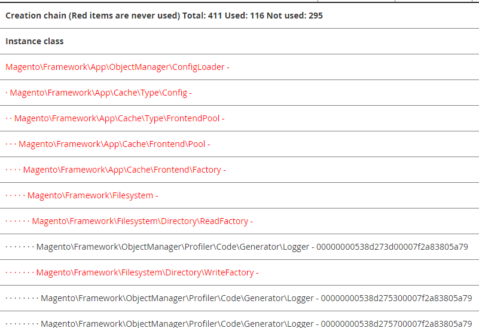

# Abilita profilatura

Con la profilatura di Commerce è possibile:

- Abilita un profiler incorporato.

  È possibile utilizzare un profiler integrato con Commerce per eseguire attività quali l’analisi delle prestazioni. La natura del profiling dipende dagli strumenti analitici utilizzati. Supportiamo diversi formati, tra cui HTML. Quando si abilita il profiler, viene generato un file `var/profiler.flag` che indica che il profiler è abilitato e le configurazioni. Se disabilitato, il file viene eliminato.

- Visualizzare i grafici delle dipendenze in una pagina Commerce.

  Un _grafico delle dipendenze_ è un elenco di dipendenze degli oggetti e di tutte le relative dipendenze, nonché di tutte le dipendenze per tali dipendenze e così via.

  L&#39;elenco delle _dipendenze inutilizzate_ è particolarmente interessante. Si tratta di oggetti creati perché richiesti in un costruttore, ma mai utilizzati, ovvero perché nessuno dei metodi utilizzati è stato chiamato. Di conseguenza, il tempo del processore e la memoria impiegata per creare queste dipendenze vengono sprecati.

Commerce fornisce la funzionalità di base in [`Magento\Framework\Profiler`](https://github.com/magento/magento2/blob/2.4.8/lib/internal/Magento/Framework/Profiler.php).

È possibile abilitare e configurare il profiler utilizzando una variabile MAGE_PROFILER o la riga di comando.

## Imposta MAGE_PROFILER

È possibile impostare il valore di `MAGE_PROFILER` in uno dei modi descritti in [Impostare il valore dei parametri di avvio](../bootstrap/set-parameters.md).

`MAGE_PROFILER` supporta i seguenti valori:

- `1` per abilitare l&#39;output di un profiler specifico.

  Per abilitare un profiler specifico, puoi utilizzare uno dei seguenti valori:

   - `csvfile` che utilizza [`Magento\Framework\Profiler\Driver\Standard\Output\Csvfile`](https://github.com/magento/magento2/blob/2.4.8/lib/internal/Magento/Framework/Profiler/Driver/Standard/Output/Csvfile.php)
   - Qualsiasi altro valore (eccetto `2`), incluso un valore vuoto, che utilizza [`Magento\Framework\Profiler\Driver\Standard\Output\Html`](https://github.com/magento/magento2/blob/2.4.8/lib/internal/Magento/Framework/Profiler/Driver/Standard/Output/Html.php)

- `2` per abilitare i grafici delle dipendenze.

  I grafici delle dipendenze vengono in genere visualizzati nella parte inferiore di una pagina. Nella figura seguente viene illustrata una parte dell&#39;output:

  

## Comandi CLI

È possibile abilitare o disabilitare il profiler utilizzando i comandi CLI:

- `dev:profiler:enable <type>` abilita il profiler con `type` di `html` (impostazione predefinita) o `csvfile`. Se attivato, viene creato un flagfile `var/profiler.flag`.
- `dev:profiler:disable` disabilita il profiler. Se disabilitato, il flagfile `var/profiler.flag` viene rimosso.

Per abilitare i grafici delle dipendenze, utilizza l’opzione della variabile.

**Per attivare o disattivare il profiler**:

1. Accedi al server Commerce.
1. Passare alla directory di installazione di Commerce.
1. In qualità di proprietario del file system, abilita il profiler:

   Per abilitare il profiler utilizzando il tipo `html` e creare un flagfile:

   ```bash
   bin/magento dev:profiler:enable html
   ```

   Per abilitare il profiler utilizzando il tipo `csvfile` e creare un flagfile:

   ```bash
   bin/magento dev:profiler:enable csvfile
   ```

   L&#39;output viene salvato in `<project-root>/var/log/profiler.csv`. `profiler.csv` viene sovrascritto a ogni aggiornamento di pagina.

   Per disattivare il profiler e rimuovere il file di flag:

   ```bash
   bin/magento dev:profiler:disable
   ```

