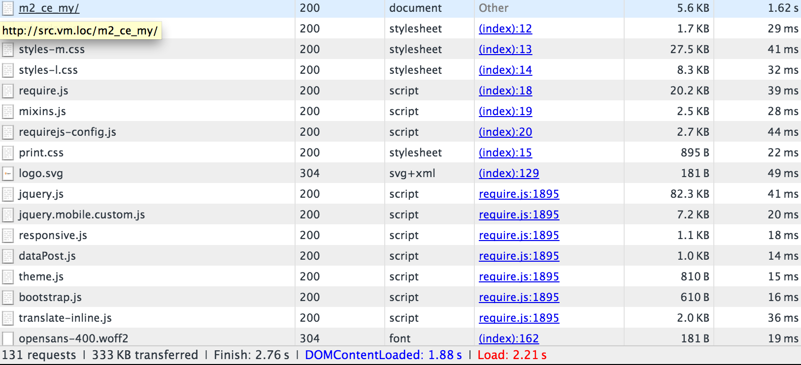

# Configura vernice

[Cache verniciata] è un acceleratore di applicazioni web open source (noto anche come _Acceleratore HTTP_ o _memorizzazione in cache del proxy inverso HTTP_). Varnish memorizza (o memorizza in cache) file o frammenti di file in memoria, il che consente a Varnish di ridurre il tempo di risposta e il consumo di larghezza di banda della rete su richieste future e equivalenti. A differenza dei server web come Apache e nginx, Varnish è stato progettato per essere utilizzato esclusivamente con il protocollo HTTP.

Commerce 2.4.2 è testato con Varnish 6.4. Commerce 2.4.x è compatibile con Varnish 6.x

>[!WARNING]
>
>Noi _consiglio vivamente_ si utilizza Varnish in produzione. Memorizzazione in cache a pagina intera integrata nel file system o [database]- è molto più lento di Varnish, e Varnish è progettato per accelerare il traffico HTTP.

Per ulteriori informazioni su Varnish, vedi:

- [La grande immagine verniciata]
- [Opzioni di avvio vernice]
- [Vernish e prestazioni del sito web]

## Diagramma topologico verniciato

La figura seguente mostra una vista di base di Varnish nella topologia Commerce.


Nella figura precedente, le richieste HTTP degli utenti su Internet generano numerose richieste di CSS, HTML, JavaScript e immagini (definite collettivamente come _assets_). Varnish siede davanti al server web e proxy queste richieste al server web.

Quando il server web restituisce le risorse, le risorse memorizzabili nella cache vengono memorizzate in Varnish. Eventuali richieste successive per tali risorse vengono soddisfatte da Varnish (ovvero, le richieste non raggiungono il server web). La vernice restituisce il contenuto memorizzato nella cache molto rapidamente. I risultati sono tempi di risposta più rapidi per restituire il contenuto agli utenti e un numero ridotto di richieste che devono essere soddisfatte da Commerce.

Le risorse memorizzate nella cache da Varnish scadono a un intervallo configurabile o vengono sostituite da versioni più recenti delle stesse risorse. È inoltre possibile cancellare manualmente la cache utilizzando il [Amministratore](https://glossary.magento.com/magento-admin) o [`magento cache:clean`](../cli/manage-cache.md#clean-and-flush-cache-types) comando.

## Panoramica del processo

Questo argomento illustra come installare inizialmente Varnish con un set minimo di parametri e verificare che funzioni. Quindi esporta una configurazione Varnish dall’amministratore Commerce e testala nuovamente.

Il processo può essere riassunto come segue:

1. Installa Varnish e verificalo accedendo a qualsiasi pagina Commerce per vedere se stai ricevendo intestazioni di risposta HTTP che indicano che Varnish sta funzionando.
1. Installa il software Commerce e utilizza l’amministratore per creare un file di configurazione Varnish.
1. Sostituisci il file di configurazione Varnish esistente con quello generato dall’amministratore.
1. Testa tutto di nuovo.

   Se non c&#39;è nulla nel tuo `<magento_root>/var/page_cache` directory, hai configurato correttamente Varnish con Commerce!

>[!NOTE]
- A meno che non venga notato, è necessario immettere tutti i comandi discussi in questo argomento come utente con `root` privilegi.
- Questo argomento è scritto per Vernish su CentOS e Apache 2.4. Se si sta impostando Varnish in un ambiente diverso, alcuni comandi potrebbero essere diversi. Per ulteriori informazioni, consulta la documentazione di Varnish .


## Problemi noti

Conosciamo i seguenti problemi con Varnish:

- [Varnish non supporta SSL]

   In alternativa, utilizza la terminazione SSL o un proxy di terminazione SSL.

- Se elimini manualmente il contenuto del `<magento_root>/var/cache` directory, è necessario riavviare Varnish.

- Possibile errore durante l&#39;installazione di Commerce:

   ```terminal
   Error 503 Service Unavailable
   Service Unavailable
   XID: 303394517
   Varnish cache server
   ```

   Se si verifica questo errore, modifica `default.vcl` e aggiungi un timeout al `backend` strofa come segue:

   ```conf
   backend default {
       .host = "127.0.0.1";
       .port = "8080";
       .first_byte_timeout = 600s;
   }
   ```

## Panoramica della memorizzazione in cache della vernice

La memorizzazione in cache della vernice funziona con Commerce utilizzando:

- [`nginx.conf.sample`](https://github.com/magento/magento2/blob/2.4/nginx.conf.sample) dall’archivio GitHub Magento 2
- `.htaccess` file di configurazione distribuito per Apache fornito con Commerce
- `default.vcl` configurazione per Varnish generata utilizzando [Amministratore](../cache/configure-varnish-commerce.md)

>[!INFO]
Questo argomento tratta solo le opzioni predefinite dell’elenco precedente. Esistono molti altri modi per configurare la memorizzazione in cache in scenari complessi (ad esempio, utilizzando una rete di distribuzione dei contenuti); tali metodi esulano dall’ambito di applicazione della presente guida.

Nella prima richiesta del browser, le risorse memorizzabili in cache vengono consegnate al browser client da Varnish e memorizzate nella cache del browser.

Inoltre, la vernice utilizza un [Entità](https://glossary.magento.com/entity) Assegna tag (ETag) alle risorse statiche. L&#39;ETag fornisce un modo per determinare quando [file statici](https://glossary.magento.com/static-files) sul server. Di conseguenza, le risorse statiche vengono inviate al client quando cambiano sul server, sia su una nuova richiesta di un browser o quando il client aggiorna la cache del browser, in genere premendo F5 o Control+F5.

Ulteriori dettagli sono forniti nelle sezioni che seguono.

## Memorizzazione in cache per richiesta del browser

In questa sezione viene utilizzato un ispettore del browser per mostrare come le risorse vengono consegnate al browser nella prima richiesta e successivamente caricate dalla cache del browser locale.

### Prima richiesta browser

`nginx.conf.sample` e `.htaccess` fornisce le opzioni per il caching client. Quando la prima richiesta viene effettuata da un browser per un oggetto memorizzabile nella cache, Varnish la consegna al client.

Nella figura seguente viene illustrato un esempio di utilizzo di un ispettore del browser:



L&#39;esempio precedente mostra una richiesta per la pagina principale di vetrina (`m2_ce_my`). Le risorse CSS e JavaScript sono memorizzate nella cache del browser client.

>[!NOTE]
La maggior parte delle risorse statiche dispone di un codice di stato HTTP 200 (OK) che indica che la risorsa è stata recuperata dal server.

### Seconda richiesta del browser

Se lo stesso browser richiede nuovamente la stessa pagina, queste risorse vengono distribuite dalla cache del browser locale, come illustrato nella figura seguente.


Nota la differenza di tempo di risposta tra la prima e la seconda richiesta. Anche in questo caso, le risorse statiche hanno un codice di risposta 200 (OK) perché vengono consegnate dalla cache locale per la prima volta.

## Utilizzo di Etag in Commerce

L’esempio seguente mostra le intestazioni di risposta per una particolare risorsa statica.


`calendar.css` ha un&#39;intestazione di risposta ETag che significa che il file CSS nel browser client può essere confrontato a quello sul server.

Inoltre, le risorse statiche vengono restituite con un codice di stato HTTP 304 (Non modificato), come illustrato nella figura seguente.


Il codice di stato 304 si verifica perché l&#39;utente ha invalidato la propria cache locale e il contenuto sul server non è cambiato. A causa del codice di stato 304, la risorsa statica _content_ non è trasferito; nel browser vengono scaricate solo le intestazioni HTTP.

Se il contenuto cambia sul server, il client scarica la risorsa statica con un codice di stato HTTP 200 (OK) e un nuovo ETag.

<!-- Link Definitions -->

[database]: https://developer.adobe.com/commerce/php/development/cache/partial/database-caching/
[La grande immagine verniciata]: https://www.varnish-cache.org/docs/trunk/users-guide/intro.html
[Cache verniciata]: https://varnish-cache.org
[Opzioni di avvio vernice]: https://www.varnish-cache.org/docs/trunk/reference/varnishd.html#ref-varnishd-options
[Vernish e prestazioni del sito web]: https://www.varnish-cache.org/docs/trunk/users-guide/performance.html#users-performance
[Varnish non supporta SSL]: https://www.varnish-cache.org/docs/3.0/phk/ssl.html
