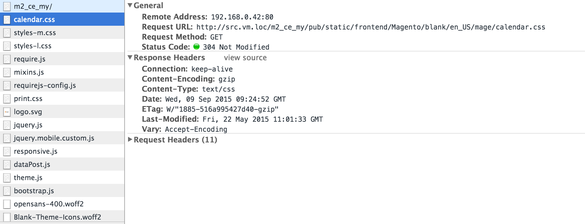

# Configurare e utilizzare vernice

[Varnish Cache](https://www.varnish.org/) è un acceleratore dell&#39;applicazione Web open-source (detto anche _acceleratore HTTP_ o _proxy HTTP inverso nella cache_). La vernice memorizza (o memorizza in cache) file o frammenti di file in memoria, il che consente a Vernice di ridurre il tempo di risposta e il consumo di larghezza di banda della rete su richieste equivalenti future. A differenza dei server web come nginx, Varnish è stato progettato per essere usato esclusivamente con il protocollo HTTP.

[Requisiti di sistema](../../installation/system-requirements.md) elenca le versioni supportate di Vernice.

>[!WARNING]
>
>_ti consigliamo vivamente_ di utilizzare Vernice in produzione. Il caching integrato a pagina intera nel file system o nel [database](https://developer.adobe.com/commerce/php/development/cache/partial/database-caching/) è molto più lento di quello di Varnish ed è progettato per accelerare il traffico HTTP.

Per ulteriori informazioni sulla vernice, consulta:

- [Il quadro vernice grande](https://www.varnish.org/docs/users-guide/intro/#users-intro)
- [Opzioni di avvio vernice](https://www.varnish.org/docs/users-guide/running/#users-running)
- [Vernice e prestazioni del sito web](https://www.varnish.org/docs/users-guide/performance/)

## Diagramma topologico della vernice

Nella figura seguente viene illustrata una visualizzazione di base della vernice nella topologia Commerce.


Nella figura precedente, le richieste HTTP degli utenti su Internet generano numerose richieste di CSS, HTML, JavaScript e immagini (collettivamente denominate _risorse_). Varnish siede davanti al server web e invia queste richieste al server web.

Quando il server web restituisce le risorse, le risorse memorizzabili in cache vengono memorizzate in vernice. Eventuali richieste successive per tali risorse vengono soddisfatte da Varish (ovvero, le richieste non raggiungono il server web). La vernice restituisce il contenuto memorizzato nella cache in modo estremamente rapido. I risultati sono tempi di risposta più rapidi per restituire il contenuto agli utenti e un numero ridotto di richieste che devono essere soddisfatte da Commerce.

Le Assets memorizzate nella cache da Varish scadono a un intervallo configurabile o vengono sostituite da versioni più recenti delle stesse risorse. È inoltre possibile cancellare la cache manualmente utilizzando il comando Admin o [`magento cache:clean`](../cli/manage-cache.md#clean-and-flush-cache-types).

## Panoramica del processo

In questo argomento viene illustrato come installare inizialmente Vernice con un set minimo di parametri e verificare che funzioni. Quindi esporta una configurazione Vernice dall&#39;amministratore Commerce e testala di nuovo.

Il processo può essere riassunto come segue:

1. Installa Vernice e testalo accedendo a qualsiasi pagina Commerce per vedere se ricevi intestazioni di risposta HTTP che indicano che Vernice funziona.
1. Installare il software Commerce e utilizzare l&#39;amministratore per creare un file di configurazione Vernice.
1. Sostituisci il file di configurazione vernice esistente con quello generato dall&#39;amministratore.
1. Prova di nuovo tutto.

   Se nella directory `<magento_root>/var/page_cache` non è presente alcun elemento, significa che è stata configurata correttamente Vernice con Commerce.

>[!NOTE]
>
>Ad eccezione di quanto indicato, è necessario immettere tutti i comandi descritti in questo argomento come utente con privilegi `root`.

## Problemi noti

Conosciamo i seguenti problemi di vernice:

- [La vernice non supporta SSL](https://www.varnish-cache.org/docs/3.0/phk/ssl.html)

  In alternativa, utilizza la terminazione SSL o un proxy di terminazione SSL.

- Se si elimina manualmente il contenuto della directory `<magento_root>/var/cache`, è necessario riavviare Varnish.

- Possibile errore durante l&#39;installazione di Commerce:

  ```text
  Error 503 Service Unavailable
  Service Unavailable
  XID: 303394517
  Varnish cache server
  ```

  Se si verifica questo errore, modificare `default.vcl` e aggiungere un timeout alla stanza `backend` come segue:

  ```conf
  backend default {
      .host = "127.0.0.1";
      .port = "8080";
      .first_byte_timeout = 600s;
  }
  ```

## Panoramica del caching di Varnish

In una tipica distribuzione basata su Nginx, Varnish accetta il traffico HTTP in entrata sulla porta 80 e inoltra le richieste a Nginx su una porta back-end come 8080. Adobe Commerce fornisce `nginx.conf.sample` per il server web di origine e genera la vernice `default.vcl` dall&#39;amministratore.

- [`nginx.conf.sample`](https://github.com/magento/magento2/blob/2.4/nginx.conf.sample) fornito con Adobe Commerce
- `default.vcl` generato da [Admin](../cache/configure-varnish-commerce.md)

>[!INFO]
>
>In questo argomento vengono illustrate solo le opzioni predefinite dell&#39;elenco precedente. Esistono molti altri modi per configurare il caching in scenari complessi (ad esempio, utilizzando una rete per la distribuzione di contenuti); tali metodi vanno oltre l’ambito di questa guida.

Alla prima richiesta del browser, le risorse memorizzabili in cache vengono consegnate al browser client da Microsoft e memorizzate nella cache del browser.

Inoltre, per le risorse statiche viene utilizzato un tag di entità (ETag). ETag consente di determinare quando i file statici cambiano sul server. Di conseguenza, le risorse statiche vengono inviate al client quando cambiano sul server, su nuova richiesta di un browser o quando il client aggiorna la cache del browser, in genere premendo F5 o Ctrl+F5.

Ulteriori dettagli sono forniti nelle sezioni seguenti.

## Memorizzazione in cache per richiesta browser

Questa sezione utilizza un controllo browser per mostrare come le risorse vengono consegnate al browser nella prima richiesta e successivamente caricate dalla cache locale del browser.

### Prima richiesta browser

`nginx.conf.sample` e `.htaccess` forniscono opzioni per il caching client. Quando la prima richiesta viene effettuata da un browser per un oggetto memorizzabile in cache, vernice lo consegna al client.

Nella figura seguente viene illustrato un esempio relativo all&#39;utilizzo di un controllo browser:


L&#39;esempio precedente mostra una richiesta per la pagina principale storefront (`m2_ce_my`). Le risorse CSS e JavaScript sono memorizzate nella cache del browser client.

>[!NOTE]
>
>La maggior parte delle risorse statiche ha un codice di stato HTTP 200 (OK), che indica che la risorsa è stata recuperata dal server.

### Seconda richiesta browser

Se lo stesso browser richiede nuovamente la stessa pagina, queste risorse vengono distribuite dalla cache del browser locale, come illustrato nella figura seguente.


Nota la differenza di tempo di risposta tra la prima e la seconda richiesta. Anche in questo caso, le risorse statiche hanno un codice di risposta 200 (OK) perché vengono consegnate dalla cache locale per la prima volta.

## Utilizzo di Etag in Commerce

L’esempio seguente mostra le intestazioni di risposta per una particolare risorsa statica.



`calendar.css` dispone di un&#39;intestazione di risposta ETag, il che significa che il file CSS nel browser client può essere confrontato con quello sul server.

Inoltre, le risorse statiche vengono restituite con un codice di stato HTTP 304 (Non modificato), come illustrato nella figura seguente.


Il codice di stato 304 si verifica perché l’utente ha invalidato la cache locale e il contenuto sul server non è cambiato. A causa del codice di stato 304, la risorsa statica _content_ non viene trasferita; solo le intestazioni HTTP vengono scaricate nel browser.

Se il contenuto cambia sul server, il client scarica la risorsa statica con un codice di stato HTTP 200 (OK) e un nuovo ETag.

