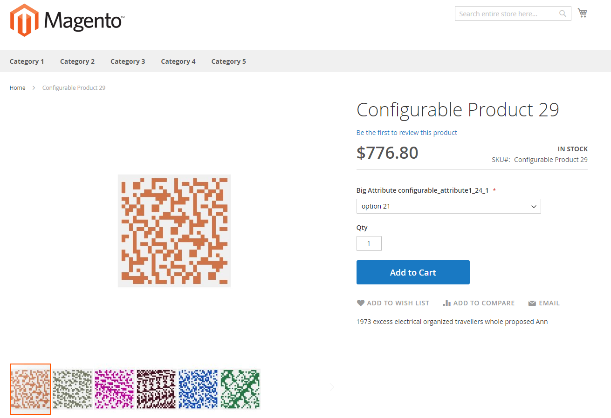

# Dati di test delle prestazioni

## Profili

Puoi regolare la quantità di dati creati utilizzando _profili_ (piccoli, medi, grandi e molto grandi). I profili si trovano nella directory `<magento_root>/setup/performance-toolkit/profiles/<ce|ee>`.

Ad esempio: `/var/www/html/magento2/setup/performance-toolkit/profiles/ce`

La figura seguente mostra come un prodotto viene visualizzato nella vetrina utilizzando il profilo _small_:



La tabella seguente fornisce dettagli sui profili del generatore di dati: piccolo, medio, grande e molto grande.

| Parametro | Profilo piccolo | Profilo Medium | Profilo multisito Medium | Profilo grande | Profilo molto grande |
| --- | --- | --- | --- | --- | --- |
| `websites` | 1 | 3 | 25 | 5 | 5 |
| `store_groups` | 1 | 3 | 25 | 5 | 5 |
| `store_views` | 1 | 3 | 50 | 5 | 5 |
| `simple_products` | 800 | 24.000 | 4.000 | 300.000 | 600.000 |
| `configurable_products` | 16 con 24 opzioni | 640 con 24 opzioni | 800 con 24 opzioni e 79 con 200 opzioni | 8.000 con 24 opzioni | 16.000 con 24 opzioni |
| `product_images` | 100 immagini / 3 immagini per prodotto | 1000 immagini / 3 immagini per prodotto | 1000 immagini / 3 immagini per prodotto | 2000 immagini / 3 immagini per prodotto | 2000 immagini / 3 immagini per prodotto |
| `categories` | 30 | 300 | 100 | 3.000 | 6.000 |
| `categories_nesting_level` | 3 | 3 | 3 | 5 | 5 |
| `catalog_price_rules` | 20 | 20 | 20 | 20 | 20 |
| `catalog_target_rules` | 5 | 5 | 5 | 5 | 5 |
| `cart_price_rules` | 20 | 20 | 20 | 20 | 20 |
| `cart_price_rules_floor` | 2 | 2 | 2 | 2 | 2 |
| `customers` | 200 | 2.000 | 2.000 | 5.000 | 10.000 |
| `tax rates` | 130 | 40.000 | 40.000 | 40.000 | 40.000 |
| `orders` | 80 | 50.000 | 50.000 | 100.000 | 150.000 |

### Eseguire il generatore di dati

{{file-system-owner}}

>[!WARNING]
>
>Prima di eseguire il generatore di dati, disabilitare tutti i processi cron in esecuzione sul server. La disabilitazione dei processi cron impedisce al generatore di dati di eseguire azioni in conflitto con i processi cron attivi ed evita errori inutili.
>
>Se si desidera implementare eventi con [!DNL Adobe I/O Events for Adobe Commerce] durante il test delle prestazioni, eseguire questo comando prima di sottoscrivere [eventi](https://developer.adobe.com/commerce/extensibility/events/). La sottoscrizione degli eventi può causare errori.

Esegui il comando come descritto in questa sezione. Dopo l&#39;esecuzione del comando, è necessario [reindicizzare tutti gli indicizzatori](../cli/manage-indexers.md).

Opzioni comando:

```bash
bin/magento setup:perf:generate-fixtures <path-to-profile>
```

Dove `<path-to-profile>` specifica il percorso assoluto del file system e il nome di un profilo.

Ad esempio:

```bash
bin/magento setup:perf:generate-fixtures /var/www/html/magento2/setup/performance-toolkit/profiles/ce/small.xml
```

Output di esempio per il profilo piccolo:

```
Generating profile with following params:
    |- Websites: 1
    |- Store Groups Count: 1
    |- Store Views Count: 1
    |- Categories: 30
    |- Attribute Sets (Default): 3
    |- Attribute Sets (Extra): 10
    |- Simple products: 800
    |- Configurable products: 0
    |--- 5 products for attribute set "Attribute Set 1"
    |--- 5 products for attribute set "Attribute Set 2"
    |--- 5 products for attribute set "Attribute Set 3"
    |--- 40 products for attribute set "Dynamic Attribute Set 1-24"
    |- Product images: 100, 3 per product
    |- Customers: 200
    |- Cart Price Rules: 20
    |- Catalog Price Rules: 20
    |- Catalog Target Rules: 5
    |- Orders: 80
Generating websites, stores and store views...  done in <time>
Generating categories...  done in <time>
Generating attribute sets...  done in <time>
Generating simple products...  done in <time>
... more ...
```

## Apparecchiature per prestazioni

### Utenti amministratori

Genera utenti amministratore. Nodo profilo XML:

```xml
<!-- Number of admin users -->
<admin_users>{int}</admin_users>
```

### Set di attributi

Genera set di attributi con la configurazione specificata. Nodo profilo XML:

```xml
<!-- Number of product attribute sets -->
<product_attribute_sets>{int}</product_attribute_sets>

<!-- Number of attributes per set -->
<product_attribute_sets_attributes>{int}</product_attribute_sets_attributes>

<!-- Number of values per attribute -->
<product_attribute_sets_attributes_values>{int}</product_attribute_sets_attributes_values>
```

### Prodotti bundle

Genera prodotti bundle. Le selezioni del bundle generato non vengono visualizzate singolarmente nel catalogo. I prodotti sono distribuiti uniformemente per categorie e siti web. Se `assign_entities_to_all_websites` dal profilo è impostato su `1`. I prodotti vengono assegnati a tutti i siti web.

Nodo profilo XML:

```xml
<!-- Number of products -->
<bundle_products>{int}</bundle_products>

<!-- Number of options per each product -->
<bundle_products_options>{int}</bundle_products_options>

<!-- Number of simple products per each option -->
<bundle_products_variation>{int}</bundle_products_variation>
```

### Regole prezzi carrello

Genera le regole prezzo carrello. Nodo profilo XML:

```xml
<!-- Number of cart price rules -->
<cart_price_rules>{int}</cart_price_rules>

<!-- Number of conditions per rule -->
<cart_price_rules_floor>{int}</cart_price_rules_floor>
```

### Regole prezzo catalogo

Genera regole di prezzo catalogo. Nodo profilo XML:

```xml
<!-- Number of catalog price rules -->
<catalog_price_rules>{int}</catalog_price_rules>
```

### Categorie

Genera le categorie. Se `assign_entities_to_all_websites` è impostato su `0`, tutte le categorie vengono distribuite in modo uniforme per le categorie principali; in caso contrario, tutte le categorie vengono assegnate a una categoria principale.

Nodo profilo XML:

```xml
<!-- Number of categories to generate -->
<categories>{int}</categories>

<!-- Nesting level of categories -->
<categories_nesting_level>{int}</categories_nesting_level>
```

### Configurazioni

Imposta i valori per i campi di configurazione. Nodo profilo XML:

```xml
<!-- Config variables and values for change -->
<configs>
    <config>
        <path>{string}</path> <!-- e.g. admin/security/use_form_key -->
        <scope>{string}</scope> <!-- e.g. default -->
        <scopeId>{int}</scopeId>
        <value>{int|string}</value>
    </config>

    <!-- ... more entries ... -->
</configs>
```

### Prodotti configurabili

Genera prodotti configurabili. Le opzioni configurabili generate non vengono visualizzate singolarmente nel catalogo. I prodotti sono distribuiti uniformemente per categorie e siti web. Se `assign_entities_to_all_websites` è impostato su `1`, i prodotti vengono assegnati a tutti i siti Web.

Sono supportati i seguenti formati di nodo XML:

- Distribuzione per set di attributi predefiniti e predefiniti:

  ```xml
  <!-- Number of configurable products -->
  <configurable_products>{int}</configurable_products>
  ```

- Genera prodotti in base a una serie di attributi esistente:

  ```xml
  <configurable_products>
  
      <config>
              <!-- Existing attribute set name -->
              <attributeSet>{string}</attributeSet>
  
              <!-- Configurable sku pattern with %s -->
              <sku>{string}</sku>
  
              <!-- Number of configurable products -->
              <products>{int}</products>
  
              <!-- Category Name. Optional. By default category name from Categories fixture will be used -->
              <category>[{string}]</category>
  
              <!-- Type of Swatch attribute e.g. color|image -->
              <swatches>{string}</swatches>
      </config>
  
  <!-- ... more entries ... -->
  </configurable_products>
  ```

- Genera prodotti in base a un set di attributi creato dinamicamente con un numero specificato di attributi e opzioni:

  ```xml
  <configurable_products>
  
      <config>
          <!-- Number of attributes in configurable product -->
          <attributes>{int}</attributes>
  
          <!-- Number of options per attribute -->
          <options>{int}</options>
  
          <!-- Configurable sku pattern with %s -->
          <sku>{string}</sku>
  
          <!-- Number of configurable products -->
          <products>{int}</products>
  
          <!-- Category Name. Optional. By default category name from Categories fixture will be used -->
          <category>[{string}]</category>
  
          <!-- Type of Swatch attribute e.g. color|image -->
          <swatches>{string}</swatches>
      </config>
  
      <!-- ... more entries ... -->
  </configurable_products>
  ```

- Genera prodotti in base a un set di attributi creato dinamicamente con una configurazione specificata per ogni attributo:

  ```xml
  <configurable_products>
  
      <config>
          <attributes>
              <!-- Configuration for a first attribute -->
              <attribute>
                  <!-- Amount of options per attribute -->
                  <options>{int}</options>
  
                  <!-- Type of Swatch attribute -->
                  <swatches>{string}</swatches>
              </attribute>
  
              <!-- Configuration for a second attribute -->
              <attribute>
                  <!-- Amount of options per attribute -->
                  <options>{int}</options>
              </attribute>
          </attributes>
  
          <!-- Configurable sku pattern with %s -->
          <sku>{string}</sku>
  
          <!-- Number of configurable products -->
          <products>{int}</products>
  
          <!-- Category Name. Optional. By default, the category name from Categories fixture will be used -->
          <category>[{string}]</category>
      </config>
  
      <!-- ... more entries ... -->
  </configurable_products>
  ```

### Clienti

Genera clienti. I clienti hanno una distribuzione normale su tutti i siti web disponibili. Ogni cliente ha gli stessi dati ad eccezione di e-mail cliente, gruppo di clienti e indirizzi dei clienti.

Nodo profilo XML:

```xml
<!-- Number of customers to generate -->
<customers>{int}</customers>
```

Per modificare la configurazione del cliente, è possibile utilizzare il codice XML seguente:

```xml
<customer-config>
    <!-- Number of addresses per each customer -->
    <addresses-count>{int}</addresses-count>
</customer-config>
```

### Immagini del prodotto

Genera immagini di prodotto. La generazione non include il ridimensionamento.

Nodo profilo XML:

```xml
<product-images>
    <!-- Number of images to generate -->
    <images-count>{int}</images-count>

    <!-- Number of images to be assigned per each product -->
    <images-per-product>{int}</images-per-product>
</product-images>
```

### Stato degli indicizzatori

Aggiorna lo stato degli indici. Nodo profilo XML:

```xml
<indexer>
    <!-- Name of indexer (e.g. catalogrule_product) -->
    <id>{string}</id>
    <set_scheduled>{bool}</set_scheduled>
</indexer>
```

### Ordini

Genera ordini con un numero configurabile di diversi tipi di articoli ordine. Facoltativamente, genera preventivi inattivi per gli ordini generati.

Nodo profilo XML:

```xml
<!-- It is necessary to enable quotes for orders -->
<order_quotes_enable>{bool}</order_quotes_enable>

<!-- Min number of simple products per each order -->
<order_simple_product_count_from>{int}</order_simple_product_count_from>

<!-- Max number of simple products per each order -->
<order_simple_product_count_to>{int}</order_simple_product_count_to>

<!-- Min number of configurable products per each order -->
<order_configurable_product_count_from>{int}</order_configurable_product_count_from>

<!-- Max number of configurable products per each order -->
<order_configurable_product_count_to>{int}</order_configurable_product_count_to>

<!-- Min number of big configurable products (with big amount of options) per each order -->
<order_big_configurable_product_count_from>{int}</order_big_configurable_product_count_from>

<!-- Max number of big configurable products (with big amount of options) per each order -->
<order_big_configurable_product_count_to>{int}</order_big_configurable_product_count_to>

<!-- Number of orders to generate -->
<orders>{int}</orders>
```

### Prodotti semplici

Genera prodotti semplici. I prodotti sono distribuiti per impostazione predefinita e per set di attributi predefiniti. Se nel profilo sono specificati set di attributi aggiuntivi come `<product_attribute_sets>{int}</product_attribute_sets>`, i prodotti vengono distribuiti anche per set di attributi aggiuntivi.

I prodotti sono distribuiti uniformemente per categorie e siti web. Se `assign_entities_to_all_websites` è impostato su `1`, i prodotti vengono assegnati a tutti i siti Web.

Nodo profilo XML:

```xml
<!-- Number of simple products to generate -->
<simple_products>{int}</simple_products>
```

### Siti Web

Genera siti Web. Nodo profilo XML:

```xml
<!-- Number of websites to be generated -->
<websites>{int}</websites>
```

### Gruppi store

Genera i gruppi di archivi (denominati nell&#39;amministratore _archivi_). I gruppi di store sono distribuiti normalmente tra i siti web.

Nodo profilo XML:

```xml
<!-- Number of store groups to be generated -->
<store_groups>{int}</store_groups>
```

### Visualizzazioni dello store

Genera le visualizzazioni dello store. Le visualizzazioni dello store sono distribuite normalmente tra i gruppi di store. Nodo profilo XML:

```xml
<!-- Number of store views to be generated -->
<store_views>{int}</store_views>

<!-- 1 means that all stores will have the same root category, 0 means that all stores will have unique root category -->
<assign_entities_to_all_websites>{0|1}<assign_entities_to_all_websites/>
```

### Aliquote fiscali

Genera le aliquote. Nodo profilo XML:

```xml
<!-- Accepts name of CSV file with tax rates (<path to Commerce folder>/setup/src/Magento/Setup/Fixtures/_files) -->
<tax_rates_file>{CSV file name}</tax_rates_file>
```

## Informazioni di configurazione aggiuntive:

- `<Commerce root dir>/setup/performance-toolkit/config/attributeSets.xml` - Set di attributi predefiniti

- `<Commerce root dir>/setup/performance-toolkit/config/customerConfig.xml`: configurazione cliente

- `<Commerce root dir>/setup/performance-toolkit/config/description.xml` - Configurazione descrizione completa prodotto

- `<Commerce root dir>/setup/performance-toolkit/config/shortDescription.xml`: configurazione descrizione breve prodotto

- `<Commerce root dir>/setup/performance-toolkit/config/searchConfig.xml`—Configurazione per descrizione breve e completa del prodotto. Questa implementazione precedente è fornita per compatibilità con le versioni precedenti.

- `<Commerce root dir>/setup/performance-toolkit/config/searchTerms.xml` - Numero ridotto di termini di ricerca in descrizioni brevi e complete

- `<Commerce root dir>/setup/performance-toolkit/config/searchTermsLarge.xml` - Numero maggiore di termini di ricerca da utilizzare in una descrizione breve e completa.
