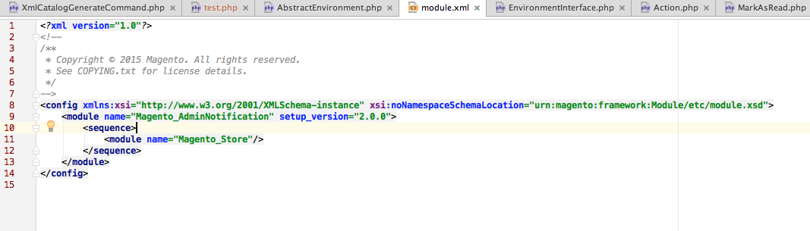

# Panoramica dell’evidenziatore URN

{{file-system-owner}}

Il codice Commerce fa riferimento a tutti gli schemi XSD come [Nomi delle risorse uniformi (URN)](https://www.ietf.org/rfc/rfc2141.txt). Se stai sviluppando codice e devi fare riferimento a XSD, questo comando configura l’ambiente di sviluppo integrato (IDE) per riconoscere ed evidenziare gli URL. Questo rende lo sviluppo più facile.

Per impostazione predefinita, un IDE come PhpStorm non è configurato per riconoscere gli URL e, di conseguenza, viene visualizzato in rosso come segue:


La `bin/magento dev:urn-catalog:generate` consente all&#39;IDE (attualmente solo codice PhpStorm e Visual Studio) di riconoscere ed evidenziare gli URL come segue:



In particolare, questo comando crea la seguente configurazione PhpStorm:


## Configurare l’IDE

Attualmente sono supportati solo codici PhpStorm e Visual Studio.

Sintassi di comando:

```bash
bin/magento dev:urn-catalog:generate <path>
```

Dove `<path>` è il percorso del tuo PhpStorm `misc.xml` , che si trova rispetto alla directory principale del progetto. In genere, `<path>` è `.idea/misc.xml`.

>[!INFO]
>
>Per mantenere aggiornati i tuoi &quot;Schemi e DTD&quot;, esegui la `dev:urn-catalog:generate` ogni volta che aggiungi, modifichi o rimuovi moduli Commerce 2 contenenti `*.xsd` file.
