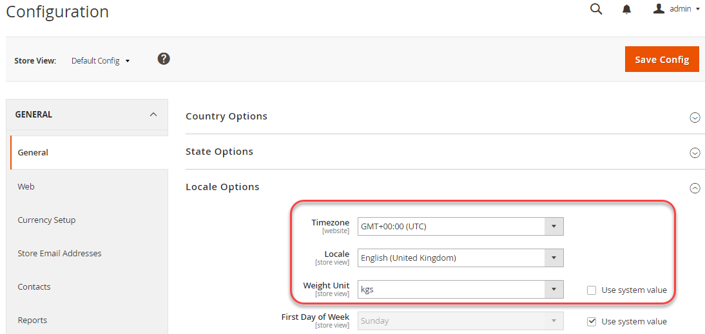

# Esempio di utilizzo di una configurazione condivisa

Questo esempio mostra come modificare le seguenti impostazioni nel sistema di sviluppo, aggiornare il file di configurazione condiviso, `config.php`, nel sistema di generazione e implementa le stesse impostazioni nel sistema di produzione:

- Fuso orario
- Unità di peso

Queste impostazioni sono disponibili in Admin in **Negozi** > Impostazioni > **Configurazione** > Generale > **Generale**.

È possibile utilizzare la stessa procedura per configurare le impostazioni non sensibili specifiche del sistema nei seguenti riferimenti:

- [Riferimento ad altri percorsi di configurazione](../reference/config-reference-general.md)
- [Riferimento per i percorsi di configurazione dei pagamenti](../reference/config-reference-payment.md)
- [Riferimento per i percorsi di configurazione dell’estensione Commerce Enterprise B2B](../reference/config-reference-b2b.md)

## Prima di iniziare

Prima di iniziare, impostare le autorizzazioni e la proprietà del file system come descritto in [Prerequisiti per i sistemi di sviluppo, generazione e produzione](../deployment/prerequisites.md).

## Ipotesi

Questo argomento fornisce un esempio di modifica della configurazione del sistema di produzione. Se lo desideri, puoi scegliere diverse opzioni di configurazione.

Ai fini di questo esempio, si assume quanto segue:

- Utilizzare il controllo sorgente Git
- Il sistema di sviluppo è disponibile in un archivio remoto Git denominato `mconfig`
- Il tuo ramo di lavoro Git si chiama `m2.2_deploy`

## Passaggio 1: Impostare la configurazione nel sistema di sviluppo

Per impostare il fuso orario e le unità di peso nel sistema di sviluppo:

1. Accedi all&#39;amministratore.
1. Fai clic su **Negozi** > Impostazioni > **Configurazione** > Generale > **Generale**.
1. Nel riquadro a destra, espandi **Opzioni internazionali**.

   Nella figura seguente viene illustrato un esempio.

   

1. Da **Fuso orario** elenco, fai clic su **GMT+00.00 (UTC)**.
1. Elimina **Usa valore di sistema** accanto a **Unità di misura** campo .
1. Da **Unità di misura** elenco, fai clic su **kgs**.
1. Fai clic su **Salva configurazione**.
1. Se richiesto, svuota la cache.

## Passaggio 2: Aggiorna la configurazione condivisa

Genera il file di configurazione condiviso, `app/etc/config.php`, nel sistema di sviluppo e trasferiscilo utilizzando il controllo del codice sorgente nel sistema di build, come descritto in questa sezione.

{{$include /help/_includes/config-save-config.md}}

## Passaggio 3: Aggiorna il sistema di compilazione e genera file

Dopo aver eseguito il commit delle modifiche nella configurazione condivisa nel controllo del codice sorgente, è possibile estrarre tali modifiche nel sistema di compilazione, compilare il codice e generare file statici. L&#39;ultimo passo è quello di estrarre queste modifiche al sistema di produzione. Di conseguenza, la configurazione del sistema di produzione corrisponderà al sistema di sviluppo.

{{$include /help/_includes/config-update-build-system.md}}

## Passaggio 4: Aggiornare il sistema di produzione

L&#39;ultimo passaggio del processo consiste nell&#39;aggiornare il sistema di produzione dal controllo del codice sorgente. Questo richiama tutte le modifiche apportate ai sistemi di sviluppo e di generazione, il che significa che il sistema di produzione è completamente aggiornato.

{{$include /help/_includes/config-update-prod-system.md}}

### Verifica le modifiche nell’amministratore

**Per verificare che queste impostazioni non siano modificabili in Admin**:

1. Accedi all&#39;amministratore.
1. Fai clic su **Negozi** > Impostazioni > **Configurazione** > Generale > **Generale**.
1. Nel riquadro a destra, espandi **Opzioni internazionali**.

   Le opzioni appena impostate vengono visualizzate come segue:

   

>[!INFO]
>
>Per modificare un&#39;impostazione bloccata nell&#39;amministratore, utilizza [`magento config:set --lock` command](../cli/set-configuration-values.md).
