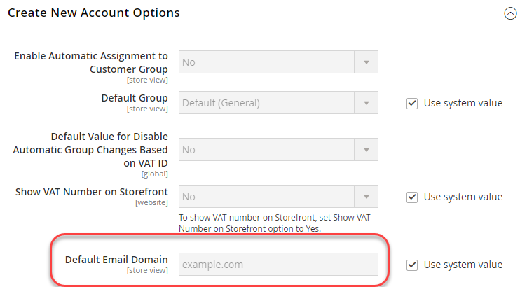

# Esempio di utilizzo dei comandi CLI

Questo esempio mostra come impostare valori condivisi, specifici del sistema e sensibili nel sistema di sviluppo, quindi distribuire tali valori nel sistema di produzione.
Questa operazione viene eseguita utilizzando una combinazione di configurazioni condivise, il file `config.php` e il comando CLI di Commerce.

In questo esempio vengono utilizzate le impostazioni di configurazione seguenti:

- **Numero Iva** e **Nome archivio** per le impostazioni di configurazione condivise.

  Sono disponibili in **Archivi** > Impostazioni > **Configurazione** > Generale > **Generale**.

- **Invia e-mail a** per il valore di configurazione sensibile.

  Si trova in **Archivi** > Impostazioni > **Configurazione** > Generale > **Contatti**.

- **Dominio e-mail predefinito** per il valore di configurazione specifico del sistema.

  Si trova in **Archivi** > Impostazioni > **Configurazione** > Clienti > **Configurazione cliente** > **Crea nuove opzioni account**.

È possibile utilizzare la stessa procedura illustrata in questo esempio per configurare le impostazioni nei seguenti riferimenti:

- [Riferimento ai percorsi di configurazione sensibili e specifici del sistema](../reference/config-reference-sens.md)
- [Riferimento ai percorsi di configurazione dei pagamenti](../reference/config-reference-payment.md)
- [Altri percorsi di configurazione di riferimento](../reference/config-reference-general.md)
- [Riferimento ai percorsi di configurazione dell’estensione Commerce Enterprise B2B](../reference/config-reference-b2b.md)

## Prima di iniziare

Prima di iniziare, configurare le autorizzazioni e la proprietà del file system come descritto in [Prerequisiti per i sistemi di sviluppo, compilazione e produzione](../deployment/prerequisites.md).

## Presupposti

Questo argomento fornisce un esempio di modifica della configurazione del sistema di produzione. Se lo desideri, puoi scegliere diverse opzioni di configurazione.

Ai fini del presente esempio, si assume quanto segue:

- Usa il controllo del codice sorgente Git
- Il sistema di sviluppo è disponibile in un archivio remoto Git denominato `mconfig`
- Il ramo di lavoro Git è denominato `m2.2_deploy`

## Passaggio 1: impostare la configurazione nel sistema di sviluppo

Per impostare le impostazioni internazionali e le unità di misura predefinite nel sistema di sviluppo:

1. Accedi all’amministratore.
1. Fai clic su **Archivi** > Impostazioni > **Configurazione** > Generale > **Generale**.
1. Se sono disponibili più siti Web, utilizzare l&#39;elenco **Visualizzazione store** nell&#39;angolo superiore sinistro per passare a un sito Web diverso, come illustrato nella figura seguente.

   

1. Nel riquadro destro espandere **Informazioni archivio**.
1. Se necessario, deselezionare la casella di controllo **Usa predefinito** accanto ai campi **Partita IVA** e **Nome archivio**.
1. Immettere un numero nel campo, ad esempio `12345`.
1. Nel campo **Nome archivio**, immetti un valore (ad esempio `My Store`).
1. Fai clic su **Salva configurazione**.
1. Nel menu di navigazione a sinistra, in Generale, fare clic su **Contatti**.
1. Nel riquadro di destra espandere **Opzioni e-mail**.
1. Se necessario, deselezionare la casella di controllo **Usa predefinito** accanto al campo **Invia e-mail a**.
1. Immetti un indirizzo e-mail nel campo.
1. Fai clic su **Salva configurazione**.
1. Utilizzare l&#39;elenco **Visualizzazione archivio** per selezionare la **Configurazione predefinita**, come illustrato nella figura seguente.

   

1. Nel riquadro sinistro fare clic su Clienti > **Configurazione cliente**.
1. Nel riquadro di destra espandere **Crea nuove opzioni account**.
1. Se necessario, deselezionare la casella di controllo **Usa valore di sistema** accanto al campo **Dominio e-mail predefinito**.
1. Immetti un nome di dominio nel campo.
1. Fai clic su **Salva configurazione**.
1. Se richiesto, svuotare la cache.

## Passaggio 2: aggiornare la configurazione

Dopo aver modificato la configurazione nell’amministratore, scrivi la configurazione condivisa in un file come seguendo la procedura riportata di seguito:

{{$include /help/_includes/config-save-config.md}}

Anche se `app/etc/env.php` (la configurazione specifica del sistema) è stata aggiornata, non archiviarla nel controllo del codice sorgente.
Le stesse impostazioni di configurazione verranno create nel sistema di produzione più avanti in questa procedura.

## Passaggio 3: aggiornare il sistema di generazione e generare i file

Dopo aver confermato le modifiche apportate alla configurazione condivisa nel controllo del codice sorgente, è possibile richiamarle nel sistema di build, compilare il codice e generare file statici.

{{$include /help/_includes/config-update-build-system.md}}

## Passaggio 4: aggiornare il sistema di produzione

L’ultimo passaggio del processo consiste nell’aggiornare il sistema di produzione. È necessario eseguire questa operazione in due parti:

- Aggiornare le impostazioni sensibili e specifiche del sistema
- Aggiornare le impostazioni condivise

### Aggiornare le impostazioni sensibili e specifiche del sistema

Per impostare le impostazioni sensibili e specifiche del sistema utilizzando le variabili di ambiente, è necessario conoscere quanto segue:

- Ambito per ogni impostazione

  Se hai seguito le istruzioni del passaggio 1, l&#39;ambito per **Inviare e-mail a** è sito Web e l&#39;ambito per **Dominio e-mail predefinito** è globale (ovvero l&#39;ambito di configurazione predefinito).

  È necessario il codice del sito Web per impostare il valore di configurazione **Invia e-mail a**.

  Per ulteriori informazioni sulla ricerca di questo valore, vedere: [Utilizzare le variabili di ambiente per ignorare le impostazioni di configurazione](../reference/override-config-settings.md#environment-variables).

- Percorsi di configurazione per le impostazioni utilizzate in questo esempio:

  | Nome impostazione | Percorso di configurazione |
  | -------------------- | -------------------------------------- |
  | Invia e-mail a | `contact/email/recipient_email` |
  | Dominio e-mail predefinito | `customer/create_account/email_domain` |

  Per tutti i percorsi di configurazione sensibili e specifici del sistema, vedere: [Riferimento percorsi di configurazione sensibili e specifici del sistema](../reference/config-reference-sens.md).

### Impostare le variabili utilizzando i comandi CLI

Utilizzare i seguenti comandi CLI per impostare le impostazioni di configurazione specifiche del sistema e sensibili:

- `magento config:set` per le impostazioni specifiche del sistema
- `magento config:sensitive:set` per le impostazioni sensibili

Per impostare l&#39;impostazione specifica del sistema **Dominio e-mail predefinito**, che si trova nell&#39;ambito predefinito, utilizzare il comando seguente:

```bash
bin/magento config:set customer/create_account/email_domain <email domain>
```

Non è necessario utilizzare l&#39;ambito nel comando perché è l&#39;ambito predefinito.

Per impostare i valori per **Invia e-mail a**, è tuttavia necessario conoscere il tipo di ambito (`website`) e il codice di ambito, che probabilmente è diverso in ogni sito.

Esempio:

```unix
bin/magento config:sensitive:set contact/email/recipient_email --scope=website --scope-code=<website code> <email address>
```

### Aggiornare le impostazioni condivise

Questa sezione illustra come richiamare tutte le modifiche apportate ai sistemi di sviluppo e di creazione in un ambiente di produzione, che aggiorna le impostazioni di configurazione condivise (Nome store e Partita IVA).

{{$include /help/_includes/config-update-prod-system.md}}

### Verificare le impostazioni di configurazione in Admin

Per verificare le impostazioni di configurazione:

1. Accedi all’amministratore del sistema di produzione.
1. Fai clic su **Archivi** > Impostazioni > **Configurazione** > Generale > **Generale**.
1. Utilizza l&#39;elenco **Visualizzazione archivio** nell&#39;angolo superiore sinistro per passare a un altro sito Web.

   Le opzioni di configurazione condivise impostate nel sistema di sviluppo vengono visualizzate in modo simile alle seguenti.

   

   >[!INFO]
   >
   >Il campo **Nome archivio** è modificabile nell&#39;ambito del sito Web ma non è modificabile se si passa all&#39;ambito Configurazione predefinita. Questo è il risultato di come si impostano le opzioni nel sistema di sviluppo. Il valore di **Partita IVA** non è modificabile nell&#39;ambito del sito Web.

1. Se non lo hai già fatto, passa all’ambito Configurazione predefinita.
1. Nel menu di navigazione a sinistra, in Generale, fare clic su **Contatti**.

   Il campo **Invia e-mail a** non è modificabile, come illustrato nella figura seguente. Si tratta di un’impostazione sensibile.

   

1. Nel riquadro sinistro fare clic su Clienti > **Configurazione cliente**.
1. Nel riquadro di destra espandere **Crea nuove opzioni account**.

   Il valore del campo **Dominio e-mail predefinito** viene visualizzato come segue. Si tratta di un’impostazione specifica del sistema.

   
