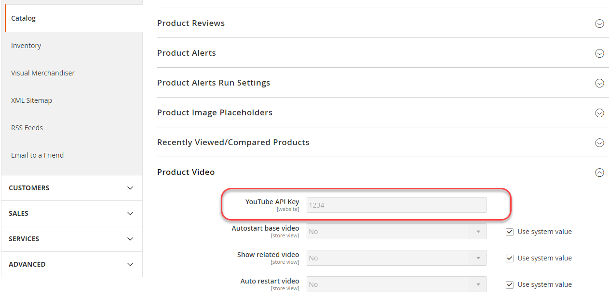

# Configurazione del sistema di produzione

Puoi avere un sistema di produzione. Tutte le seguenti condizioni devono essere soddisfatte:

- Tutto il codice Commerce si trova nel controllo del codice sorgente nello stesso archivio dei sistemi di sviluppo e generazione
- Assicurati che tutte le seguenti operazioni siano _incluso_ nel controllo del codice sorgente:

   - `app/etc/config.php`
   - `generated` directory (e sottodirectory)
   - `pub/media` directory
   - `pub/media/wysiwyg` directory (e sottodirectory)
   - `pub/static` directory (e sottodirectory)

- È necessario installare e impostare Commerce 2.2 o versione successiva per [modalità di produzione](../bootstrap/application-modes.md#production-mode)
- Ha la proprietà del file system e le autorizzazioni impostate come descritto in [Prerequisito per i sistemi di sviluppo, generazione e produzione](../deployment/prerequisites.md).

## Configurare una macchina di produzione

Per impostare una macchina di produzione:

1. Dopo aver installato Commerce o averlo estratto dal controllo del codice sorgente, accedi al server di produzione come proprietario del file system o passa a.
1. Crea `~/.ssh/.composer/auth.json` se non lo ha già fatto.

   Crea la directory:

   ```bash
   mkdir -p ~/.ssh/.composer
   ```

   Crea `auth.json` in tale directory.

   `auth.json` deve contenere [chiavi di autenticazione](../../installation/prerequisites/authentication-keys.md).

   Di seguito è riportato un esempio:

   ```json
   {
      "http-basic": {
         "repo.magento.com": {
            "username": "<your public key>",
            "password": "<your private key>"
         }
      }
   }
   ```

1. Salva le modifiche apportate a `auth.json`.
1. Copia `<Commerce root dir>/app/etc/env.php` dal sistema di sviluppo al sistema di produzione.
1. Apri `env.php` in un editor di testo e modificare i valori necessari (ad esempio, informazioni sulla connessione al database).
1. Esegui il [`magento config:set`](../cli/set-configuration-values.md) o [`magento config:set-sensitive`](../cli/set-configuration-values.md) per impostare i valori di qualsiasi valore di configurazione sensibile o specifico del sistema, rispettivamente.

   Nella sezione seguente viene illustrato un esempio.

## Imposta i valori di configurazione sul sistema di produzione

Questa sezione illustra come impostare i valori sensibili sul sistema di produzione utilizzando `magento config:sensitive:set` comando.

Per impostare i valori sensibili:

1. Trova un valore da impostare utilizzando [riferimento valore sensibile](../reference/config-reference-sens.md).
1. Prendi nota del percorso di configurazione per l’impostazione.
1. Accedi al sistema di produzione come proprietario del file system o passa a tale proprietario.
1. Passa alla directory di installazione di Commerce.
1. Immetti il comando seguente:

   ```bash
   bin/magento config:sensitive:set {configuration path} {value}
   ```

   Ad esempio, per impostare il valore della chiave API di YouTube su `1234`, immetti

   ```bash
   bin/magento config:sensitive:set catalog/product_video/youtube_api_key 1234
   ```

   Puoi anche impostare uno o più valori in modo interattivo, come segue:

   ```bash
   bin/magento config:sensitive:set -i
   ```

   Quando richiesto, immettere un valore per ogni impostazione sensibile o premere Invio per ignorare un valore e passare a quello successivo.

1. Per verificare che il valore sia stato impostato, accedi all’amministratore.
1. Individua l’impostazione in Admin.

   Ad esempio, l’impostazione della chiave API di YouTube si trova in **Negozi** > Impostazioni > **Configurazione** > **Catalogo** > **Catalogo** > **Video prodotto**.

   L’impostazione viene visualizzata in Admin (Amministrazione) e non può essere modificata. Nella figura seguente viene illustrato un esempio.

   
