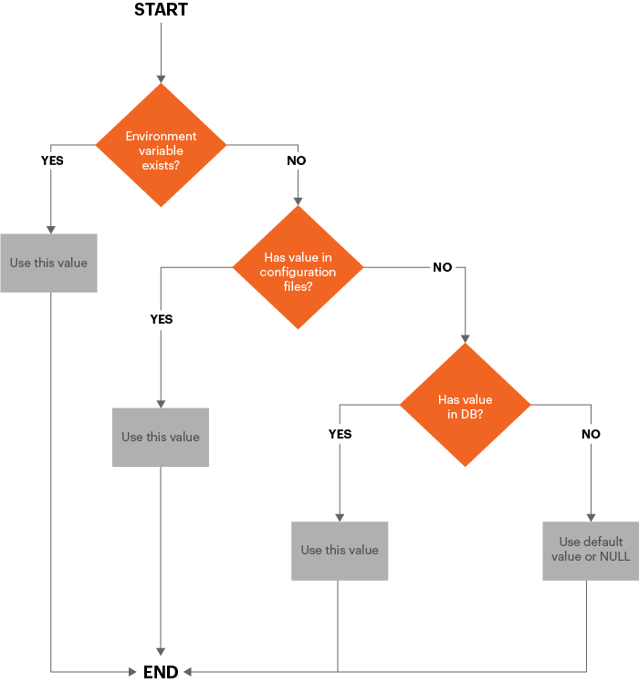

# Dettagli tecnici

Questo argomento illustra i dettagli dell’implementazione tecnica relativi all’implementazione della pipeline in Commerce 2.2 e versioni successive. I miglioramenti possono essere suddivisi nei seguenti settori:

- [Gestione della configurazione](#configuration-management)
- [Modifiche nell&#39;amministratore](#changes-in-the-admin)
- [Installa e rimuovi cron](#install-and-remove-cron)

Questo argomento discute anche della [flusso di lavoro consigliato](#recommended-workflow) per l’implementazione della pipeline e fornisce alcuni esempi per aiutarti a comprendere come funziona.

Prima di iniziare, consulta la sezione [Prerequisiti per i sistemi di sviluppo, generazione e produzione](../deployment/prerequisites.md).

## Gestione della configurazione

Per sincronizzare e mantenere la configurazione dei sistemi di sviluppo e produzione, utilizza il seguente schema di sostituzione.



Come illustrato nel diagramma, i valori di configurazione vengono utilizzati nell’ordine seguente:

1. Le variabili di ambiente, se presenti, sostituiscono tutti gli altri valori.
1. Dai file di configurazione condivisi `env.php` e `config.php`. Valori in `env.php` sostituisci i valori in `config.php`.
1. Da valori memorizzati nel database.
1. Se non esiste alcun valore in una di queste origini, viene utilizzato il valore predefinito o NULL.

### Gestire la configurazione condivisa

La configurazione condivisa è memorizzata in `app/etc/config.php`, che dovrebbe essere nel controllo della sorgente.

Imposta la configurazione condivisa nell’amministratore nello sviluppo (o nell’infrastruttura cloud di Adobe Commerce) _integrazione_) e scrivi la configurazione in `config.php` utilizzando [`magento app:config:dump` command](../cli/export-configuration.md).

### Gestire la configurazione specifica del sistema

La configurazione specifica del sistema è memorizzata in `app/etc/env.php`che _not_ essere nel controllo della sorgente.

Imposta la configurazione specifica del sistema nell’amministratore del sistema di sviluppo (o Adobe Commerce sull’integrazione dell’infrastruttura cloud) e scrivi la configurazione in `env.php` utilizzando [`magento app:config:dump` command](../cli/export-configuration.md).

Questo comando scrive anche le impostazioni sensibili in `env.php`.

### Gestire la configurazione sensibile

La configurazione sensibile viene memorizzata anche in `app/etc/env.php`.

Puoi gestire la configurazione sensibile in uno dei seguenti modi:

- Variabili di ambiente
- Salva la configurazione sensibile in `env.php` nel sistema di produzione utilizzando [`magento config:set:sensitive` command](../cli/set-configuration-values.md)

### Impostazioni di configurazione bloccate nell&#39;amministratore

Qualsiasi impostazione di configurazione in `config.php` o `env.php` sono bloccati nell&#39;amministratore; in altre parole, tali impostazioni non possono essere modificate nell’amministratore.
Utilizza la [`magento config:set` o `magento config:set --lock`](../cli/export-configuration.md#config-cli-config-set) per modificare le impostazioni nella `config.php` o `env.php` file.

## Amministratore Commerce

L’amministratore mostra il seguente comportamento in modalità di produzione:

- Non puoi abilitare o disabilitare i tipi di cache nell’amministratore
- Le impostazioni per gli sviluppatori non sono disponibili (**Negozi** > Impostazioni > **Configurazione** > Avanzate > **Sviluppatore**), compresi:

   - Minimizzare CSS, JavaScript e HTML
   - Unisci CSS e JavaScript
   - Compilazione LESS lato server o lato client
   - Traduzioni in linea
   - Come descritto in precedenza, qualsiasi impostazione di configurazione in `config.php` o `env.php` è bloccato e non può essere modificato nell&#39;amministratore.
   - Puoi modificare le impostazioni internazionali Amministratore solo per le lingue utilizzate dai temi distribuiti

      Nella figura seguente viene illustrato un esempio di **Impostazione account** > **Impostazioni internazionali interfaccia** nell’elenco Admin che mostra solo due impostazioni internazionali distribuite:

      

- Non è possibile modificare le configurazioni internazionali per alcun ambito utilizzando l&#39;Admin.

   È consigliabile apportare queste modifiche prima di passare alla modalità Produzione.

   È comunque possibile configurare le impostazioni internazionali utilizzando le variabili di ambiente o `config:set` Comando CLI con il percorso `general/locale/code`.

## Installa e rimuovi cron

Nella versione 2.2 per la prima volta, ti aiutiamo a configurare il tuo lavoro cron fornendo il [`magento cron:install` command](../cli/configure-cron-jobs.md). Questo comando imposta una crontab come utente che esegue il comando.

Inoltre, è possibile rimuovere la scheda cronologica utilizzando il `magento cron:remove` comando.

## Flusso di lavoro di distribuzione della pipeline consigliato

Il diagramma seguente illustra come consigliamo di utilizzare la distribuzione della pipeline per gestire la configurazione.


### Sistema di sviluppo

Nel tuo sistema di sviluppo, apporti modifiche alla configurazione nell’amministratore e genera la configurazione condivisa, `app/etc/config.php` e la configurazione specifica del sistema, `app/etc/env.php`. Controlla il codice Commerce e la configurazione condivisa nel controllo del codice sorgente e invialo al server di compilazione.

È inoltre necessario installare estensioni e personalizzare il codice Commerce nel sistema di sviluppo.

Nel sistema di sviluppo:

1. Imposta la configurazione in Admin.

1. Utilizza la `magento app:config:dump` per scrivere la configurazione nel file system.

   - `app/etc/config.php` è la configurazione condivisa, che contiene tutte le impostazioni _eccetto_ impostazioni sensibili e specifiche del sistema. Questo file deve essere nel controllo del codice sorgente.
   - `app/etc/env.php` è la configurazione specifica del sistema, che contiene impostazioni univoche per un particolare sistema (ad esempio, nomi host e numeri di porta). Questo file deve _not_ essere nel controllo della sorgente.

1. Aggiungi il codice modificato e la configurazione condivisa al controllo del codice sorgente.

1. Per rimuovere il codice php generato e i file di risorse statiche durante lo sviluppo, esegui i seguenti comandi:

   ```bash
   rm -r var/view_preprocessed/*
   rm -r pub/static/*/*
   rm -r generated/*/*
   ```

Dopo aver eseguito i comandi per cancellare le risorse, Commerce genera file di lavoro.

>[!WARNING]
>
>Attento all&#39;approccio di cui sopra. Eliminazione di `.htacces`nel file s `generated` o `pub` La cartella può causare problemi.

### Sistema di compilazione

Il sistema di compilazione compila il codice e genera file di visualizzazione statici per i temi registrati in Commerce. non necessita di una connessione al database Commerce; ha bisogno solo della base di codice Commerce.

Nel sistema di build:

1. Estrai il file di configurazione condiviso dal controllo del codice sorgente.
1. Utilizza la `magento setup:di:compile` per compilare il codice.
1. Utilizza la `magento setup:static-content:deploy -f` per aggiornare i file di visualizzazione dei file statici.
1. Controlla gli aggiornamenti nel controllo del codice sorgente.

>[!INFO]
>
>Vedi [Strategie di distribuzione per i file di visualizzazione statici](../cli/static-view-file-strategy.md).

### Sistema di produzione

Nel sistema di produzione, ovvero nell’archivio live, puoi estrarre le risorse generate e gli aggiornamenti di codice dal controllo del codice sorgente e impostare le impostazioni di configurazione specifiche e sensibili del sistema utilizzando la riga di comando o le variabili di ambiente.

Nel sistema di produzione:

1. Avvia la modalità di manutenzione.
1. Recupera il codice e gli aggiornamenti di configurazione dal controllo del codice sorgente.
1. Se utilizzi Adobe Commerce, interrompi i processi di lavoro in coda.
1. Utilizza la `magento app:config:import` per importare le modifiche di configurazione nel sistema di produzione.
1. Se hai installato componenti che hanno modificato lo schema del database, esegui `magento setup:upgrade --keep-generated` per aggiornare lo schema e i dati del database, mantenendo i file statici generati.
1. Per impostare le impostazioni specifiche del sistema, utilizza `magento config:set` variabili di ambiente o di comando.
1. Per impostare le impostazioni sensibili, utilizza `magento config:sensitive:set` variabili di ambiente o di comando.
1. Pulito (anche indicato come _scaricatore_) nella cache.
1. Modalità di manutenzione finale.

## Comandi di gestione della configurazione

Forniamo i seguenti comandi per aiutarti a gestire la configurazione:

- [`magento app:config:dump`](../cli/export-configuration.md) per scrivere le impostazioni di configurazione amministratore in `config.php` e `env.php` (ad eccezione delle impostazioni sensibili)
- [`magento config:set`](../cli/set-configuration-values.md) impostare i valori delle impostazioni specifiche del sistema sul sistema di produzione.

   Utilizza l’opzione `--lock` per bloccare l’opzione nell’amministratore (ovvero, rendere l’impostazione non modificabile). Se un&#39;impostazione è già bloccata, utilizza la `--lock` per modificare l&#39;impostazione.

- [`magento config:sensitive:set`](../cli/set-configuration-values.md) per impostare i valori delle impostazioni sensibili nel sistema di produzione.
- [`magento app:config:import`](../cli/import-configuration.md) per importare le modifiche di configurazione da `config.php` e `env.php` al sistema di produzione.

## Esempi di gestione della configurazione

Questa sezione mostra alcuni esempi di gestione della configurazione per vedere come vengono apportate le modifiche a `config.php` e `env.php`.

### Modificare le impostazioni internazionali predefinite

Questa sezione mostra le modifiche apportate a `config.php` quando si modifica l&#39;unità di peso predefinita utilizzando l&#39;amministratore (**Negozi** > Impostazioni > **Configurazione** > Generale > **Generale** > **Opzioni internazionali**).

Dopo aver apportato la modifica nell&#39;amministratore, esegui `bin/magento app:config:dump` per scrivere il valore in `config.php`. Il valore viene scritto nel `general` matrice sotto `locale` come frammento seguente da `config.php` mostra:

```php
'general' =>
    array (
        'locale' =>
        array (
            'code' => 'en_US',
            'timezone' => 'America/Chicago',
            'weight_unit' => 'kgs'
        )
    )
```

### Modificare diverse impostazioni di configurazione

Questa sezione illustra come apportare le seguenti modifiche alla configurazione:

- Aggiunta di una visualizzazione sito web, store e store (**Negozi** > Impostazioni > **Tutti i negozi**)
- Modifica del dominio e-mail predefinito (**Negozi** > Impostazioni > **Configurazione** > Clienti > **Configurazione del cliente**)
- Impostazione del nome utente e della password dell&#39;API PayPal (**Negozi** > Impostazioni > **Configurazione** > Vendite > **Metodi di pagamento** > **PayPal** > **Impostazioni PayPal richieste**)

Dopo aver apportato la modifica nell&#39;amministratore, esegui `bin/magento app:config:dump` sul sistema di sviluppo. Questa volta, non tutte le modifiche vengono scritte in `config.php`; infatti, solo il sito web, la visualizzazione store e la visualizzazione store vengono scritti in quel file come mostrato nei seguenti snippet.

### config.php

`config.php` contiene:

- Modifiche alla visualizzazione sito web, store e store.
- Impostazioni del motore di ricerca non specifiche del sistema
- Impostazioni PayPal non sensibili
- Commenti che ti informano delle impostazioni sensibili omesse da `config.php`

`websites` array:

```php
      'new' =>
      array (
        'website_id' => '2',
        'code' => 'new',
        'name' => 'New website',
        'sort_order' => '0',
        'default_group_id' => '2',
        'is_default' => '0',
      ),
```

`groups` array:

```php
      2 =>
      array (
        'group_id' => '2',
        'website_id' => '2',
        'code' => 'newstore',
        'name' => 'New store',
        'root_category_id' => '2',
        'default_store_id' => '2',
      ),
```

`stores` array:

```php
     'newview' =>
      array (
        'store_id' => '2',
        'code' => 'newview',
        'website_id' => '2',
        'group_id' => '2',
        'name' => 'New store view',
        'sort_order' => '0',
        'is_active' => '1',
      ),
```

`payment` array:

```php
      'payment' =>
      array (
        'paypal_express' =>
        array (
          'active' => '0',
          'in_context' => '0',
          'title' => 'PayPal Express Checkout',
          'sort_order' => NULL,
          'payment_action' => 'Authorization',
          'visible_on_product' => '1',
          'visible_on_cart' => '1',
          'allowspecific' => '0',
          'verify_peer' => '1',
          'line_items_enabled' => '1',
          'transfer_shipping_options' => '0',
          'solution_type' => 'Mark',
          'require_billing_address' => '0',
          'allow_ba_signup' => 'never',
          'skip_order_review_step' => '1',
        ),
```

### env.php

L’impostazione di configurazione predefinita specifica del sistema del dominio e-mail viene scritta in `app/etc/env.php`.

Le impostazioni di PayPal vengono scritte in nessuno dei due file perché il `bin/magento app:config:dump` Il comando non scrive le impostazioni sensibili. È necessario impostare le impostazioni PayPal sul sistema di produzione utilizzando i seguenti comandi:

```bash
bin/magento config:sensitive:set paypal/wpp/api_username <username>
```

```bash
bin/magento config:sensitive:set paypal/wpp/api_password <password>
```
