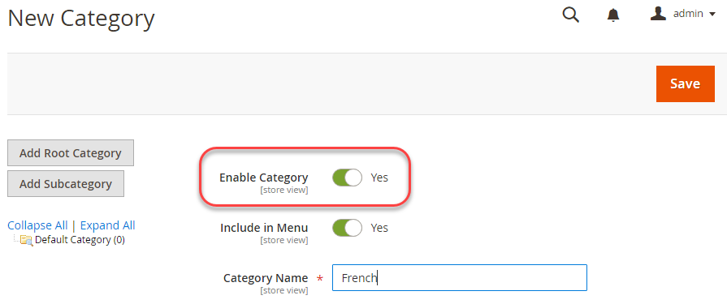

# Configurazione di più viste nell’amministratore

Questa attività richiede la creazione di una categoria principale (e di altre categorie, se desiderato) per ogni archivio. Le attività descritte in questo argomento forniscono un modo per impostare più store. Per ulteriori informazioni, consulta le seguenti risorse nella Guida utente di Commerce:

- [Categorie](https://docs.magento.com/user-guide/catalog/categories.html)
- [Aggiunta di siti Web](https://docs.magento.com/user-guide/stores/stores-all-create-website.html)
- [Archiviare gli URL](https://docs.magento.com/user-guide/stores/store-urls.html)
- [Contenuto](https://docs.magento.com/user-guide/cms/content-menu.html)

>[!INFO]
>
>Solo a scopo di esempio, utilizziamo un sito web francese con codice del sito web `french` in questo argomento. Per esercitazioni dettagliate, consulta [Esercitazione: Configurazione di più siti web con Apache](ms-apache.md) e [Esercitazione: Configurazione di più siti web con l&#39;allegato](ms-nginx.md)

## Passaggio 1: Creare categorie radice

La creazione di una categoria principale è facoltativa, ma in questa esercitazione viene mostrato come eseguire questa operazione nell’evento in cui si desidera che ogni sito web abbia una categoria principale univoca. Puoi creare altre categorie, se lo desideri.

Per creare una categoria principale:

1. Accedi all’amministratore come utente autorizzato a creare categorie.
1. Fai clic su **Catalogo** > **Categorie**.
1. Fai clic su **Aggiungi categoria radice**.
1. In **Nome categoria** immettere un nome univoco per identificare questa categoria.
1. Assicurati che Abilita categoria sia impostato su **Sì**.

   Per informazioni sulle altre opzioni disponibili in questa pagina, consulta [Categorie principali](https://docs.magento.com/user-guide/catalog/category-root.html).

   Nella figura seguente viene illustrato un esempio.

   

1. Fai clic su **Salva**.
1. Ripeti queste attività il numero di volte necessario per creare le categorie principali per gli archivi.

## Passaggio 2: Creare siti web

Per creare un sito web:

1. Accedi all’amministratore come utente autorizzato a creare siti web, store e viste store.
1. Fai clic su **Negozi** > **Impostazioni** > **Tutti i negozi**.
1. Sulla _Negozi_ pagina, fai clic su **Crea sito Web**.

   - **Nome**- Inserisci un nome per identificare il sito web.
   - **Codice**- Inserire un codice univoco; ad esempio, se si dispone di un negozio francese, è possibile immettere `french`
   - **Ordinamento**- Immettere un ordinamento numerico facoltativo.

   Nella figura seguente viene illustrato un esempio.

   

1. Fai clic su **Salva sito Web**.
1. Ripeti queste attività il numero di volte necessario per creare i tuoi siti web.

## Passaggio 3: Creare negozi

Per creare uno store:

1. In _Amministratore_ pannello, fai clic su **Negozi** > **Impostazioni** > **Tutti i negozi**.
1. Sulla _Negozi_ pagina, fai clic su **Crea archivio**.

   - **Sito Web**- Fare clic sul nome del sito Web a cui associare lo store.
   - **Nome**- Immettere un nome per identificare lo store.
   - **Codice**- Inserire un codice univoco per identificare lo store.
   - **Categoria principale**- Fare clic sul nome della categoria principale per questo archivio.

   Nella figura seguente viene illustrato un esempio.

   

1. Fai clic su **Salva archivio**.
1. Ripeti queste attività il numero di volte necessario per creare gli archivi.

## Passaggio 4: Creare viste store

Per creare una visualizzazione store:

1. In _Amministratore_ pannello, fai clic su **Negozi** > **Impostazioni** > **Tutti i negozi**.
1. Nella pagina Stores, fai clic su **Crea visualizzazione store**.

   - **Store**- Fare clic sul nome dell&#39;archivio a cui associare la visualizzazione archivio.
   - **Nome**- Immettere un nome per identificare la visualizzazione archivio.
   - **Codice**- Immettere un nome univoco per identificare la visualizzazione archivio.
   - **Stato**—Select **Abilitato**.

   Nella figura seguente viene illustrato un esempio.

   

1. Fai clic su **Save Store View**.
1. Ripeti queste attività il numero di volte necessario per creare le viste Store.

## Passaggio 5: Modificare l’URL di base del sito web

Per accedere a un sito web utilizzando un URL univoco, come `http://french.magento.mg`, devi modificare l’URL di base per ogni sito nell’amministratore.

Per modificare l’URL di base del sito web:

1. In _Amministratore_ pannello, fai clic su **Negozi** > **Impostazioni** > **Configurazione** > **Generale** > **Web**.
1. Da **Visualizzazione store** nella parte superiore della pagina fare clic sul nome di uno dei siti Web come illustrato nella figura riportata di seguito.

   

1. Nel riquadro a destra, espandi **URL di base**.
1. In _URL di base_ sezione, cancella **Usa valore di sistema**.
1. Inserisci il `http://french.magento.mg` URL nel **URL di base** e **URL collegamento di base** campi.

1. Ripeti il passaggio precedente nella _URL di base (sicuro)_ sezione .

   >[!INFO]
   >
   >Se stai impostando un URL di base per la distribuzione di Adobe Commerce sull’infrastruttura cloud, devi sostituire il primo periodo con tre trattini. Ad esempio, se l’URL di base è `french.branch-sbg7pPa-f3dueAiM03tpy.us.magentosite.cloud`, inserisci `http://french---branch-sbg7pPa-f3dueAiM03tpy.us.magentosite.cloud`. Se stai impostando un URL di base per il test locale, utilizza un punto.

1. Fai clic su **Salva configurazione**.

1. Ripeti queste attività per altri siti web.

## Passaggio 6: Aggiungi il codice store all&#39;URL di base

Commerce ti offre la possibilità di aggiungere il codice store all’URL di base del sito, semplificando così il processo di configurazione di più store. Utilizzando questa opzione, non è necessario creare directory nel file system Commerce per memorizzare `index.php` e `.htaccess`.

Questo impedisce `index.php` e `.htaccess` da fuori sincronia con la base di codice Commerce in aggiornamenti futuri.

Consulta la sezione [Guida utente di Commerce](https://docs.magento.com/user-guide/stores/store-urls.html).

Per aggiungere il codice store all&#39;URL di base:

1. In _Amministratore_ pannello, fai clic su **Negozi** > **Impostazioni** > **Configurazione** > **Generale** > **Web**.
1. Da **Visualizzazione store** nella parte superiore della pagina, fai clic su **Configurazione predefinita** come illustrato nella figura riportata di seguito.

   

1. Nel riquadro a destra, espandi **Opzioni URL**.
1. Elimina **Usa valore di sistema** casella di controllo accanto a _Aggiungi codice store agli URL_.
1. Da _Aggiungi codice store agli URL_ elenco, fai clic su **Sì**.

   

1. Fai clic su **Salva configurazione**.
1. Se richiesto, svuota la cache. (**Sistema** > **Gestione cache**).

## Passaggio 7: Modificare l&#39;URL di base della vista store predefinito

Esegui questo passaggio per ultimo perché perderai l’accesso all’amministratore; l&#39;accesso viene restituito dopo aver impostato gli host virtuali come descritto negli argomenti specifici del server web.

Per modificare l&#39;URL di base della vista store predefinito:

1. In _Amministratore_ pannello, fai clic su **Negozi** > **Impostazioni** > **Configurazione** > **Generale** > **Web**.

1. Da _Visualizzazione store_ nella parte superiore della pagina, fai clic su **Configurazione predefinita**.

   

1. Nel riquadro a destra, espandi **URL di base**.
1. In _URL di base_ sezione, cancella **Usa valore di sistema**.
1. Inserisci il `http://magento.mg` URL nel **URL di base** e **URL collegamento di base** campi.

1. Ripeti il passaggio precedente nella **URL di base (sicuro)** sezione .

   >[!INFO]
   >
   >Se imposti un URL di base per Adobe Commerce sull’infrastruttura cloud, devi sostituire il primo periodo con tre trattini. Ad esempio, se l’URL di base è `french.branch-sbg7pPa-f3dueAiM03tpy.us.magentosite.cloud`, inserisci `http://french---branch-sbg7pPa-f3dueAiM03tpy.us.magentosite.cloud`

1. Fai clic su **Salva configurazione**.
