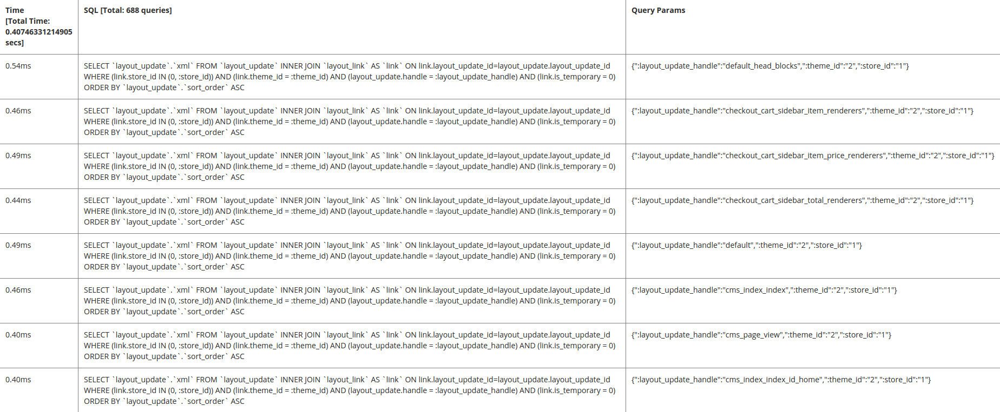

# Configurare il profiler del database

Il profiler del database Commerce visualizza tutte le query implementate in una pagina, incluso l&#39;ora per ogni query e i parametri applicati.

## Passaggio 1: Modificare la configurazione dell&#39;implementazione

Modificare `<magento_root>/app/etc/env.php` per aggiungere il seguente riferimento alla classe del profiler del [&#128279;](https://github.com/magento/magento2/tree/2.4/lib/internal/Magento/Framework/DB/Profiler.php)database:

```php?start_inline=1
        'profiler' => [
            'class' => '\Magento\Framework\DB\Profiler',
            'enabled' => true,
        ],
```

Di seguito è riportato un esempio:

```php?start_inline=1
 'db' =>
  array (
    'table_prefix' => '',
    'connection' =>
    array (
      'default' =>
      array (
        'host' => 'localhost',
        'dbname' => 'magento',
        'username' => 'magento',
        'password' => 'magento',
        'model' => 'mysql4',
        'engine' => 'innodb',
        'initStatements' => 'SET NAMES utf8;',
        'active' => '1',
        'profiler' => [
            'class' => '\Magento\Framework\DB\Profiler',
            'enabled' => true,
        ],
      ),
    ),
  ),
```

## Passaggio 2: configurare l&#39;output

Configurare l&#39;output nel file di bootstrap di Commerce applicazione. Questo potrebbe essere `<magento_root>/pub/index.php` o potrebbe trovarsi in una configurazione di host virtuale del server Web.

I risultati nell&#39;esempio seguente sono visualizzati in una tabella a tre colonne:

- Tempo totale (visualizza il tempo totale necessario per eseguire tutte le query sulla pagina)
- SQL (visualizza tutte le query SQL; l&#39;intestazione della riga visualizza il conteggio delle query)
- Parametri di query (visualizza i parametri per ogni query SQL)

Per configurare l&#39;output, aggiungi quanto segue dopo la `$bootstrap->run($app);` riga nel file di bootstrap:

```php?start_inline=1
/** @var \Magento\Framework\App\ResourceConnection $res */
$res = \Magento\Framework\App\ObjectManager::getInstance()->get('Magento\Framework\App\ResourceConnection');
/** @var Magento\Framework\DB\Profiler $profiler */
$profiler = $res->getConnection('read')->getProfiler();
echo "<table cellpadding='0' cellspacing='0' border='1'>";
echo "<tr>";
echo "<th>Time <br/>[Total Time: ".$profiler->getTotalElapsedSecs()." secs]</th>";
echo "<th>SQL [Total: ".$profiler->getTotalNumQueries()." queries]</th>";
echo "<th>Query Params</th>";
echo "</tr>";
foreach ($profiler->getQueryProfiles() as $query) {
    /** @var Zend_Db_Profiler_Query $query*/
    echo '<tr>';
    echo '<td>', number_format(1000 * $query->getElapsedSecs(), 2), 'ms', '</td>';
    echo '<td>', $query->getQuery(), '</td>';
    echo '<td>', json_encode($query->getQueryParams()), '</td>';
    echo '</tr>';
}
echo "</table>";
```

## Passaggio 3: Visualizza i risultati

Vai a qualsiasi pagina del tuo negozio o dell&#39;amministratore per visualizzare i risultati. Di seguito è riportato un esempio:


