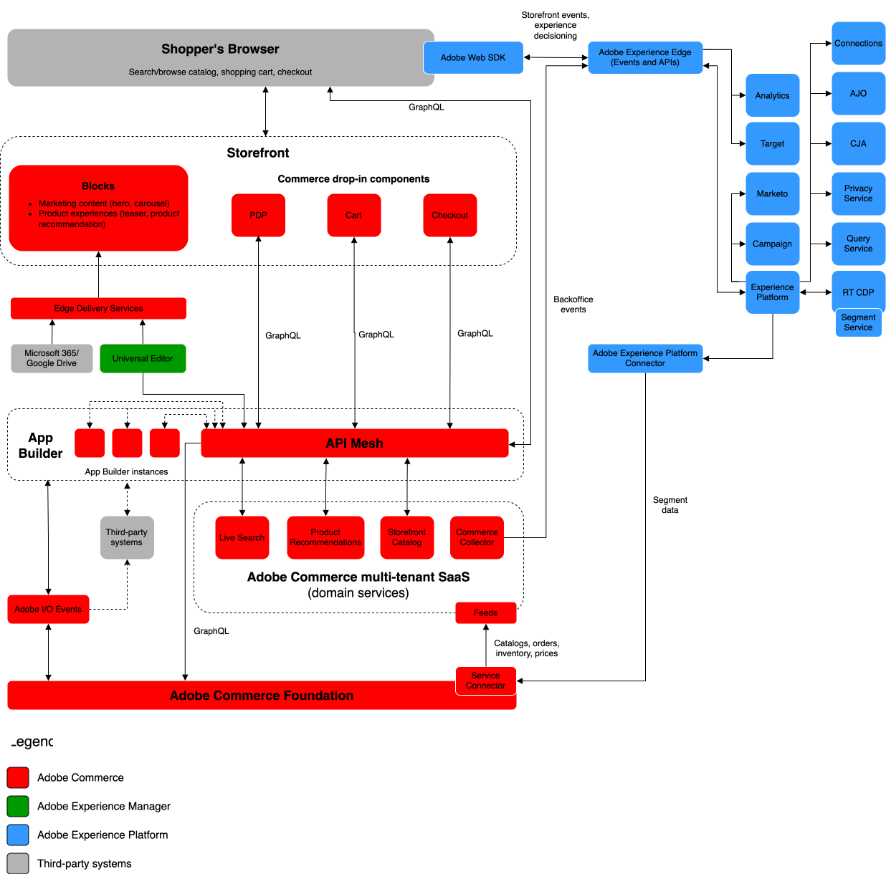

# Architettura di riferimento aziendale di Adobe Systems Commerce

Adobe Systems Commerce è la piattaforma basata sull&#39;esperienza che abbina in modo univoco la flessibilità tecnica alla facilità d&#39;uso, il tutto al servizio della creazione di esperienze eccezionali che dare impulso a risultati aziendali.

Il commercio si è evoluto per soddisfare i requisiti aziendali in termini di prestazioni, scalabilità e sicurezza. L&#39;adozione di un approccio implementazione moderno che utilizza le più recenti soluzioni di commercio componibile di Adobe Systems è critico al successo delle aziende. Questa pagina descrive in dettaglio il moderno approccio Commerce implementazione.

Il diagramma seguente illustra il flusso di dati tra Adobe Systems Commerce e tutte le soluzioni Adobe Experience Cloud.

{zoomable="yes"}

>[!NOTE]
>
>I flussi di dati di alto livello mostrati nel diagramma sono coerenti nella maggior parte delle implementazioni aziendali. Il componente chiave che può rendere uniche le implementazioni è il modo in cui versione il catalogo (specialmente per B2B). È consigliabile mappare attentamente l&#39;architettura [del catalogo alle API Web di Commerce](https://developer.adobe.com/commerce/webapi/get-started/).

## Cloud Foundation

[Adobe Systems Commerce on infrastruttura cloud](https://experienceleague.adobe.com/en/docs/commerce-cloud-service/user-guide/overview) è la base del tuo implementazione Commerce. Fornisce una [piattaforma di hosting automatizzato sicura](../../security-and-compliance/shared-responsibility.md) con un approccio self-service alla creazione, distribuzione, monitoraggio e gestione dei applicazione commerciali in un ambiente cloud-nativo.

Vedi i seguenti dettagli tecnici cloud base:

- [**Architettura**](https://experienceleague.adobe.com/en/docs/commerce-cloud-service/user-guide/architecture/scaled-architecture) scalabile: capacità regolata automaticamente per mantenere prestazioni stabili e prevedibili
- [**Più ambienti**](https://experienceleague.adobe.com/en/docs/commerce-cloud-service/user-guide/architecture/pro-architecture): pre-provisioning con PHP, MySQL (MariaDB), Redis, RabbitMQ e tecnologie di motori ricerca supportate per sviluppare, testare e distribuire il tuo sito
- [**Gestione**](https://experienceleague.adobe.com/en/docs/commerce-cloud-service/user-guide/configure/overview) della configurazione: file di configurazione dell&#39;ambiente personalizzabili e interfaccia della riga di comando (CLI) per gestire applicazione impostazioni, route, versione e distribuire azioni e notifiche.
- [**workflow**](https://experienceleague.adobe.com/en/docs/commerce-cloud-service/user-guide/architecture/pro-develop-deploy-workflow) basata su Git: versione e distribuire automaticamente dopo aver spinto le modifiche al codice per uno sviluppo rapido e una distribuzione continua
- [**Osservabilità**](https://experienceleague.adobe.com/en/docs/commerce-cloud-service/user-guide/monitor/performance) integrata: Strumenti che combinano i dati di log provenienti da più origini per aiutarti a gestire le prestazioni del tuo sito e diagnosticare i problemi
- [**Copertura**](https://developer.adobe.com/commerce/webapi/get-started/) API completa:[ API GraphQL](https://developer.adobe.com/commerce/webapi/graphql/) e [REST](https://developer.adobe.com/commerce/webapi/rest) per l&#39;integrazione della applicazione di base di Commerce con sistemi di terze parti e l&#39;estensione delle funzionalità di Commerce

## Integrazione con Experience Cloud

Adobe Systems Commerce si integra con tutte le soluzioni Experience Cloud per offrire [esperienze di e-commerce personalizzate su larga scala](https://experienceleague.adobe.com/en/docs/commerce-admin/customers/customers-menu/personalize-scale#customers-menu).

[Connessione](https://experienceleague.adobe.com/en/docs/commerce/data-connection/overview) dati sblocca informazioni dettagliate sul comportamento di acquisto dei tuoi acquirenti in modo da poter creare esperienze di acquisto personalizzate su tutti i canali con altri prodotti Adobe Systems Digital Experience.

>[!NOTE]
>
>Per ulteriori informazioni, consultare le seguenti informazioni:
>
>- [Blueprint](https://experienceleague.adobe.com/en/docs/blueprints-learn/architecture/overview) Digital Experience per maggiori dettagli tecnici.
>- Vedere [Personalizzazione dell&#39;esperienza](https://experienceleague.adobe.com/en/docs/events/the-skill-exchange-recordings/commerce/aug2024/personalization) del cliente.

## Integrazione con sistemi di terze parti

Adobe Systems fornisce agli sviluppatori punti di estensione completi e strumenti per versione applicazioni che estendono le funzionalità di base di Commerce e integrano Commerce con sistemi di terze parti (come CRM, ERP e PIMS). Questi strumenti riducono il costo totale di proprietà della piattaforma nei seguenti modi:

- **Scalabilità**: le applicazioni possono essere ridimensionate separatamente dal software principale, consentendo una maggiore efficienza e aggiornamenti semplificati.
- **Isolamento: un ambiente isolato** significa che gli sviluppatori possono aggiornare o modificare le loro estensioni a loro discrezione senza fare affidamento su una versione principale.
- **Indipendenza** tecnologica: gli sviluppatori possono scegliere qualsiasi stack tecnologico e linguaggio di codifica adatto alle loro esigenze.

Adobe Systems fornisce i seguenti strumenti di sviluppo per creare integrazioni e personalizzazioni:

- [**API Mesh per Adobe Systems Developer app Builder**](https://developer.adobe.com/graphql-mesh-gateway/): consente di coordinare e combinare più API, GraphQL, REST e altre origini in un unico endpoint GraphQL interrogabile.
- [**app Builder**](https://developer.adobe.com/app-builder/docs/overview/): crea e distribuire applicazioni Web sicure e scalabili che estendono le funzionalità di Commerce e integrare con soluzioni di terze parti.
- [**Eventi**](https://developer.adobe.com/commerce/extensibility/events/): utilizza trigger di eventi personalizzati per interagire con altri strumenti di sviluppo estensibili.
- [**Webhook:**](https://developer.adobe.com/commerce/extensibility/webhooks/) utilizza i webhook per attivare automaticamente le interazioni tra Commerce e sistemi di terze parti.
- [**SDK**](https://developer.adobe.com/commerce/extensibility/admin-ui-sdk/) Admin interfaccia: personalizza e migliora l&#39;amministratore delle vendite con nuove pagine e funzionalità per i tuoi commercianti.
- [**Starter Kit**](https://developer.adobe.com/commerce/extensibility/starter-kit/) di integrazione: accelera le integrazioni di backoffice con integrazioni di riferimento, script di onboarding e un&#39;architettura standardizzata.

>[!NOTE]
>
>Vedere [L&#39;approccio moderno: estendibilità effettiva nel commercio Adobe Systems](https://experienceleague.adobe.com/en/docs/events/the-skill-exchange-recordings/commerce/aug2024/extensibility).

## Servizi vetrina

Adobe Systems fornisce un ricco set di servizi di merchandising intelligenti e componibili per aiutarti a supportare i tuoi obiettivi aziendali chiave. Questi servizi forniscono anche API critico all&#39;ottimizzazione delle prestazioni su larga scala.

- [Live Search](https://experienceleague.adobe.com/en/docs/commerce/live-search/overview): offri risultati più intelligenti, veloci e pertinenti per gli acquirenti con questo strumento ricerca basato sull&#39;intelligenza artificiale.
- [Raccomandazioni](https://experienceleague.adobe.com/en/docs/commerce/product-recommendations/overview) di prodotto: aggiungi consigli basati sull&#39;intelligenza artificiale in base al comportamento dei acquirente, alle tendenze popolari, alla somiglianza del prodotto e altro ancora.
- [Servizio catalogo](https://experienceleague.adobe.com/en/docs/commerce/catalog-service/guide-overview): offri ai tuoi clienti un&#39;esperienza di prodotto ottimizzata, aumentando al contempo le prestazioni, migliorando i scalabilità e aumentando le conversioni.
- [Servizi di](https://experienceleague.adobe.com/en/docs/commerce/payment-services/guide-overview) pagamento: aumenta la soddisfazione dei clienti offrendo vari metodi di pagamento, tra cui rate di pagamento gratuito interesse e una visione unica dell&#39;elaborazione dei pagamenti, degli ordini e delle fatture.

## Vetrina headless

Il commercio headless è un commercio basato sull&#39;API. Adobe Systems Commerce è completamente headless con un&#39;architettura disaccoppiata che fornisce tutti i servizi e i dati commerciali tramite un livello API GraphQL. Questa architettura consente ai team di sviluppare i propri frontend indipendentemente dal applicazione principale, fornendo l&#39;agilità necessaria per versione e testare rapidamente nuovi punti di contatto con le tecnologie emergenti.

Adobe Systems fornisce una moderna tecnologia headless storefront che include gli stessi vantaggi e funzionalità offerti da [Edge Delivery Services](https://www.aem.live/home) con authoring basato su documenti, un&#39;architettura incentrata sulle prestazioni e sperimentazione nativo pronta all&#39;uso. Sfrutta la scalabilità e le prestazioni dei servizi[&#128279;](#storefront-services) di vetrina di Adobe Systems Commerce [e la flessibilità e la convenienza dei componenti](https://experienceleague.adobe.com/developer/commerce/storefront/) drop-in per fornire funzionalità commerciali.

