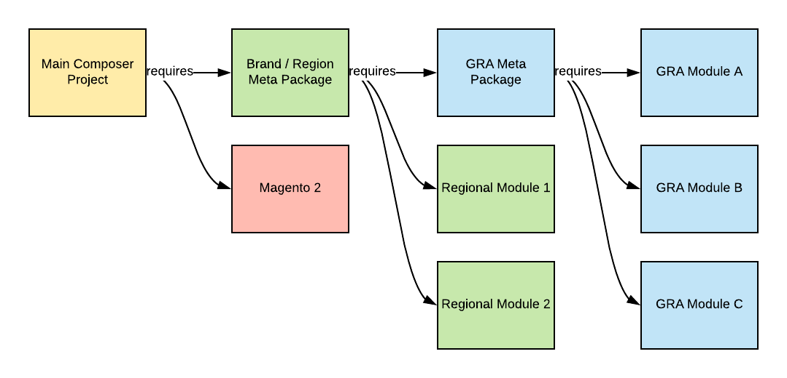

# Esempi di architettura di riferimento globale

In questo argomento vengono descritti i metodi comuni per organizzare un [architettura di riferimento globale (GRA)](overview.md) base di codice. Anche se il [pacchetti separati](#option-1-separate-packages) opzione è preferibile, alcune situazioni richiedono una delle altre opzioni descritte di seguito.

## Definizioni

{{$include /help/_includes/gra-definitions.md}}

## Opzione 1: pacchetti separati

Consulta [Struttura del progetto Compositore](composer/project-structure.md) best practice per impostare questo metodo.



Il modo più flessibile per gestire i pacchetti GRA Composer è attraverso i metapackages. I metapacchetti contengono una `composer.json` solo file, che definisce altre dipendenze del pacchetto. Creare metapacchetti utilizzando [Packagist privato](https://packagist.com/) archivi.

### Progetto principale `composer.json`

```json
{
    "name": "example-client/region-1",
    "description": "Example Client Region 1",
    "type": "project",
    "require": {
        "magento/product-enterprise-edition": "2.3.5",
        "example-client/meta-region-1": "~1.0"
    },
    "minimum-stability": "dev",
    "prefer-stable": true,
    "repositories": [
        {"type": "composer", "url": "https://repo.packagist.com/example-client/"},
        {"packagist.org": false}
    ]
}
```

### `example-client/meta-region-1 composer.json`

```json
{
    "name": "example-client/meta-region-1",
    "description": "Region 1 meta package",
    "type": "metapackage",
    "require": {
        "example-client/meta-gra": "~1.0",
        "example-client/theme-frontend-region1",
        "example-client/language-es-es",
        "ingenico/ogone-client"
    }
}
```

### `example-client/meta-gra composer.json`

```json
{
    "name": "example-client/meta-gra",
    "description": "GRA meta package",
    "type": "metapackage",
    "require": {
        "geoip2/geoip2": "~2.0",
        "magento-services/module-stackify-logger": "~1.1",
        "example-client/sap-connector",
        "example-client/service-chat",
        "example-client/store-locator"
    }
}
```

Ogni modulo, Language Pack, tema e libreria dispone di un proprio archivio Git. Ogni archivio Git si sincronizza automaticamente con l’archivio Private Packagist e genera un pacchetto in tale archivio purché sia presente un `composer.json` nella directory principale dell’archivio Git.

## Opzioni 2: pacchetti in blocco

Di seguito è riportato un esempio di più moduli all’interno di un singolo pacchetto Compositore.

Un pacchetto bulk può includere solo pacchetti dello stesso tipo. Ad esempio, se disponi di più pacchetti per moduli, temi, Language Pack e librerie di Adobe Commerce, devi creare pacchetti in blocco separati per ciascun tipo.

La struttura del file all’interno della directory del fornitore deve essere simile a quella dell’esempio seguente. Tuttavia, controlla il progetto per vedere cosa deve essere incluso nell’archivio Git):

```tree
.
└── example-client/
    └── gra/
        └── src/
            ├── SapConnector/
            │   ├── etc/
            │   └── registration.php
            ├── ServiceChat/
            │   ├── etc/
            │   └── registration.php
            ├── StoreLocator/
            │   ├── etc/
            │   └── registration.php
            └── composer.json
```

Il `composer.json` Il file deve essere simile al seguente:

```json
{
    "name": "example-client/gra",
    "description": "GRA Modules",
    "require": {
        "magento/magento-composer-installer": "*"
    },
    "type": "magento2-module",
    "autoload": {
        "files": [
            "src/SapConnector/registration.php",
            "src/ServiceChat/registration.php",
            "src/StoreLocator/registration.php"
        ],
        "psr-4": {
            "ExampleClient\\SapConnector\\": "src/SapConnector",
            "ExampleClient\\ServiceChat\\": "src/ServiceChat",
            "ExampleClient\\StoreLocator\\": "src/StoreLocator"
        }
    }
}
```

## Opzione 3: Suddivisione di Git

Questa architettura utilizza quattro archivi Git per memorizzare il codice:

- `core`: contiene l’installazione di base di Adobe Commerce. Viene utilizzato per aggiornare le versioni di Adobe Commerce.
- `GRA`: contiene il codice GRA. Tutti i moduli GRA, i Language Pack, i temi delle etichette bianche e le librerie.
- `brand/region`: ogni marchio o area geografica dispone di un proprio archivio con solo codice specifico del marchio o dell’area geografica.
- `release`: tutte le operazioni precedenti vengono unite in questo archivio Git. Qui sono consentiti solo i commit di unione.


Per impostare questa opzione:

1. Crea i quattro tipi di archivio in Git. Creare `core` e `GRA` archivi una sola volta. Crea un elemento `brand/region` e uno `release` per ogni marchio.

   Nomi repository suggeriti:

   - `m2-core`
   - `m2-gra`
   - `m2-region-x`/`m2-brand-x` (ad esempio, `m2-emea`/`m2-adobe`)
   - `m2-release-region-x`/`m2-release-brand-x` (ad esempio, `m2-release-emea`/`m2-release-adobe`)

1. Creare un `release/` ed esegui quanto segue per creare una cronologia Git condivisa per tutti gli archivi.

   ```bash
   git init
   git remote add origin git@github.com:example-client/m2-release-brand-x.git
   git remote add core git@github.com:example-client/m2-core.git
   git remote add gra git@github.com:example-client/m2-gra.git
   git remote add region-x git@github.com:example-client/m2-region-x.git
   touch .gitkeep
   git add .gitkeep
   git commit -m 'initialize repository'
   git push -u origin master
   git push core master
   git push gra master
   git push region-x master
   ```

1. Clona ogni repository, tranne `core`, in una directory diversa del computer.

   ```bash
   git clone git@github.com:example-client/m2-release-brand-x.git
   git clone git@github.com:example-client/m2-region-x.git
   git clone git@github.com:example-client/m2-gra.git
   ```

1. [Installare Adobe Commerce con Composer](../../../installation/composer.md). Rimuovi il `.gitignore` file, aggiungi `core` remote, aggiungi e conferma il codice e invia.

   ```bash
   composer create-project --repository-url=https://repo.magento.com/ magento/project-enterprise-edition m2-core
   cd m2-core
   git init
   rm .gitignore
   git remote add origin git@github.com:example-client/m2-core.git
   git fetch
   git checkout .gitkeep
   git add --all
   git commit -m 'install Adobe Commerce'
   git push
   ```

1. In `GRA` repository, creare le directory seguenti:

   - `app/code/`
   - `app/design/`
   - `app/i18n/`
   - `lib/`

1. Aggiungi il codice. Rimuovi il `.gitignore` file, aggiungi e conferma il codice, aggiungi il remoto e invia.

1. In `brand/region` archivio. Effettua le stesse operazioni descritte in `GRA` e ricorda che i file devono essere univoci. Non è possibile includere lo stesso file sia in questo archivio che in `GRA` archivio.

1. In `release` , applicare l&#39;unione.

   ```bash
   git clone git@github.com:example-client/m2-release-brand-x.git
   cd m2-release-brand-x
   git remote add core git@github.com:example-client/m2-core.git
   git remote add gra git@github.com:example-client/m2-gra.git
   git remote add region-x git@github.com:example-client/m2-region-x.git
   git fetch --all
   git merge core/master gra/master brand-a/master
   git push
   ```

1. Rimuovi il `.gitkeep` file.

1. Distribuire `release` nei server di produzione, test, controllo qualità e sviluppo. Aggiornamento `core`, `GRA`, e `brand` l&#39;esecuzione del codice è altrettanto semplice dei seguenti comandi:

   ```bash
   git fetch --all
   git merge core/master gra/master brand-a/master
   git push
   ```

## Opzione 4: Monorepo (scelta consigliata)

Questa strategia simula da vicino il funzionamento dell’archivio Git del Magento Open Source.

Tutto il codice viene sviluppato e testato in un unico archivio. L’automazione distilla i pacchetti da questo singolo archivio, che può essere installato su UAT e sugli ambienti di produzione utilizzando Composer.


L’opzione monorepo ti offre la facilità di lavorare in un singolo archivio, fornendo al contempo la flessibilità di comporre le istanze con i pacchetti.

Il controllo delle versioni e la distillazione dei pacchetti vengono eseguiti tramite automazione, utilizzando le azioni GitHub o GitLab.


Per ulteriori informazioni su questa automazione, consulta le risorse seguenti:

- [https://github.com/symplify/monorepo-builder](https://github.com/symplify/monorepo-builder)
- [https://github.com/danharrin/monorepo-split-github-action](https://github.com/danharrin/monorepo-split-github-action)

>[!TIP]
>
>La configurazione di un monorepo è avanzata, ma offre la massima flessibilità al minor costo di gestione.

## Non mescolare strategie

Non è consigliabile utilizzare un approccio combinato utilizzando Composer per i pacchetti GRA e `app/` directory per i pacchetti del marchio o dell’area geografica.

Non solo ottieni tutto _vantaggi_ ma anche tutti _svantaggi_ di entrambi i metodi. Dovresti scegliere una delle due (Git o Compositore) per lavorare in modo ottimale.

## Soluzioni da evitare

- **Convenzioni di denominazione dei moduli per indicare GRA o brand**

  I moduli di denominazione per indicare GRA o marchio portano a una mancanza di flessibilità. Utilizza invece i metapacchetti Compositore per determinare a quale gruppo appartiene un modulo. Ad esempio, per il file VF del cliente, pacchetto `vf/meta-gra` contiene riferimenti a tutti i pacchetti GRA e può essere installato utilizzando `composer require vf/meta-gra` comando. Pacchetto `vf/meta-kipling` contiene riferimenti a tutti i colli specifici Kipling e al `vf/meta-gra` pacchetto. I moduli sono denominati `vf/module-sales` e `vf/module-sap` ad esempio. Questa convenzione di denominazione consente di spostare i pacchetti tra lo stato del marchio e lo stato GRA, con un impatto ridotto.

- **Aggiornamenti di base di Adobe Commerce per istanza**

  Pianifica gli aggiornamenti di base di Adobe Commerce, inclusi gli aggiornamenti delle patch, per far sì che diversi marchi o aree geografiche vengano eseguiti il più vicino possibile. Il supporto di più versioni di Adobe Commerce per i moduli condivisi comporta il forking dei moduli a causa di vincoli di compatibilità e raddoppia lo sforzo di manutenzione. Per evitare questo sforzo maggiore, accertati che tutte le istanze siano in esecuzione sulla stessa versione di Adobe Commerce prima di continuare lo sviluppo regolare.
