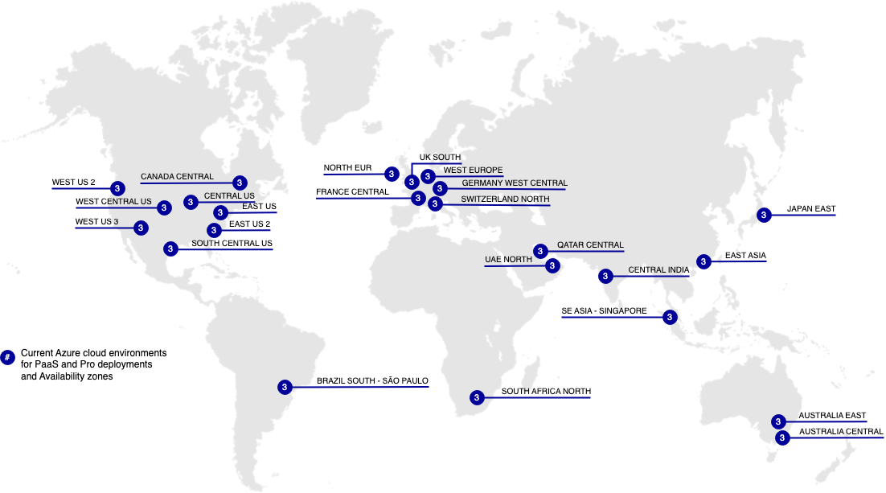

# Aree geografiche cloud

Le sezioni seguenti forniscono dettagli sulle diverse aree di AWS e Azure disponibili per Adobe Commerce sull’infrastruttura cloud.

## Aree geografiche di AWS

>[!NOTE]
>
> Solo on-premise in Cina e in Russia.

## Aree geografiche di Azure

>[!NOTE]
>
> Solo on-premise in Cina e in Russia. Tutti i commercianti che richiedono ambienti di integrazione devono utilizzare aree geografiche degli Stati Uniti.
