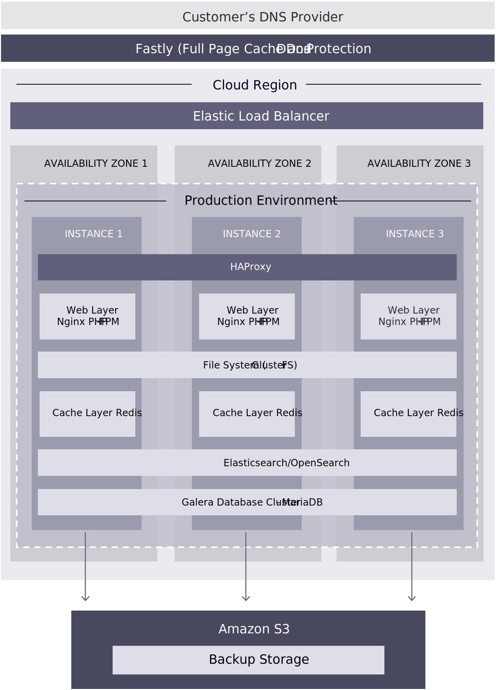

# Tecnologie

Come già accennato, Adobe Commerce sfrutta una serie di soluzioni software per supportare la piattaforma. In particolare, per quanto riguarda la produzione, abbiamo suddiviso alcune delle soluzioni tecniche e delle funzionalità incluse in Adobe Commerce sull’infrastruttura cloud per trarre il massimo dall’ambiente di produzione.

## Soluzioni software

- **Nginx**- Server Web che utilizza PHP-FPM. Esiste un’istanza con più processi di lavoro.

- **GlusterFS**- File server per la gestione di tutte le distribuzioni di file statici e la sincronizzazione con quattro installazioni di directory:
   - `var`
   - `pub/media`
   - `pub/static`
   - `app/etc`

- **Redis**- Un server per ogni VM con un solo server attivo e gli altri due come repliche.

- **Elasticsearch**—Cercare Adobe Commerce versione 2.2.x e successive.

- **OpenSearch**—Cercare Adobe Commerce versione 2.4.6 e successive.

- **Galera**: cluster di database con un database MySQL MariaDB per nodo con un&#39;impostazione di incremento automatico di tre per ID univoci in ogni database.

## Caratteristiche e vantaggi

- Con tre istanze dedicate in un VPC, è disponibile un load balancer elastico su tre aree di disponibilità o centri dati separati.

- È disponibile una resilienza più elevata per gli eventi che possono causare il mancato funzionamento di una singola istanza. Ad esempio, un’interruzione di un’intera area di disponibilità o di un centro dati di AWS.

- Nessuna riduzione dei tempi di inattività sull&#39;intero stack, inclusi web, caching, ricerca e database, in meno di 15 minuti.
