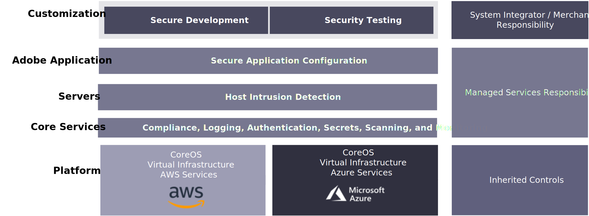

# Adobe Managed Services

Adobe Commerce è una piattaforma per la fornitura di funzionalità di e-commerce, tra cui funzionalità predefinite, la possibilità di personalizzare e integrazioni di terze parti.

Managed Services di Adobe è un’applicazione e un’infrastruttura ospitate e gestite per Adobe Commerce sui piani di cloud Infrastructure Pro.

## Vantaggi

## Sicurezza

Lo stack Adobe Security per Managed Services crea sicurezza a tutti i livelli utilizzando automazione e coerenza per ridurre gli errori umani. I team di sviluppo e operazioni ereditano automaticamente i controlli di sicurezza da diversi livelli dello stack.

I partner di Platform come Amazon Web Services e Microsoft Azure garantiscono la massima copertura di sicurezza durante l’applicazione delle personalizzazioni della piattaforma, mentre il team Managed Services di Adobe fornisce servizi di sicurezza di base come la conformità, la registrazione, l’autenticazione, la scansione e il monitoraggio, nonché la sicurezza del server e la configurazione sicura dell’applicazione. L’e-commerce Dentsu sarà responsabile dello sviluppo e delle integrazioni personalizzate e dei processi di sicurezza associati per il codice personalizzato.

Il diagramma seguente mostra lo stack di tecnologie di sicurezza di Adobe Managed Service:

