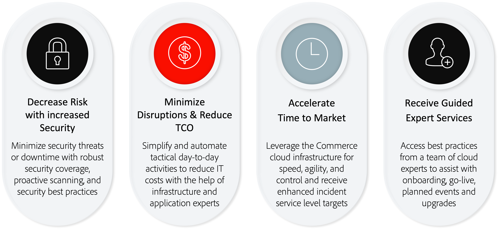

# Adobe Managed Services

Adobe Commerce è una piattaforma per la fornitura di funzionalità di e-commerce che include solide funzionalità predefinite, opzioni di personalizzazione estese e integrazioni di terze parti.

Adobe Managed Services fornisce applicazioni e infrastrutture in hosting e gestite per Adobe Commerce sui piani di cloud Infrastructure Pro.

## Vantaggi

### Confronto delle opzioni di implementazione

Adobe Managed Services offre vantaggi fondamentali rispetto alle implementazioni cloud locali e non gestite, tra cui:

- **Obiettivi a livello di servizio avanzato (SLT)**- Tempi di risposta più rapidi rispetto al supporto standard di Adobe Commerce.
- **Accordi sui livelli di servizio migliorati (SLA)**—99,9% livello di applicazione che i clienti Adobe Commerce abituali su infrastrutture cloud ottengono oltre il livello di infrastruttura del 99,99%.
- **Esperienza cloud designata**- Managed Services fornisce ai clienti un Customer Success Engineer designato (CSE) che funge da esperto di infrastruttura cloud e applicazioni. Il CSE collabora con i clienti e i loro partner, fornendo loro le migliori pratiche e indicazioni per accelerare il time-to-market, tra cui:
   - Guida e supporto attraverso il processo di onboarding
   - Gestione del provisioning e della configurazione della piattaforma
   - Consulenza sui principi architettonici per integrazioni e personalizzazioni
   - Gestione degli incidenti e continuità aziendale
   - Fornire supporto agli eventi tramite pianificazione, esecuzione e monitoraggio
   - Supporto e competenza cloud (ottimizzazione proattiva, reporting e best practice)

Rivedi la seguente infografica per un confronto più dettagliato dei principali vantaggi di Managed Services:

## Ruoli e responsabilità

Adobe fornisce una serie di servizi relativi al provisioning, allo sviluppo, alla gestione temporanea e alla produzione di Adobe Commerce sui sistemi Managed Services. Affinché lo sviluppo e la distribuzione della soluzione procedano nel modo più efficiente possibile, è importante che il cliente e il partner capiscano e svolgano i loro ruoli, come descritto di seguito:

<table>
    <thead>
        <tr>
            <th></th>
            <th>Cliente</th>
            <th>Partner</th>
            <th>Tecnico di successo del cliente</th>
        </tr>
    </thead>
    <tbody>
        <tr>
            <td colspan="4" style="background:lightgray;"><strong>Provisioning</strong></td>
        </tr>
        <tr>
            <td>Selezione area cloud</td>
            <td>Proprietario</td>
            <td>Collaboratore</td>
            <td>Advisor</td>
        </tr>
        <tr>
            <td>Provisioning di istanze</td>
            <td></td>
            <td></td>
            <td>Proprietario</td>
        </tr>
        <tr>
            <td>Configurazione e sicurezza della rete interna</td>
            <td></td>
            <td></td>
            <td>Proprietario</td>
        </tr>
        <tr>
            <td>Provisioning delle applicazioni Adobe Commerce</td>
            <td></td>
            <td></td>
            <td>Proprietario</td>
        </tr>
        <tr>
            <td>Accesso al codice sorgente di Adobe Commerce</td>
            <td></td>
            <td></td>
            <td>Proprietario</td>
        </tr>
        <tr>
            <td>Provisioning del servizio CDN</td>
            <td></td>
            <td></td>
            <td>Proprietario</td>
        </tr>
        <tr>
            <td>Ambiente di sviluppo locale</td>
            <td>Collaboratore</td>
            <td>Proprietario</td>
            <td></td>
        </tr>
        <tr>
            <td colspan="4" style="background:lightgray;"><strong>Sviluppo e controllo qualità</strong></td>
        </tr>
        <tr>
            <td>Raccolta dei requisiti e gestione dei progetti</td>
            <td>Collaboratore</td>
            <td>Proprietario</td>
            <td>Advisor</td>
        </tr>
        <tr>
            <td>Sviluppo di applicazioni</td>
            <td>Collaboratore</td>
            <td>Proprietario</td>
            <td>Advisor</td>
        </tr>
        <tr>
            <td>Test dell'applicazione</td>
            <td>Collaboratore</td>
            <td>Proprietario</td>
            <td>Advisor</td>
        </tr>
        <tr>
            <td colspan="4" style="background:lightgray;"><strong>Staging e transizione</strong></td>
        </tr>
        <tr>
            <td>Implementazione del codice per lo sviluppo, l’integrazione e lo staging</td>
            <td>Collaboratore</td>
            <td>Proprietario</td>
            <td>Advisor</td>
        </tr>
        <tr>
            <td>Distribuzione dei contenuti</td>
            <td>Collaboratore</td>
            <td>Proprietario</td>
            <td>Advisor</td>
        </tr>
        <tr>
            <td>Sviluppo del test di accettazione dell'utente</td>
            <td>Proprietario</td>
            <td>Collaboratore</td>
            <td>Advisor</td>
        </tr>
        <tr>
            <td>Test di accettazione da parte dell'utente</td>
            <td>Proprietario</td>
            <td>Collaboratore</td>
            <td>Advisor</td>
        </tr>
        <tr>
            <td>Requisiti di monitoraggio personalizzati</td>
            <td>Collaboratore</td>
            <td>Proprietario</td>
            <td>Advisor</td>
        </tr>
        <tr>
            <td>Certificati SSL forniti dal cliente</td>
            <td>Proprietario</td>
            <td></td>
            <td>Collaboratore</td>
        </tr>
        <tr>
            <td>Sviluppo di test delle prestazioni e del carico</td>
            <td>Collaboratore</td>
            <td>Proprietario</td>
            <td>Advisor</td>
        </tr>
        <tr>
            <td>Test delle prestazioni e del carico</td>
            <td>Collaboratore</td>
            <td>Proprietario</td>
            <td>Advisor</td>
        </tr>
        <tr>
            <td>Sviluppo della personalizzazione e controllo qualità</td>
            <td>Collaboratore</td>
            <td>Proprietario</td>
            <td>Advisor</td>
        </tr>
        <tr>
            <td>Completamento del Runbook</td>
            <td>Proprietario</td>
            <td>Collaboratore</td>
            <td>Collaboratore</td>
        </tr>
        <tr>
            <td>Esamina del Runbook</td>
            <td></td>
            <td></td>
            <td>Proprietario</td>
        </tr>
        <tr>
            <td colspan="4" style="background:lightgray;"><strong>Launch</strong></td>
        </tr>
        <tr>
            <td>Elenco di controllo per la pubblicazione</td>
            <td>Collaboratore</td>
            <td>Collaboratore</td>
            <td>Proprietario</td>
        </tr>
        <tr>
            <td>Sala conferenze per eventi live</td>
            <td>Collaboratore</td>
            <td>Collaboratore</td>
            <td>Proprietario</td>
        </tr>
        <tr>
            <td>Distribuzione del codice di produzione</td>
            <td>Collaboratore</td>
            <td>Collaboratore</td>
            <td>Proprietario</td>
        </tr>
        <tr>
            <td colspan="4" style="background:lightgray;"><strong>Produzione</strong></td>
        </tr>
        <tr>
            <td>Monitoraggio dell'infrastruttura di produzione</td>
            <td></td>
            <td></td>
            <td>Proprietario</td>
        </tr>
        <tr>
            <td>Monitoraggio principale delle applicazioni</td>
            <td>Collaboratore</td>
            <td>Collaboratore</td>
            <td>Proprietario</td>
        </tr>
        <tr>
            <td>Risposta evento produzione</td>
            <td>Collaboratore</td>
            <td>Collaboratore</td>
            <td>Proprietario</td>
        </tr>
        <tr>
            <td>Manutenzione a livello di infrastruttura e sistema operativo</td>
            <td></td>
            <td></td>
            <td>Proprietario</td>
        </tr>
        <tr>
            <td>Manutenzione e patch di sicurezza del codice personalizzato</td>
            <td>Collaboratore</td>
            <td>Proprietario</td>
            <td>Advisor</td>
        </tr>
        <tr>
            <td>Fornire l’accesso agli aggiornamenti e agli aggiornamenti dei prodotti Adobe Commerce</td>
            <td>Collaboratore</td>
            <td>Collaboratore</td>
            <td>Proprietario</td>
        </tr>
        <tr>
            <td>Applicazione degli aggiornamenti e degli aggiornamenti dei prodotti Adobe Commerce</td>
            <td>Collaboratore</td>
            <td>Proprietario</td>
            <td>Advisor</td>
        </tr>
        <tr>
            <td>Modifica della commissione di approvazione per approvare le distribuzioni di produzione</td>
            <td>Collaboratore</td>
            <td>Collaboratore</td>
            <td>Proprietario</td>
        </tr>
        <tr>
            <td>Amministrazione di applicazioni di produzione</td>
            <td>Proprietario</td>
            <td>Collaboratore</td>
            <td>Advisor</td>
        </tr>
        <tr>
            <td>Ottimizzazione dell'infrastruttura di produzione</td>
            <td>Collaboratore</td>
            <td>Collaboratore</td>
            <td>Proprietario</td>
        </tr>
        <tr>
            <td>Architettura di produzione scalabile</td>
            <td></td>
            <td></td>
            <td>Proprietario</td>
        </tr>
        <tr>
            <td>Backup e ripristino della produzione</td>
            <td></td>
            <td>Collaboratore</td>
            <td>Proprietario</td>
        </tr>
        <tr>
            <td colspan="4" style="background:lightgray;"><strong>Sicurezza e conformità</strong></td>
        </tr>
        <tr>
            <td>Audit del servizio SOC-2</td>
            <td></td>
            <td></td>
            <td>Proprietario</td>
        </tr>
        <tr>
            <td>Certificazione PCI dell'infrastruttura</td>
            <td></td>
            <td></td>
            <td>Proprietario</td>
        </tr>
        <tr>
            <td>Certificazione PCI dell'applicazione personalizzata</td>
            <td>Proprietario</td>
            <td>Collaboratore</td>
            <td></td>
        </tr>
        <tr>
            <td>Controlli di sicurezza delle applicazioni principali</td>
            <td>Proprietario</td>
            <td>Collaboratore</td>
            <td>Advisor</td>
        </tr>
        <tr>
            <td>Controlli di sicurezza delle personalizzazioni e delle estensioni</td>
            <td>Proprietario</td>
            <td>Collaboratore</td>
            <td></td>
        </tr>
        <tr>
            <td>Test di penetrazione delle istanze delle applicazioni del cliente</td>
            <td>Proprietario</td>
            <td>Collaboratore</td>
            <td></td>
        </tr>
        <tr>
            <td>Regole firewall per applicazioni web (WAF)</td>
            <td>Collaboratore</td>
            <td>Collaboratore</td>
            <td>Proprietario</td>
        </tr>
        <tr>
            <td>Monitoraggio del rilevamento di intrusioni</td>
            <td></td>
            <td></td>
            <td>Proprietario</td>
        </tr>
        <tr>
            <td>Monitoraggio degli eventi dell'applicazione e del database</td>
            <td>Collaboratore</td>
            <td>Collaboratore</td>
            <td>Proprietario</td>
        </tr>
        <tr>
            <td>Monitoraggio eventi del firewall per applicazioni web</td>
            <td>Collaboratore</td>
            <td>Collaboratore</td>
            <td>Proprietario</td>
        </tr>
        <tr>
            <td>Gestione utente e integrazione SSO</td>
            <td>Proprietario</td>
            <td>Collaboratore</td>
            <td>Collaboratore</td>
        </tr>
        <tr>
            <td>Risposta evento di sicurezza</td>
            <td>Collaboratore</td>
            <td>Collaboratore</td>
            <td>Proprietario</td>
        </tr>
        <tr>
            <td>Impostazione, protezione e manutenzione della connessione a reti e risorse aziendali </td>
            <td>Proprietario</td>
            <td>Advisor</td>
            <td>Advisor</td>
        </tr>
    </tbody>
</table>

## Sicurezza

Lo stack di sicurezza Adobe per Managed Services crea sicurezza a tutti i livelli utilizzando automazione e coerenza per ridurre gli errori umani. I team di sviluppo e operazioni ereditano automaticamente i controlli di sicurezza da diversi livelli dello stack.

I partner della piattaforma, come Amazon Web Services e Microsoft Azure, garantiscono la massima copertura di sicurezza durante l’applicazione delle personalizzazioni della piattaforma, mentre il team Managed Services di Adobe fornisce servizi di sicurezza di base, come la conformità, la registrazione, l’autenticazione, la scansione e il monitoraggio, nonché la sicurezza del server e la configurazione sicura dell’applicazione. Vedi [Sicurezza Adobe Commerce](https://business.adobe.com/products/magento/secure-ecommerce.html) per ulteriori informazioni.

Il diagramma seguente mostra lo stack della tecnologia di sicurezza di Adobe Managed Services:

## Assistenza per l&#39;aggiornamento

Il team Managed Services svolge un ruolo attivo nella pianificazione e nell’assistenza del processo di aggiornamento. Il tuo Customer Success Engineer (CSE) collabora con il team del progetto di aggiornamento, inclusi i project manager e gli sviluppatori (esperti interni di materia, partner certificati di Adobe o professionisti di Adobe Consulting) per aiutare il tuo team a garantire una pianificazione adeguata e l’aderenza alle best practice durante l’aggiornamento.

I CSE di Managed Services hanno collaborato con i clienti Adobe Commerce per eseguire gli aggiornamenti in ambienti di grandi dimensioni. Il tuo CSE può aiutarti a sfruttare le competenze degli esperti per massimizzare il successo dell&#39;aggiornamento, riducendo al contempo i tempi di inattività e i rischi generali. Inoltre, i CSE di Managed Services funzionano con l’ambiente di staging dedicato per l’aggiornamento, in modo che i processi di produzione esistenti non siano interessati durante la convalida dell’aggiornamento.

Adobe fornisce un set di servizi relativi al provisioning, allo sviluppo, alla gestione temporanea e alla produzione del sistema Managed Services. La tabella seguente fornisce una panoramica dei ruoli che ogni partecipante svolge nel processo di aggiornamento:

<table>
<thead>
  <tr>
    <th>Passaggio</th>
    <th>Attività</th>
    <th>Cliente</th>
    <th>Partner per lo sviluppo*</th>
    <th>Managed Services</th>
  </tr>
</thead>
<tbody>
  <tr>
    <td rowspan="3">Aggiornamento del piano</td>
    <td>Crea piano di progetto di aggiornamento</td>
    <td>Proprietario</td>
    <td>Collaboratore</td>
    <td>Collaboratore CSE fornisce esempi di modello di aggiornamento ed esempi di piano di aggiornamento; offre consigli e suggerimenti sulle best practice.</td>
  </tr>
  <tr>
    <td>Determinare le modifiche dell'infrastruttura necessarie</td>
    <td></td>
    <td>Collaboratore</td>
    <td>Proprietario CSE esamina l'infrastruttura di staging e produzione per garantire un dimensionamento corretto.</td>
  </tr>
  <tr>
    <td>Valutare la complessità dell'aggiornamento Identificare e documentare pacchetti, problemi e correzioni e moduli di terze parti e personalizzati</td>
    <td>Collaboratore</td>
    <td>Proprietario</td>
    <td>Collaboratore CSE fornisce rapporti e consigli sullo strumento di compatibilità per l’aggiornamento.</td>
  </tr>
  <tr>
    <td rowspan="3">Esegui aggiornamento</td>
    <td>Aggiornamento dei servizi di infrastruttura [MariaDB, Redis, Open Search e Rabbit MQ] (Staging e Produzione)</td>
    <td></td>
    <td></td>
    <td>Proprietario CSE coordina gli aggiornamenti del servizio di infrastruttura. CSE pianifica l'evento di conferenza per gli aggiornamenti. CSE facilita la migrazione dei dati da Produzione a Staging.</td>
  </tr>
  <tr>
    <td>Aggiornare la base di codice e le personalizzazioni Commerce; ricompilazione del codice e refactoring del codice</td>
    <td>Collaboratore</td>
    <td>Proprietario</td>
    <td></td>
  </tr>
  <tr>
    <td>Esegui verifiche e risoluzione dei problemi post-aggiornamento</td>
    <td></td>
    <td>Proprietario</td>
    <td>Collaboratore Il CSE esegue il runbook post-aggiornamento per rilevare e correggere i problemi relativi all'aggiornamento.</td>
  </tr>
  <tr>
    <td rowspan="3">UAT e Launch</td>
    <td>Eseguire test di prestazioni e sicurezza</td>
    <td>Collaboratore</td>
    <td>Proprietario</td>
    <td>Collaboratore Il CSE assiste i test di carico monitorando le prestazioni dell'applicazione e dell'infrastruttura. CSE supporta la configurazione di Commerce Security Scan Tool.</td>
  </tr>
  <tr>
    <td>Test di accettazione degli utenti sull'staging</td>
    <td>Proprietario</td>
    <td>Collaboratore</td>
    <td>Collaboratore CSE convalida l'applicazione e l'infrastruttura che eseguono correttamente l'aggiornamento.</td>
  </tr>
  <tr>
    <td>Launch a Produzione</td>
    <td>Collaboratore</td>
    <td>Proprietario</td>
    <td>Collaboratore CSE pianifica l'evento di riunione della conferenza di avvio.</td>
  </tr>
  <tr>
    <td>Post-lancio</td>
    <td></td>
    <td>Collaboratore</td>
    <td>Collaboratore</td>
    <td>Proprietario Il CSE controlla le prestazioni dell'applicazione e dell'infrastruttura.</td>
  </tr>
</tbody>
</table>
