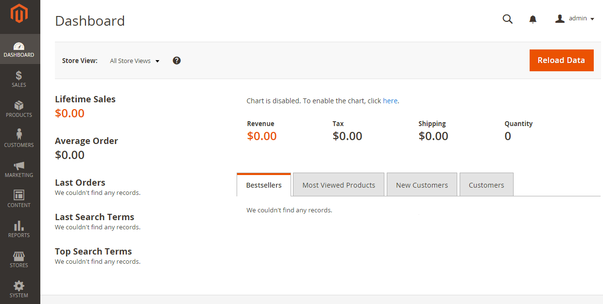

# Verificare l&#39;installazione

Vai alla vetrina in un browser web. Ad esempio, se l&#39;URL di base dell&#39;installazione è `http://www.example.com`, immetterlo nella barra degli indirizzi o della posizione del browser.

La figura seguente mostra una pagina di vetrina di esempio. Se viene visualizzato come segue, l&#39;installazione è stata completata correttamente.

## Verifica la vetrina (nessun dato di esempio)

Vai alla vetrina in un browser web. Ad esempio, se l&#39;URL di base dell&#39;installazione è `http://www.example.com`, immetterlo nella barra degli indirizzi o della posizione del browser.

La figura seguente mostra una pagina di vetrina di esempio. Se viene visualizzato come segue, l&#39;installazione è stata completata correttamente.

Se nella pagina viene visualizzato un errore `404 (Not Found)` o non vengono visualizzati gli stili, vedere [risoluzione dei problemi](https://support.magento.com/hc/en-us/articles/360032994352).

## Verificare l’amministratore

Accedi all’amministratore in un browser web. Ad esempio, se l&#39;URL di base dell&#39;installazione è `http://www.example.com` e l&#39;URI amministratore è `admin_au1nT`, immettere `http://www.example.com/admin_au1nT` nella barra degli indirizzi o della posizione del browser.

L&#39;URI amministratore è specificato dal valore del parametro di installazione `backend-frontname`.

Quando richiesto, accedi come amministratore.

La figura seguente mostra un esempio di pagina Amministratore. Se viene visualizzato come segue, l&#39;installazione è stata completata correttamente.

Se nella pagina non sono visualizzati gli stili, vedere [risoluzione dei problemi](https://support.magento.com/hc/en-us/articles/360032994352).

Se ricevi un errore 404 (Non trovato) simile al seguente, vedi [Errore di versione PHP o 404 durante l&#39;accesso ad Adobe Commerce nel browser](https://support.magento.com/hc/en-us/articles/360033117152).

`The requested URL /magento2index.php/admin/admin/dashboard/index/key/0c81957145a968b697c32a846598dc2e/ was not found on this server.`
