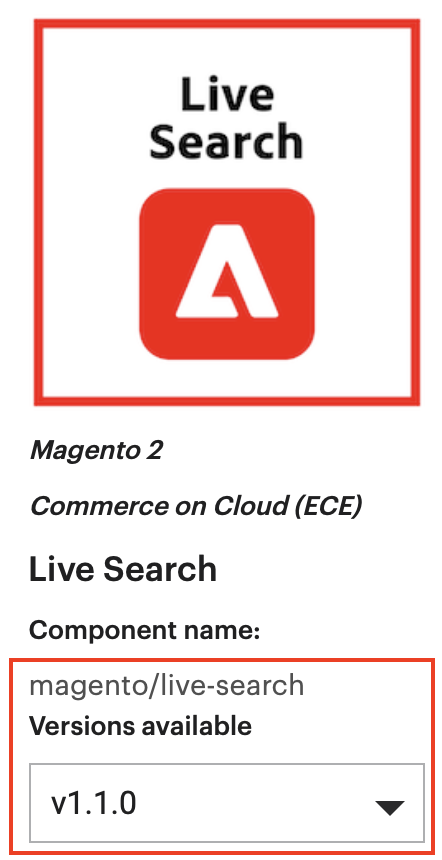

# Installare un’estensione

Il codice che estende o personalizza il comportamento di Adobe Commerce e Magento Open Source è denominato estensione. Facoltativamente, puoi creare un pacchetto e distribuire le estensioni nel [Commerce Marketplace](https://marketplace.magento.com) o un altro sistema di distribuzione dell&#39;estensione.

Le estensioni includono:

- Moduli (estensione delle funzionalità di Adobe Commerce e Magenti Open Source)
- Temi (cambiare l&#39;aspetto e la sensazione del vostro [vetrina](https://glossary.magento.com/storefront) e amministratore)
- Pacchetti per lingua (localizza la vetrina e l’amministratore)

>[!TIP]
>
>In questo argomento viene illustrato come utilizzare la riga di comando per installare le estensioni acquistate dalla Commerce Marketplace. È possibile utilizzare la stessa procedura per installare _qualsiasi_ estensione; tutto ciò di cui hai bisogno è dell&#39;estensione [Compositore](https://glossary.magento.com/composer) nome e versione. Per trovarlo, apri l&#39;estensione `composer.json` e prendere nota dei valori `"name"` e `"version"`.

Prima dell&#39;installazione, è possibile:

1. Esegui il backup del database.
1. Attiva la modalità di manutenzione:

   ```bash
   bin/magento maintenance:enable
   ```

Per installare un&#39;estensione, devi:

1. Ottieni un&#39;estensione dalla Commerce Marketplace o da un altro sviluppatore di estensioni.
1. Se installi un&#39;estensione dalla Commerce Marketplace, assicurati che la `repo.magento.com` l&#39;archivio esiste nel tuo `composer.json` file:

   ```bash
   "repositories": [
       {
           "type": "composer",
           "url": "https://repo.magento.com/"
       }
   ]
   ```

1. Ottieni il nome e la versione del Compositore dell&#39;estensione.
1. Aggiorna `composer.json` nel tuo progetto con il nome e la versione dell&#39;estensione .
1. Verifica che l&#39;estensione sia installata correttamente.
1. Abilita e configura l&#39;estensione .

## Ottieni il nome e la versione del Compositore di estensione

Se conosci già il nome e la versione del Compositore dell&#39;estensione, salta questo passaggio e continua con [Aggiorna il tuo `composer.json` file](#update-your-composer-file).

Per ottenere il nome e la versione del Compositore dell&#39;estensione dalla Commerce Marketplace:

1. Accedi a [Commerce Marketplace](https://marketplace.magento.com) con il nome utente e la password utilizzati per acquistare l&#39;estensione.

1. Nell’angolo in alto a destra, fai clic su **Nome** > **Il mio profilo**.

   

1. Fai clic su **Acquisti personali**.

   

1. Trova l&#39;estensione da installare e fai clic su **Dettagli tecnici**.

   

>[!TIP]
>
>In alternativa, puoi trovare il nome e la versione del Compositore di _qualsiasi_ estensione (acquistata su Commerce Marketplace o altrove) nel `composer.json` file.

## Aggiorna il file Composer

Aggiungi il nome e la versione dell&#39;estensione al tuo `composer.json` file:

1. Passa alla directory del progetto e aggiorna il `composer.json` file.

   ```bash
   composer require <component-name>:<version>
   ```

   Ad esempio:

   ```bash
   composer require j2t/module-payplug:2.0.2
   ```

1. Inserisci il tuo [chiavi di autenticazione](../prerequisites/authentication-keys.md). La tua chiave pubblica è il tuo nome utente; la tua chiave privata è la tua password.

1. Attendi che Compositore completi l’aggiornamento delle dipendenze del progetto e assicurati che non ci siano errori:

   ```terminal
   Updating dependencies (including require-dev)
   Package operations: 1 install, 0 updates, 0 removals
     - Installing j2t/module-payplug (2.0.2): Downloading (100%)
   Writing lock file
   Generating autoload files
   ```

## Verifica dell&#39;estensione

Per verificare che l&#39;estensione sia installata correttamente, esegui il seguente comando:

```bash
bin/magento module:status J2t_Payplug
```

Per impostazione predefinita, l’estensione è probabilmente disabilitata:

```terminal
Module is disabled
```

Il nome dell&#39;estensione è nel formato `<VendorName>_<ComponentName>`; si tratta di un formato diverso dal nome del Compositore. Usa questo formato per abilitare l&#39;estensione . Se non sei sicuro del nome dell&#39;estensione, esegui:

```bash
bin/magento module:status
```

E cerca l&#39;estensione sotto &quot;Elenco dei moduli disabilitati&quot;.

## Abilita l&#39;estensione

Alcune estensioni non funzionano correttamente a meno che tu non cancelli prima i file di visualizzazione statica generati. Utilizza la `--clear-static-content` per cancellare i file di visualizzazione statica quando si abilita un&#39;estensione.

1. Abilita l’estensione e cancella i file di visualizzazione statica:

   ```bash
   bin/magento module:enable J2t_Payplug --clear-static-content
   ```

   Dovresti visualizzare il seguente output:

   ```terminal
   The following modules have been enabled:
   - J2t_Payplug
   
   To make sure that the enabled modules are properly registered, run 'setup:upgrade'.
   Cache cleared successfully.
   Generated classes cleared successfully. Please run the 'setup:di:compile' command to generate classes.
   Generated static view files cleared successfully.
   ```

1. Registra l&#39;estensione:

   ```bash
   bin/magento setup:upgrade
   ```

1. Ricompila il progetto: In modalità Produzione, potresti ricevere un messaggio per &quot;Esegui nuovamente il comando di compilazione Magento&quot;. L&#39;applicazione non richiede l&#39;esecuzione del comando di compilazione in modalità Sviluppatore.

   ```bash
   bin/magento setup:di:compile
   ```

1. Verifica che l&#39;estensione sia abilitata:

   ```bash
   bin/magento module:status J2t_Payplug
   ```

   Dovresti vedere l’output per verificare che l’estensione non sia più disabilitata:

   ```terminal
   Module is enabled
   ```

1. Pulisci la cache:

   ```bash
   bin/magento cache:clean
   ```

1. Configura l&#39;estensione in Admin in base alle esigenze.

>[!TIP]
>
>Se si verificano errori durante il caricamento della vetrina in un browser, utilizza il seguente comando per cancellare la cache: `bin/magento cache:flush`.

## Aggiornare un&#39;estensione

Per aggiornare o aggiornare un modulo o un&#39;estensione:

1. Scarica il file aggiornato da Marketplace o da un altro sviluppatore di estensioni. Prendi nota del nome e della versione del modulo.

1. Esporta il contenuto nella directory radice dell&#39;applicazione.

1. Se esiste un pacchetto Composer per il modulo, esegui una delle seguenti operazioni.

   Aggiornamento per nome del modulo:

   ```bash
   composer update vendor/module-name
   ```

   Aggiornamento per versione:

   ```bash
   composer require vendor/module-name ^x.x.x
   ```

1. Esegui i seguenti comandi per aggiornare, distribuire e pulire la cache.

   ```bash
   bin/magento setup:upgrade --keep-generated
   ```

   ```bash
   bin/magento setup:static-content:deploy
   ```

   ```bash
   bin/magento cache:clean
   ```
