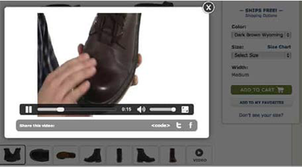

# Immagini del prodotto

E-commerce è interamente basato sull’esperienza online. I clienti che visitano il tuo sito web dovrebbero essere incuriositi dall&#39;acquisto dei prodotti disponibili, il che aumenterà il tasso di conversione. Molti fattori giocano un ruolo importante nell&#39;aumento del ROI. Un fattore di questo tipo è l&#39;immagine del prodotto. Le immagini dei prodotti svolgono un ruolo importante nell&#39;attirare e convincere i clienti ad acquistare un prodotto. Puoi utilizzare le stesse immagini del prodotto sia per B2B che per B2C.

In realtà, i clienti possono sentire e provare il prodotto, ma quando acquistano online non hanno una possibilità di farlo, quindi, è necessario fornire informazioni dettagliate sul prodotto. Oltre ai dettagli, è essenziale avere immagini visive di alta qualità del prodotto come immagini e video per aiutare i clienti a comprendere il prodotto prima di decidere di acquistare. Le immagini dei prodotti sono la prima cosa che i clienti vedono sul tuo sito web, anche prima della descrizione del prodotto, del nome o del prezzo.

È possibile utilizzare diversi tipi di immagini in base alle esigenze aziendali.

## Immagine del prodotto su superficie piana

## Immagini di prodotto con modelli

## Immagini di prodotto

## Immagini lifestyle

## Immagini caricate dall’utente

## Immagini di imballaggio del prodotto

## Immagini non in box

## Video del prodotto

## Best practice

- **Demo del prodotto** - Se il prodotto ha uno scopo definito, demo il prodotto per mostrarne le funzioni e le caratteristiche.

- **Promozione di immagini** generate dagli utenti: gli utenti caricano le immagini con il prodotto come recensione, motivando altri acquirenti ad acquistare il prodotto.

- **Vista a 360 gradi del prodotto** - Il caricamento di un video a 360 gradi o GIF del prodotto può fornire una vista dettagliata al cliente e motivarlo ad acquistare il prodotto.

- **Convenzione di denominazione**: imposta come regola seguire una convenzione di denominazione per l’immagine del prodotto, che aiuta a ridurre al minimo l’errore di caricamento di un’immagine errata per un prodotto e aiuta il team a gestire facilmente le immagini.

- **Caricamento pagina** - Non caricare immagini che aumenteranno il tempo di caricamento della pagina. Se un cliente deve attendere che l&#39;immagine venga visualizzata, potrebbe lasciare il sito.

- **Contenuto** semplice - Non complicare eccessivamente il contenuto. Cercate di mantenere il contenuto semplice e attraente dove la messa a fuoco è il prodotto. Ad esempio, una best practice consiste nell’avere l’immagine del prodotto su uno sfondo bianco per migliorare l’immagine del prodotto.

- **Immagine** del prodotto reale: quando un cliente acquista un prodotto online, si aspetta di vedere il prodotto così com’è sul sito web. Evita di applicare filtri o migliorare l’immagine per modificare l’aspetto del prodotto. È importante essere trasparenti con il cliente, altrimenti si potrebbe avere un alto tasso di rendimento.

>[!TIP]
>
>L&#39;obiettivo delle immagini dei prodotti è quello di mostrare al cliente quale sia il prodotto, come si presenta e motivarlo ad acquistarlo.
