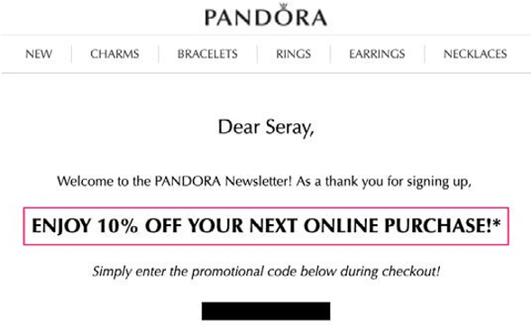

# E-mail marketing

Il marketing e-mail (in termini semplici) consiste nell’inviare messaggi di marketing ai lead e ai clienti attuali tramite e-mail per promuovere, attrarre e vendere prodotti ai clienti. I team di marketing hanno il pieno controllo sul recupero delle informazioni sui clienti e sull’invio di contenuti personalizzati ai clienti tramite campagne e-mail dirette. L’e-mail funge da strumento per creare una relazione tra i clienti e il brand.

Perché considerare l’e-mail marketing:

- Consente di creare una relazione con i clienti attuali e futuri

- Aiuta le vendite e aumenta il tasso di conversione

- Aiuta ad accelerare la crescita delle aziende

- Non richiede una terza parte, ad esempio Instagram o Facebook

## E-mail di benvenuto

La prima impressione è essenziale in un&#39;attività di e-commerce. Se la prima e-mail inviata ai nuovi clienti è efficace, lascerà un&#39;impressione duratura nella memoria del cliente. Cercate di mantenere il design semplice ed originale. Ad esempio, alcuni marchi forniscono sconti nell’e-mail quando il cliente effettua l’iscrizione.

## E-mail curata

L’e-mail curata è una delle forme migliori di e-mail in quanto consente agli abbonati di saperne di più sul prodotto. Puoi anche inviare e-mail curate in base alla segmentazione del cliente.

## E-mail di coinvolgimento

I clienti possono facilmente ignorare le e-mail, ma se queste vengono inviate come e-mail di coinvolgimento, la probabilità che un cliente le elimini senza visualizzarle è inferiore. Le e-mail di coinvolgimento possono assumere la forma di una campagna che offre agli utenti una promozione, ad esempio la spedizione gratuita.

## Indirizzo e-mail di riferimento

Parola di bocca è una delle migliori strategie di marketing. Ad esempio, l’invio di un’e-mail di riferimento a un cliente esistente. Ad esempio, &quot;Fai riferimento a un amico e ricevi $ 10!&quot; L’e-mail di riferimento motiva i clienti a diffondere la parola in modo organico, aiutandoli a ottenere più clienti.

## E-mail sconto

Offrire sconti tramite e-mail è una strategia di marketing efficace. È necessario offrire sconti agli abbonati per mantenere la loro fedeltà.

## E-mail di abbandono

I clienti abbandonano i loro carrelli per vari motivi, inclusi costi di spedizione elevati o una politica di restituzione insoddisfacente. Puoi provare a convertire questi clienti in acquirenti di successo inviando loro un promemoria e-mail sul prodotto che hanno lasciato nel loro carrello. Inoltre, è possibile offrire incentivi per completare il loro pagamento, inclusa la spedizione gratuita, uno sconto o un voucher per il loro acquisto successivo. Questo aiuta ad aumentare il tasso di conversione.

## E-mail di conferma dell&#39;ordine

Le e-mail di conferma dell’ordine non solo contribuiscono a incrementare le vendite, ma anche a fornire ai clienti la certezza di aver effettuato l’ordine, il che aumenta l’esperienza e la fedeltà dei clienti.

## E-mail di sondaggio

Dopo che i clienti ricevono i loro ordini, devi inviare un’e-mail di sondaggio per informarti sulla loro esperienza e sui suggerimenti per migliorarli. Alcuni rivenditori forniscono anche un buono regalo se i clienti completano il sondaggio perché la maggior parte delle volte i clienti non completano i sondaggi in quanto non c&#39;è motivo per loro di farlo.

