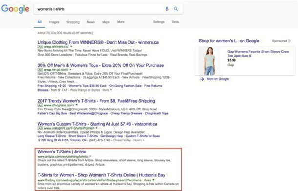

# Ottimizzazione dei motori di ricerca (SEO)

L’ottimizzazione SEO (Search Engine Optimization) è uno strumento che consente di ottimizzare il sito web in base a parole chiave specifiche, in modo che abbia una classificazione più elevata nei risultati di ricerca di Google. Google classifica i siti web in base al fatto che il brand abbia risposto a tutte le domande di ricerca poste dai clienti. Quando i clienti cercano qualcosa su Google, trovano diversi tipi di risultati. Le sezioni seguenti descrivono tali risultati.

## Non pagato

Vedere i risultati evidenziati in rosso nell&#39;immagine seguente:

## Pagato

Vedere i risultati evidenziati in arancione nell&#39;immagine seguente:

>[!NOTE]
>
>Google Shopping delineato in viola.

## Strategie

La strategia SEO include:

- **Ricerca per parole chiave**—Parole chiave utilizzate dai clienti per la ricerca

- **Architettura del sito**: la ricerca viene eseguita sulle parole chiave

- **SEO (tecnico)** - Verifica della ricerca per indicizzazione SEO nel sito

- **SEO a pagina**: i metadati e i contenuti vengono utilizzati per attirare i clienti

- **Analytics**—Strumenti, come Google Analytics, vengono utilizzati per tenere traccia di SEO

Le campagne B2B SEO (Search Engine Optimization) hanno lo scopo di aumentare la consapevolezza del brand e la generazione di lead, il che porta a un aumento del tasso di conversione. Le campagne B2C SEO (Search Engine Optimization) hanno lo scopo di attirare i visitatori a effettuare acquisti immediati. La SEO ha usi e impatti diversi nelle aziende B2B rispetto alle aziende B2C. SEO può aiutare ad aumentare il traffico sul tuo sito, che a sua volta aumenterà le vendite e il ROI. Imposta una semplice strategia SEO (Search Engine Optimization) per ottenere un vantaggio competitivo.
