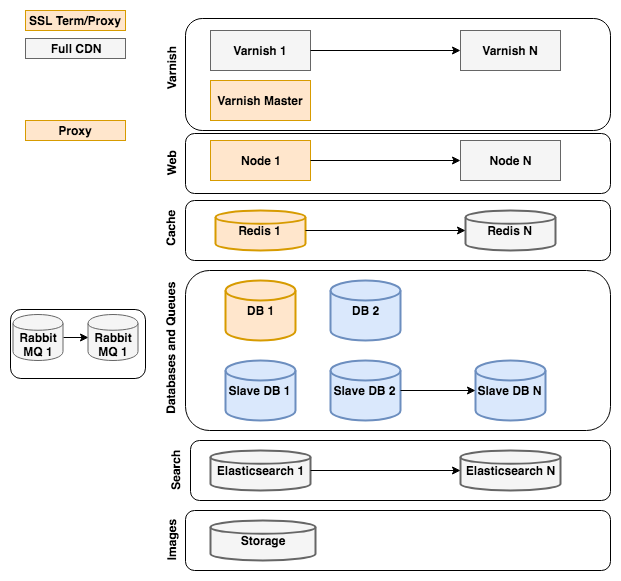

# Architettura di riferimento

Questo argomento descrive una configurazione consigliata generica per le istanze Adobe Commerce e Magenti Open Source che utilizzano server normali ospitati fisicamente in un data center (non virtualizzato) in cui le risorse non vengono condivise con altri utenti. Il provider di hosting, specialmente se è specializzato nell&#39;hosting ad alte prestazioni Commerce, potrebbe consigliare una configurazione diversa che sia ugualmente o più efficace per i tuoi requisiti.

Per Adobe Commerce sugli ambienti di infrastruttura cloud, consulta [Architettura iniziale](https://devdocs.magento.com/cloud/architecture/starter-architecture.html).

## [!DNL Commerce] Diagramma dell&#39;architettura di riferimento

La [!DNL Commerce] Il diagramma dell’architettura di riferimento rappresenta l’approccio migliore per impostare un [!DNL Commerce] sito.

Il colore di ciascun elemento nel diagramma indica se l’elemento fa parte di Magenti Open Source o Adobe Commerce e se è richiesto.

* Gli elementi arancione sono necessari per il Magento Open Source
* Gli elementi grigi sono opzionali per il Magento Open Source
* Gli elementi blu sono facoltativi per Adobe Commerce

Le sezioni seguenti forniscono raccomandazioni e considerazioni per ogni sezione del diagramma di Commerce Reference Architecture.

### [!DNL Varnish]

* A [!DNL Varnish] il cluster può adattarsi al traffico di un sito
* Regola la dimensione dell’istanza in base al numero di pagine della cache necessarie
* In un sito con traffico elevato, utilizza un [!DNL Varnish] Master per garantire lo scaricamento in cache di una richiesta (al massimo) per livello web

### Web

* Abilita scalabilità dei nodi per traffico e ridondanza
* Un nodo è principale ed esegue cron
* In alternativa, utilizza un Admin dedicato e i nodi di lavoro

### Cache

* Prendi in considerazione l’implementazione di un’istanza Redis separata per le sessioni
* Puoi avere un&#39;istanza Redis per cache
* Ridimensiona l’istanza in modo che contenga la dimensione massima prevista della cache

### Database e code

* I siti a traffico elevato possono ottimizzare le prestazioni del DB con database slave e database suddivisi per ordini/carrelli (in Adobe Commerce)
* Utilizzare un database slave per abilitare il ripristino rapido e i backup dei dati
* I siti a traffico ridotto possono memorizzare le immagini nel database

### Ricerca

* Ottimizza il numero di istanze in base al traffico di ricerca

### Storage

* Valuta l&#39;utilizzo di GFS o GlusterFS per l&#39;archiviazione su pub/media
* In alternativa, utilizza l’archiviazione DB per i siti a traffico ridotto

### Consigliato [!DNL Varnish] architettura di riferimento

Il Magento supporta diversi motori di memorizzazione in cache a pagina intera (File, Memcache, Redis, [!DNL Varnish]) preconfigurato, insieme a una copertura estesa attraverso estensioni. [!DNL Varnish] è il motore di cache a pagina intera consigliato.  [!DNL Commerce] supporta molti [!DNL Varnish] configurazioni.

Per i siti che non richiedono elevata disponibilità, si consiglia di utilizzare un [!DNL Varnish] configurazione con terminazione SSL Nginx.

![Semplice [!DNL Varnish] Configurazione con terminazione SSL](../assets/performance/images/single-varnish-with-ssl-termination.png)

Per i siti che richiedono un’elevata disponibilità, si consiglia di utilizzare un [!DNL Varnish] configurazione con un load balancer di terminazione SSL.

![Alta disponibilità a due livelli [!DNL Varnish] configurazione con load balancer di terminazione SSL](../assets/performance/images/ha-2-tier-varnish-with-ssl-term-load-balancer.png)
