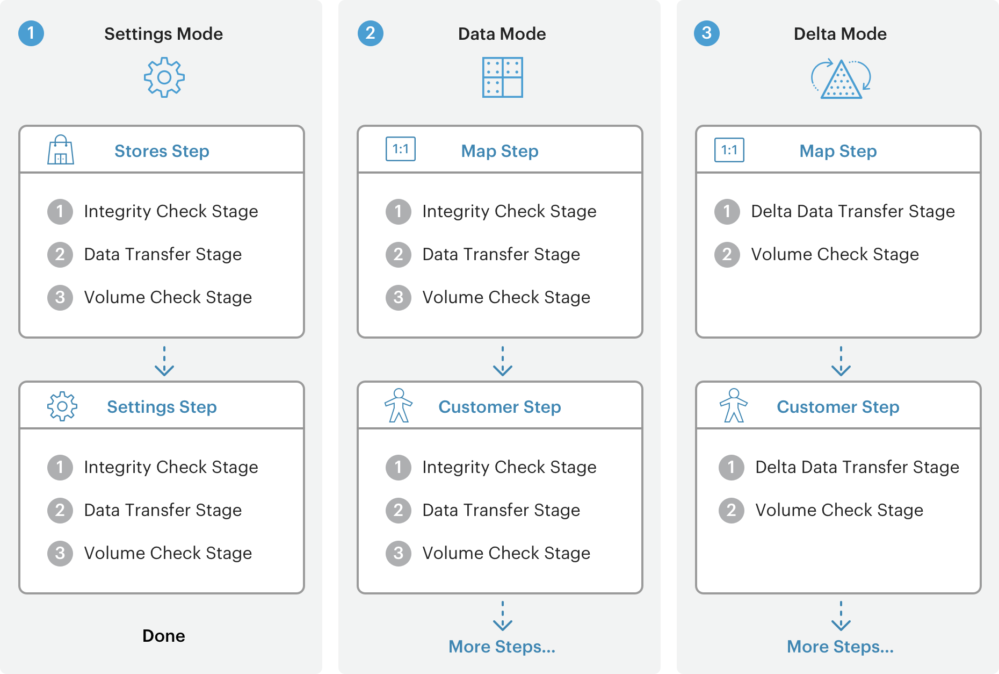

# Funzionamento della migrazione dei dati

In questo argomento viene fornita una panoramica generale della migrazione dei dati dal Magento 1 al Magento 2 tramite [!DNL Data Migration Tool].

Il [!DNL Data Migration Tool] è uno strumento dell’interfaccia della riga di comando (CLI) utilizzato per trasferire i dati dal Magento 1 al Magento 2. Lo strumento verifica la coerenza tra le strutture di database (tabelle e campi) del Magento 1 e 2, tiene traccia dell’avanzamento del trasferimento dei dati, crea registri ed esegue i test di verifica dei dati.

## Terminologia

* **Modalità** : un set ordinato di operazioni per la migrazione dei dati dal Magento 1.x al Magento 2.x.
* **Passaggi** : le attività in una modalità che definiscono i tipi di dati da migrare.
* **Fasi** : le attività in un passaggio che convalidano, trasferiscono e verificano i dati.
* **File mappa** : file XML che definiscono le regole e le connessioni tra le strutture di dati del Magento 1.x e del Magento 2.x per il completamento delle fasi.

## Modalità

Il [!DNL Data Migration Tool] suddivide il processo di migrazione in tre fasi o *modalità* per trasferire e adattare i dati dal Magento 1.x al Magento 2.x. Le tre modalità sono elencate qui e devono essere eseguite in questo ordine:

1. **Modalità impostazioni**: esegue la migrazione della configurazione del sistema e delle impostazioni relative al sito Web.
1. **Modalità dati**: esegue la migrazione in blocco delle risorse del database.
1. **Modalità delta**: migra le modifiche incrementali (modifiche dall’ultima esecuzione), ad esempio nuovi clienti e ordini.

## Passaggi

Il [!DNL Data Migration Tool] utilizza un elenco di *passaggi* all’interno di ogni modalità per migrare un particolare tipo di dati. Ad esempio, nella modalità Impostazioni sono disponibili due passaggi per la migrazione di tutti i dati delle impostazioni: il passaggio Archivi e il passaggio Impostazioni. I dettagli sui dati specifici migrati in ciascuno di questi passaggi (e per i passaggi nelle altre modalità) sono disponibili nella sezione [[!DNL Data Migration Tool] Specifiche tecniche](technical-specification.md).

## Fasi

All&#39;interno di ogni passaggio sono presenti tre *stadi* che vengono sempre eseguiti in questo ordine per garantire la corretta migrazione dei dati:

1. **Controllo di integrità**: confronta i nomi dei campi della tabella, i tipi e altre informazioni per verificare la compatibilità tra le strutture di dati dei Magenti 1 e 2.
1. **Trasferimento dati**: trasferisce la tabella di dati per tabella dai Magenti 1 e 2.
1. **Controllo volume**: confronta il numero di record tra le tabelle per verificare che il trasferimento sia stato eseguito correttamente.

## File mappa

Il livello più basso dei processi di migrazione è l&#39;XML *file mappa*. Il [!DNL Data Migration Tool] utilizza i file di mappa nelle fasi di un passaggio per trasformare diverse strutture di dati tra le tabelle 1.x e 2.x del Magento.

Quando, ad esempio, si trasformano i dati da un database del Magento Open Source 1.8.0.0 al Magento Open Source 2.x.x, il file di mapping tiene conto del fatto che una tabella è stata rinominata e la rinomina di conseguenza nel database di destinazione. Se non vi sono differenze nella struttura o nel formato dei dati, [!DNL Data Migration Tool] lo trasferisce così com’è, inclusi i dati delle tabelle create dalle estensioni, al database Magento 2.

Quando le differenze non vengono dichiarate nei file di mappa, [!DNL Data Migration Tool] visualizza un errore e non si avvia.

I file di mappatura sono trattati più dettagliatamente in [[!DNL Data Migration Tool] Specifiche tecniche].

## Diagramma del flusso di migrazione

[[!DNL Data Migration Tool] Specifiche tecniche](technical-specification.md)

Siamo lieti che tu stia considerando di passare dalla piattaforma di commercio #1 del mondo — Magento 1.x — alla piattaforma del futuro, Magento 2. Siamo entusiasti di condividere i dettagli di questo processo, che chiamiamo migrazione.

## Componenti di migrazione

La migrazione al Magento 2 prevede quattro componenti: dati, estensioni e codice personalizzato, temi e personalizzazioni.

### Dati

Abbiamo sviluppato **MAGENTO 2[!DNL Data Migration Tool]** per spostare in modo efficiente tutti i prodotti, i clienti e i dati degli ordini, le configurazioni dei negozi, le promozioni e altro ancora al Magento 2. Questa guida fornisce informazioni sullo strumento e sulle best practice per utilizzarlo per migrare i dati.

### Estensioni e codice personalizzato

Abbiamo lavorato sodo con la community di sviluppo per aiutarti a utilizzare le estensioni del Magento 1 nel Magento 2. Ora siamo orgogliosi di presentare [Commerce Marketplace](https://marketplace.magento.com/), dove puoi scaricare o acquistare le versioni più recenti delle estensioni preferite.

Ulteriori informazioni sullo sviluppo di estensioni per il Magento 2 sono disponibili nel [Guida per gli sviluppatori PHP](https://developer.adobe.com/commerce/php/development/).

### Temi e personalizzazioni

Il Magento 2 si avvale di nuovi approcci e tecnologie che offrono ai commercianti una capacità ineguagliabile di creare esperienze di acquisto innovative e di scalare a nuovi livelli. Per sfruttare questi progressi, gli sviluppatori devono apportare modifiche ai temi e alle personalizzazioni. La documentazione è disponibile online per la creazione del Magento 2 [temi](https://developer.adobe.com/commerce/frontend-core/guide/themes/), [layout](https://developer.adobe.com/commerce/frontend-core/guide/layouts/), e [personalizzazioni](https://developer.adobe.com/commerce/frontend-core/guide/layouts/xml-manage/).

## Attività di migrazione

Proprio come per un aggiornamento tra versioni 1.x (ad esempio, da v1.12 a v1.14), il livello di impegno per la migrazione dal Magento 1 al Magento 2 dipende da come è stato creato il sito e dal relativo livello di personalizzazione.
Tuttavia, stiamo migliorando costantemente la [!DNL Data Migration Tool] (vedere [Changelog](https://github.com/magento/data-migration-tool/blob/2.3/CHANGELOG.md) per maggiori dettagli); pertanto gli sforzi di migrazione sono in continua diminuzione.
