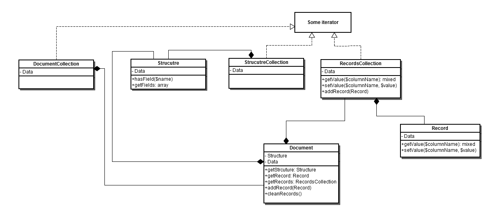

# [!DNL Data Migration Tool] specifiche tecniche

Questa sezione descrive [!DNL Data Migration Tool] dettagli sull’implementazione ed estensione delle funzionalità.

## Archivi

Per accedere al [!DNL Data Migration Tool] codice sorgente, consulta GitHub [archivio](https://github.com/magento/data-migration-tool).

## Requisiti di sistema

Il [requisiti di sistema](../../installation/system-requirements.md) per [!DNL Data Migration Tool] sono gli stessi del Magento 2.

## Struttura interna

### Struttura della directory

Il diagramma seguente rappresenta la struttura di directory di [!DNL Data Migration Tool]:

```terminal
├── etc                                    --- all configuration files
│   ├── opensource-to-opensource            --- configuration files for migration from Magento Open Source 1 to Magento Open Source 2
│   │   ├── 1.9.1.1
│   │   │   ├── config.xml.dist
│   │   │   └── map.xml.dist
│   │   ├── 1.9.2.0
│   │   │   ├── config.xml.dist
│   │   │   └── map.xml.dist
│   │   ├── ........
│   │   ├── class-map.xml.dist
│   │   ├── deltalog.xml.dist
│   │   └── settings.xml.dist
│   │   ├── ........
│   ├── opensource-to-commerce              --- configuration files for migration from Magento Open Source 1 to Adobe Commerce 2
│   ├── commerce-to-commerce                --- configuration files for migration from Adobe Commerce 1 to Adobe Commerce 2
│   ├── class-map.xsd
│   ├── config.xsd
│   ├── map.xsd
│   └── settings.xsd
├── src
│   └── Migration
│       ├── App                             --- application framework
│       ├── Console
│       ├── Handler                         --- handlers are used by map files
│       │   ├── AbstractHandler.php
│       │   ├── AddPrefix.php
│       │   ├── ConvertIp.php
│       │   ├── ........
│       ├── Logger
│       ├── Reader
│       ├── Mode
│       │   ├── AbstractMode.php
│       │   ├── Data.php
│       │   ├── Delta.php
│       │   └── Settings.php
│       ├── ResourceModel                   --- contains adapter for connection to data storage and classes to work with structured data
│       │   ├── Adapter
│       │   │   └── Mysql.php
│       │   ├── AbstractCollection.php
│       │   ├── AbstractResource.php
│       │   ├── AdapterInterface.php
│       │   ├── Destination.php
│       │   ├── Document.php
│       │   ├── Record.php
│       │   ├── Source.php
│       │   └── Structure.php
│       ├── Config.php
│       ├── Exception.php
│       └── Step                            --- functionality for migrating specific data
│           ├── Eav
│           │   ├── Data.php
│           │   ├── Helper.php
│           │   ├── InitialData.php
│           │   ├── Integrity.php
│           │   └── Volume.php
│           ├── Map
│           │   ├── Data.php
│           │   ├── Delta.php
│           │   ├── Helper.php
│           │   ├── Integrity.php
│           │   └── Volume.php
│           ├── UrlRewrite
│           │   ├── Version11300to2000.php
│           │   ├── Version11410to2000.php
│           │   └── Version191to2000.php
│           ├── ..........
└── tests
    ├── integration
    ├── static
    └── unit
```

## Punto di ingresso

Lo script che esegue il processo di migrazione si trova in: `magento-root/bin/magento`.

## Configurazione

Schema per la configurazione `config.xsd` il file si trova in `etc/` directory. Il file di configurazione predefinito (`config.xml.dist`) viene creato per ogni versione del Magento 1.x. Si trova in una directory separata sotto `etc/`.

Il file di configurazione predefinito può essere sostituito da uno personalizzato (vedere [sintassi del comando](migrate-data/overview.md#command-syntax)).

Il file di configurazione ha la seguente struttura:

```xml
<config xmlns:xs="http://www.w3.org/2001/XMLSchema-instance" xs:noNamespaceSchemaLocation="config.xsd">
    <steps mode="settings">
        <step title="Settings step">
            <integrity>Migration\Step\Settings</integrity>
            <data>Migration\Step\Settings</data>
        </step>
    </steps>
    <steps mode="data">
        <step title="Map step">
            <integrity>Migration\Step\Map\Integrity</integrity>
            <data>Migration\Step\Map\Data</data>
            <volume>Migration\Step\Map\Volume</volume>
        </step>
        ...
    </steps>
    <steps mode="delta">
        <step title="Map step">
            <delta>Migration\Step\Map\Delta</delta>
            <volume>Migration\Step\Map\Volume</volume>
        </step>
        ...
    </steps>
    <source>
        <database host="localhost" name="magento1" user="root" password=""/>
    </source>
    <destination>
        <database host="localhost" name="magento2" user="root" password=""/>
    </destination>
    <options>
        <map_file>map-file.xml</map_file>
        <settings_map_file>settings-map-file.xml</settings_map_file>
        <bulk_size>100</bulk_size>
        <custom_option>custom_option_value</custom_option>
        <source_prefix />
        <dest_prefix />
        ...
    </options>
</config>
```

* passaggi: descrive tutti i passaggi elaborati durante la migrazione

* origine: configurazione per l’origine dati. Tipi di origine disponibili: database

* destinazione: configurazione per la destinazione dati. Tipi di destinazione disponibili: database

* options - elenco di parametri. Contiene i parametri obbligatori (map_file, settings_map_file, bulk_size) e facoltativi (custom_option, resource_adapter_class_name, prefix_source, prefix_dest, log_file)

Modifica l&#39;opzione del prefisso nel caso in cui il Magento sia stato installato con il prefisso nelle tabelle di database. Può essere impostata per i database del Magento 1 e del Magento 2. Utilizzate di conseguenza le opzioni di configurazione &quot;source_prefix&quot; e &quot;dest_prefix&quot;.

I dati di configurazione sono accessibili con `\Migration\Config` classe.

## Passaggi operazioni disponibili

| Documento | Campo |
|---|---|
| `step` | Nodo di secondo livello all’interno del nodo Passaggi. La descrizione della fase pertinente deve essere specificata nel `title` attributo. |
| `integrity` | Specifica la classe PHP responsabile del controllo dell&#39;integrità. Confronta i nomi dei campi, i tipi e altre informazioni della tabella per verificare la compatibilità tra le strutture di dati dei Magenti 1 e 2. |
| `data` | Specifica la classe PHP responsabile del controllo dei dati. Trasferisce i dati tabella per tabella dal Magento 1 al Magento 2. |
| `volume` | Specifica la classe PHP responsabile del controllo del volume. Confronta il numero di record tra le tabelle per verificare che il trasferimento sia stato eseguito correttamente. |
| `delta` | Specifica la classe PHP responsabile del controllo delta. Trasferisce il delta dal Magento 1 al Magento 2 dopo la migrazione completa dei dati. |

## Attributi delle informazioni del database di origine

| Documento | Campo | Obbligatorio |
|---|---|---|
| `name` | Nome del database del server del Magento 1. | sì |
| `host` | Indirizzo IP host del server Magento 1. | sì |
| `port` | Numero di porta del server del Magento 1. | no |
| `user` | Nome utente del server di database del Magento 1. | sì |
| `password` | Password del server di database del Magento 1. | sì |
| `ssl_ca` | Percorso del file dell’autorità di certificazione SSL. | no |
| `ssl_cert` | Percorso del file del certificato SSL. | no |
| `ssl_key` | Percorso del file di chiave SSL. | no |

## Attributi delle informazioni del database di destinazione

| Documento | Campo | Obbligatorio |
|---|---|---|
| `name` | Nome del database del server di Magento 2. | sì |
| `host` | Indirizzo IP host del server Magento 2. | sì |
| `port` | Numero di porta del server del Magento 2. | no |
| `user` | Nome utente del server di database del Magento 2. | sì |
| `password` | Password del server database di Magento 2. | sì |
| `ssl_ca` | Percorso del file dell’autorità di certificazione SSL. | no |
| `ssl_cert` | Percorso del file del certificato SSL. | no |
| `ssl_key` | Percorso del file di chiave SSL. | no |

## Connetti utilizzando il protocollo TLS

È inoltre possibile connettersi a un database utilizzando il protocollo TLS, ovvero le chiavi di crittografia pubbliche/private. Aggiungi i seguenti attributi facoltativi alla `database` elemento:

* `ssl_ca`
* `ssl_cert`
* `ssl_key`

Ad esempio:

```xml
<source>
    <database host="localhost" name="magento1" user="root" ssl_ca="/path/to/file" ssl_cert="/path/to/file" ssl_key="/path/to/file"/>
</source>
<destination>
    <database host="localhost" name="magento2" user="root" ssl_ca="/path/to/file" ssl_cert="/path/to/file" ssl_key="/path/to/file"/>
</destination>
```

## Interni del passaggio

Il processo di migrazione è costituito da passaggi.

Step è un&#39;unità che fornisce le funzionalità necessarie per la migrazione di alcuni dati separati. Il passo può essere costituito da uno o più stadi (controllo di integrità, dati, controllo del volume e delta).

Per impostazione predefinita, sono disponibili diversi passaggi ([Mappa](#map-step), [EAV](#eav), [Riscritture URL](#url-rewrite-step)e così via). Facoltativamente, puoi anche aggiungere passaggi personalizzati.

Le classi relative ai passi si trovano nella directory src/Migration/Step.

Per eseguire una classe Step, la classe deve essere definita nel file config.xml.

```xml
<config xmlns:xs="http://www.w3.org/2001/XMLSchema-instance" xs:noNamespaceSchemaLocation="config.xsd">
    <steps mode="mode_name">
        <step title="Step Name">
            <integrity>Migration\Step\StepName\Integrity</integrity>  <!-- integrity check stage of the step -->
            <data>Migration\Step\StepName\Data</data>
            <volume>Migration\Step\StepName\Volume</volume>
        </step>
        ...
    </steps>
    ...
</config>
```

Ogni classe stage deve implementare StageInterface.

```php
class StageClass implements StageInterface
{
  /**
   * Perform the stage
   *
   * @return bool
   */
  public function perform()
  {
  }
}
```

Se la fase dati supporta il rollback, deve implementare `RollbackInterface` di rete.

La visualizzazione del passaggio in esecuzione è fornita dal componente ProgressBar di Symfony (consultate [Barra di avanzamento](https://symfony.com/doc/current/components/console/helpers/progressbar.html)). Accedere a questo componente in un passaggio come LogLevelProcessor.

I principali metodi di utilizzo sono:

```xml
$this->progress->start();
$this->progress->advance();
$this->progress->finish();
```

## Fasi del passaggio

### Controllo dell’integrità

Ogni fase deve verificare che la struttura dell’origine dati (Magento 1 per impostazione predefinita) e la struttura della destinazione dati (Magento 2) siano compatibili. In caso contrario, viene visualizzato un errore con entità non compatibili. Nel caso in cui i campi abbiano tipi di dati diversi (lo stesso campo ha un tipo di dati decimale nel Magento 1 e un numero intero nel Magento 2), viene visualizzato un messaggio di avvertenza (tranne quando era coperto nel file Mappa).

### Trasferimento dati

Se il controllo di integrità è stato superato, il trasferimento dei dati è in esecuzione. Se compaiono errori, il rollback viene eseguito per ripristinare lo stato precedente del Magento 2. Se una classe step implementa `RollbackInterface` , il metodo di rollback viene eseguito in caso di errore.

### Controllo volume

Dopo la migrazione dei dati, Controllo volume consente di verificare che tutti i dati siano stati trasferiti correttamente.

### Consegna delta

La funzionalità Delta è responsabile della distribuzione del resto dei dati aggiunti dopo la migrazione principale.

## Modalità di esecuzione

Lo strumento deve essere eseguito in tre diverse modalità, in particolare:

1. settings - migrazione delle impostazioni di sistema
1. dati: migrazione principale dei dati
1. delta: migrazione del resto dei dati aggiunti dopo la migrazione principale

Ogni modalità dispone di un proprio elenco di passaggi da eseguire. Consulta config.xml

### Modalità di migrazione delle impostazioni

La modalità di migrazione delle impostazioni di questo strumento viene utilizzata per trasferire le seguenti entità:

1. Siti web, store, visualizzazioni dello store.
1. Configurazione dello store (principalmente Stores->Configurazione in M2 o System->Configurazione in M1)

Tutta la configurazione dell&#39;archivio mantiene i propri dati nella tabella core_config_data nel database. Il file settings.xml contiene le regole per questa tabella che vengono applicate durante il processo di migrazione. Questo file descrive le impostazioni che devono essere ignorate, rinominate o che devono modificare i relativi valori. Il file settings.xml ha la seguente struttura:

```xml
<?xml version="1.0" encoding="UTF-8"?>
<settings xmlns:xs="http://www.w3.org/2001/XMLSchema-instance" xs:noNamespaceSchemaLocation="settings.xsd">
    <key>
        <ignore>
            <path>path/to/ignore*</path>
        </ignore>
        <rename>
            <path>path/to/rename</path>
            <to>new/path/renamed</to>
        </rename>
    <key>
    <value>
        <transform>
            <path>some/key/to/change</path>
            <handler class="Some\Handler\Class"/>
        </transform>
    </value>
</settings>
```

Sotto il nodo `<key>` esistono regole che funzionano con la colonna &quot;percorso&quot; nella `core_config_data` tabella. `<ignore>` le regole impediscono allo strumento di trasferire alcune impostazioni. In questo nodo è possibile utilizzare i caratteri jolly. Tutte le altre impostazioni non elencate in `<ignore>` migrazione dei nodi. Se il percorso di un&#39;impostazione viene modificato nel Magento 2, deve essere aggiunto a `//key/rename` nodo, dove il percorso precedente indica in `//key/rename/path` il nodo e il nuovo percorso indicano `//key/rename/to` nodo.

Sotto il nodo `<value>`, esistono regole che funzionano con la colonna &quot;valore&quot; nella `core_config_data` tabella. Queste regole hanno lo scopo di trasformare il valore delle impostazioni da parte dei gestori (classi che implementano `Migration\Handler\HandlerInterface`) e adattarlo per il Magento 2.

### Modalità di migrazione dati

In questa modalità, la maggior parte dei dati viene migrata. Prima della migrazione dei dati, per ogni passaggio vengono eseguite le fasi di controllo dell&#39;integrità. Se il controllo di integrità viene superato, il [!DNL Data Migration Tool] installa le tabelle deltalog (con prefisso `m2_cl_*`) e i trigger corrispondenti al database del Magento 1 ed esegue la fase di migrazione dei dati dei passaggi. Quando la migrazione viene completata senza errori, la verifica del volume verifica la coerenza dei dati. Se effettui la migrazione del negozio live, puoi visualizzare un messaggio di avviso. Non preoccuparti, la migrazione delta si occupa di questi dati incrementali. I passaggi di migrazione più importanti sono Map, URL Rewrite ed EAV.

#### Passaggio mappa

Il passaggio della mappa è responsabile del trasferimento della maggior parte dei dati dal Magento 1 al Magento 2. Questo passaggio legge le istruzioni dal file map.xml (che si trova nel `etc/` directory). Il file descrive le differenze tra le strutture di dati di origine (Magento 1) e destinazione (Magento 2). Se il Magento 1 contiene tabelle o campi che appartengono a un’estensione che non esiste nel Magento 2, queste entità possono essere posizionate qui per ignorarle mediante il passaggio mappa. In caso contrario, viene visualizzato un messaggio di errore.

Il file della mappa ha il formato successivo:

```xml
<?xml version="1.0" encoding="UTF-8"?>
<map xmlns:xs="http://www.w3.org/2001/XMLSchema-instance" xs:noNamespaceSchemaLocation="map.xsd">
    <source>
        <document_rules>
            <ignore>
                <document>some_document2</document>
            </ignore>
            <rename>
                <document>some_document</document>
                <to>some_dest_document</to>
            </rename>
            <log_changes>
                <document key="primary_key">some_dest_document</document>
            </log_changes>
        </document_rules>

        <field_rules>
            <move>
                <field>some_document1.field1</field>
                <to>some_document1.field2</to>
            </move>
            <ignore>
                <field>some_document3.field8</field>
            </ignore>
            <transform>
                <field>some_document1.field1</field>
                <handler class="\Migration\Handler\Convert">
                    <param name="map" value="[value1:value2;value3:value4;value5:value6;]" />
                </handler>
            </transform>
        </field_rules>
    </source>
    <destination>
        <document_rules>
            <ignore>
                <document>some_document8</document>
            </ignore>
        </document_rules>

        <field_rules>
            <transform>
                <field>some_document5.field3</field>
                <handler class="\Migration\Handler\SetValue">
                    <param name="value" value="10" />
                </handler>
            </transform>
        </field_rules>
    </destination>
</map>
```

Aree:

* *sorgente* : contiene regole del database di origine

* *destinazione* : contiene regole del database di destinazione

Opzioni:

* *ignora* : documento, campo o tipo di dati contrassegnato con questa opzione viene ignorato

* *rinomina* - descrive le relazioni di nome tra documenti con un nome diverso. In un caso in cui il nome del documento di destinazione non corrisponde a quello del documento di origine, è possibile utilizzare l&#39;opzione Rinomina per impostare il nome del documento di origine in modo simile al nome della tabella di destinazione

* *sposta* - imposta la regola per spostare il campo specificato dal documento di origine al documento di destinazione. NOTA: il nome del documento di destinazione deve corrispondere al nome del documento di origine. Se i nomi dei documenti di origine e di destinazione sono diversi, è necessario utilizzare l&#39;opzione Rinomina per il documento che contiene un campo spostato

* *trasformazione* - è un’opzione che consente all’utente di migrare i campi in base al comportamento descritto in gestori

* *handler* : descrive il comportamento di trasformazione dei campi. Per chiamare il gestore, è necessario specificare il nome di una classe del gestore in un `<handler>` tag. Utilizza il `<param>` tag con il nome del parametro e i dati del valore per trasmetterlo al gestore

**Sorgente** operazioni disponibili:

| Documento | Campo |
|--- |--- |
| ignora ridenominazione | ignora trasformazione di spostamento |

**Destinazione** operazioni disponibili:

| Documento | Campo |
|--- |--- |
| ignora | ignora trasformazione |

#### Caratteri jolly

Per ignorare documenti con parti simili (`document_name_1`, `document_name_2`), è possibile utilizzare la funzionalità con caratteri jolly. Inserisci `*` simbolo anziché parte ripetuta (`document_name_*`) e questa maschera copre tutti i documenti di origine o di destinazione che soddisfano questa maschera.

#### Passaggio di riscrittura URL

Questo passaggio è complesso perché esistono molti algoritmi diversi sviluppati nel Magento 1 che non sono compatibili con il Magento 2. Per versioni diverse del Magento 1, possono esistere algoritmi diversi. Pertanto, nella cartella Step/UrlRewrite sono presenti classi sviluppate per alcune versioni specifiche di Magento, tra cui Migration\Step\UrlRewrite\Version191to2000. Può trasferire URL Riscrive i dati dal Magento 1.9.1 al Magento 2.

#### Passaggio EAV

Questo passaggio trasferisce tutti gli attributi (prodotto, cliente, RMA) dal Magento 1 al Magento 2. Utilizza il file map-eav.xml che contiene regole simili a quelle del file map.xml per casi specifici di elaborazione di dati.

Alcune delle tabelle elaborate nel passaggio:

* `eav_attribute`
* `eav_attribute_group`
* `eav_attribute_set`
* `eav_entity_attribute`
* `catalog_eav_attribute`
* `customer_eav_attribute`
* `eav_entity_type`

### Modalità di migrazione delta

Dopo la migrazione principale, i clienti della vetrina avrebbero potuto aggiungere dati aggiuntivi al database del Magento 1. Per tenere traccia di questi dati, lo strumento imposta i trigger del database per le tabelle all’inizio del processo di migrazione. Per ulteriori informazioni, consulta [Eseguire la migrazione dei dati creati da estensioni di terze parti](migrate-data/delta.md#migrate-data-created-by-third-party-extensions).

## Origini dati

Per raggiungere le origini dati del Magento 1 e del Magento 2 e operare con i relativi dati (selezionare, aggiornare, inserire, eliminare), nella cartella Risorse sono presenti molte classi. Migration\ResourceModel\Source e Migration\ResourceModel\Destination sono classi principali. Tutti i passaggi di migrazione lo utilizzano per operare con i dati. Questi dati sono contenuti in classi quali Migration\ResourceModel\Document, Migration\ResourceModel\Record, Migration\ResourceModel\Structure, ecc.

Di seguito è riportato un diagramma classi di queste classi:



## Registrazione

Al fine di implementare l&#39;output del processo di migrazione e controllare tutti i possibili livelli PSR logger, che viene utilizzato nel Magento, è applicato. `\Migration\Logger\Logger` La classe è stata implementata per fornire funzionalità di registrazione. Per utilizzare il logger, è necessario iniettarlo tramite l’iniezione di dipendenza del costruttore.

```php
class SomeClass
{
    ...
    protected $logger;

    public function __construct(\Migration\Logger\Logger $logger)
    {
        $this->logger = $logger;
    }
    ...
}
```

Dopodiché puoi utilizzare questa classe per la registrazione di alcuni eventi:

```php
$this->logger->info("Some information message");
$this->logger->debug("Some debug message");
$this->logger->error("Message about error operation");
$this->logger->warning("Some warning message");
```

È possibile personalizzare la posizione in cui scrivere le informazioni di registro. Per farlo, aggiungi un gestore al logger utilizzando il metodo pushHandler() del logger. Ogni gestore deve implementare `\Monolog\Handler\HandlerInterface` di rete. Per ora ci sono due gestori:

* ConsoleHandler: scrive i messaggi nella console

* FileHandler: scrive i messaggi nel file di log impostato nell&#39;opzione di configurazione &quot;log_file&quot;

Inoltre, è possibile implementare qualsiasi gestore aggiuntivo. Nel framework di Magento è presente un set di gestori. Esempio di aggiunta di gestori al logger:

```php
// $this->consoleHandler is the object of Migration\Logger\ConsoleHandler class
// $this->logger is the object of Migration\Logger\Logger class
$this->logger->pushHandler($this->consoleHandler);
```

Per impostare dati aggiuntivi per il logger (modalità corrente, nome tabella) è possibile utilizzare i processori logger. Esiste un processore esistente (MessageProcessor). Viene creato per aggiungere dati &quot;aggiuntivi&quot; per la registrazione dei messaggi e viene chiamato ogni volta che viene eseguito il metodo di registro. MessageProcessor ha protetto $extra var, che contiene valori vuoti per &#39;mode&#39;, &#39;stage&#39;, &#39;step&#39; e &#39;table&#39;. I dati aggiuntivi possono essere trasmessi al processore come secondo parametro (contesto) per il metodo log. Set di dati aggiuntivi al processore in AbstractStep->runStage (passaggio della modalità corrente, dello stage e del passaggio al processore) e classi di dati in cui è utilizzato logger->debug method (passaggio del nome della tabella di migrazione). Esempio di aggiunta di processori al logger:

```php
// $this->processoris the object of Migration\Logger\messageProcessor class
// $this->logger is the object of Migration\Logger\Logger class
$this->logger->pushProcessor([$this->processor, 'setExtra']);
// As a second array value you need to pass method that should be executed when processor called
```

Esiste la possibilità di impostare il livello di dettaglio. Per ora ci sono tre livelli:

* `ERROR` (scrive solo gli errori nel registro)
* `INFO` (nel registro vengono scritte solo informazioni importanti, valore predefinito)
* `DEBUG` (tutto è scritto)

Il livello di registro di verifica può essere impostato separatamente per ogni gestore chiamando `setLevel()` metodo. Se si desidera impostare il livello di dettaglio tramite il parametro della riga di comando, è necessario modificare l&#39;opzione &#39;verbose&#39; all&#39;avvio dell&#39;applicazione.

Puoi formattare i messaggi di registro con il formattatore monologo. Per il corretto funzionamento della funzionalità di formattazione, è necessario specificare il gestore di registro utilizzando `setFormatter()` metodo. Attualmente, è disponibile una classe formattatore (`MessageFormatter`) che imposta un determinato formato (in base al livello di dettaglio) durante la gestione dei messaggi (tramite `format()` dal gestore).

La manipolazione del logger (aggiunta di gestori e processori) e l’elaborazione in modalità dettagliata vengono eseguite in `process()` metodo del `Migration\Logger\Manager` classe. Il metodo viene chiamato all&#39;avvio dell&#39;applicazione.

## Test automatici

Esistono tre tipi di test nel [!DNL Data Migration Tool]:

* Statico
* Unità
* Integrazione

Si trovano nel `tests/` , che è lo stesso del tipo di test (gli unit test si trovano nella directory `tests/unit` directory). Per avviare il test, deve essere installato phpunit. Cambia la directory corrente con la directory di test e avvia phpunit. Ad esempio:

```bash
[10:32 AM]-[vagrant@debian-70rc1-x64-vbox4210]-[/var/www/magento2/vendor/magento/data-migration-tool]-[git master]
$ cd tests/unit
```

```bash
[10:33 AM]-[vagrant@debian-70rc1-x64-vbox4210]-[/var/www/magento2/vendor/magento/data-migration-tool/tests/unit]-[git master]
$ phpunit
PHPUnit 8.1.0 by Sebastian Bergmann.
....
```
