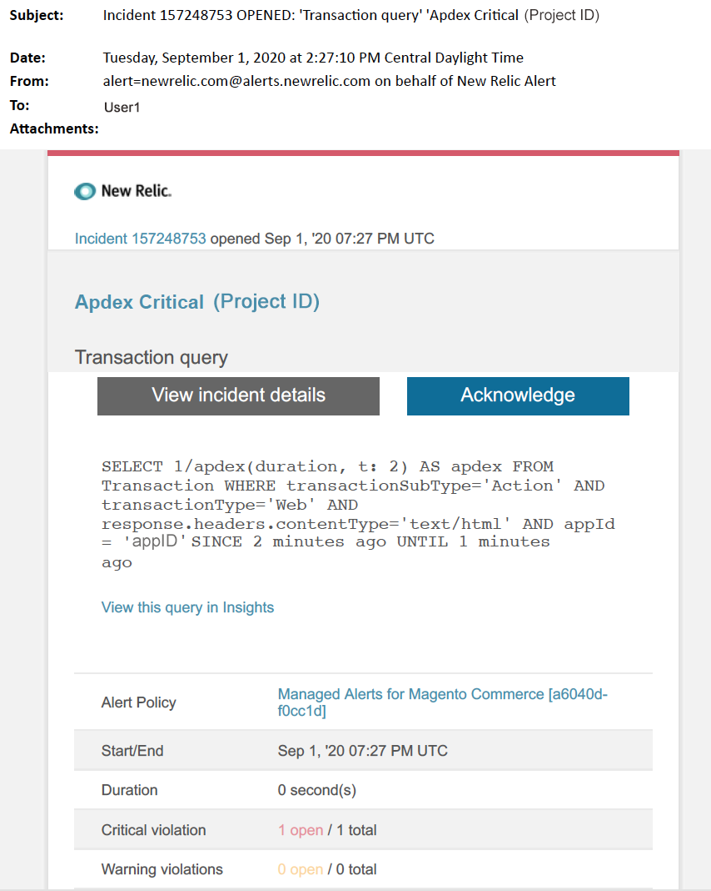

# Avvisi gestiti per Adobe Commerce: [!DNL Apdex] avviso critico

In questo articolo vengono descritti i passaggi di risoluzione dei problemi quando si riceve un avviso critico di [!DNL Apdex] per Adobe Commerce in [!DNL New Relic]. Il punteggio [!DNL Apdex] misura la soddisfazione degli utenti in base al tempo di risposta delle applicazioni e dei servizi Web. È necessaria un&#39;azione immediata per risolvere il problema. L’avviso avrà un aspetto simile al seguente, a seconda del canale di notifica dell’avviso selezionato.

{width="500"}

## Prodotti e versioni interessati

* Architettura del piano Pro di Adobe Commerce su infrastruttura cloud
* Adobe Commerce sull’infrastruttura cloud Architettura del piano iniziale

## Problema

Riceverai un avviso gestito in [!DNL New Relic] se hai firmato fino a [Avvisi gestiti per Adobe Commerce](managed-alerts-for-magento-commerce.md) e una o più soglie di avviso sono state superate. Questi avvisi sono stati sviluppati da Adobe per fornire ai commercianti un set standard utilizzando le informazioni provenienti da Supporto e Progettazione.

<u> **Esegui!** </u>

* Interrompi qualsiasi distribuzione pianificata fino a quando l&#39;avviso non viene cancellato.
* Attiva immediatamente la modalità di manutenzione se il sito non risponde o se non risponde completamente. Per ulteriori informazioni, vedere [Attivare o disattivare la modalità di manutenzione](https://experienceleague.adobe.com/it/docs/commerce-operations/installation-guide/tutorials/maintenance-mode) nella Guida all&#39;installazione di Commerce. Assicurarsi di aggiungere l&#39;IP all&#39;elenco degli indirizzi IP esenti per assicurarsi di poter accedere al sito per la risoluzione dei problemi. Per ulteriori informazioni, vedere [Gestire l&#39;elenco degli indirizzi IP esenti](https://experienceleague.adobe.com/it/docs/commerce-operations/installation-guide/tutorials/maintenance-mode#maintain-the-list-of-exempt-ip-addresses) nella Guida all&#39;installazione di Commerce.

<u>**Non fare!**</u>

* Avvia ulteriori campagne di marketing che possono portare ulteriori visualizzazioni di pagina sul sito.
* Eseguire gli indicizzatori o altri nodi che possono causare ulteriore stress su CPU o disco.
* Esegui le principali attività amministrative (ad esempio, l’amministratore di Commerce, le importazioni/esportazioni di dati).
* Cancella la cache.

Effettuando le operazioni descritte in precedenza, quando si riceve un avviso critico, prima di aver risolto la causa dell’avviso, se non si è già verificata un’interruzione del sito il sito potrebbe non rispondere.

## Soluzione

Per identificare e risolvere la causa, seguire la procedura riportata di seguito.

>[!WARNING]
>
>Poiché si tratta di un avviso critico, è consigliabile completare il **passaggio 1** prima di provare a risolvere il problema (passaggio 2 in poi).

1. Controlla se è presente un ticket di supporto Adobe Commerce. Per i passaggi, consulta [Tracciare i ticket di supporto](https://experienceleague.adobe.com/it/docs/commerce-knowledge-base/kb/help-center-guide/magento-help-center-user-guide#track-support-case) nella Knowledge Base di supporto di Commerce. Il supporto potrebbe aver ricevuto un avviso di soglia [!DNL New Relic], creato un ticket e iniziato a lavorare sul problema. Se non esiste alcun ticket, creane uno. Il ticket deve contenere le seguenti informazioni:
   * Motivo contatto: selezionare **[!UICONTROL New Relic CRITICAL alert received]**.
   * Descrizione dell&#39;avviso.
   * [[!DNL New Relic] Collegamento per incidente](https://docs.newrelic.com/docs/alerts-applied-intelligence/new-relic-alerts/alert-incidents/view-violation-event-details-incidents). Questo è incluso nei tuoi [Avvisi gestiti per Adobe Commerce](managed-alerts-for-magento-commerce.md).
1. Per identificare l&#39;origine del problema, utilizzare la pagina Transazione di [[!DNL New Relic] APM](https://docs.newrelic.com/docs/apm/applications-menu/monitoring/transactions-page-find-specific-performance-problems) per identificare le transazioni con problemi di prestazioni:
   * Ordina le transazioni in base a [!DNL Apdex] punteggi crescenti. [[!DNL Apdex]](https://docs.newrelic.com/docs/apm/new-relic-apm/apdex/apdex-measure-user-satisfaction) fa riferimento alla soddisfazione degli utenti per il tempo di risposta delle applicazioni e dei servizi Web. Un punteggio [!DNL Apdex] basso può indicare un collo di bottiglia (una transazione con un tempo di risposta più alto). In genere si tratta del database, [!DNL Redis] o PHP. Per i passaggi, fare riferimento a [[!DNL New Relic] Visualizza transazioni con insoddisfazione Apdex più elevata](https://docs.newrelic.com/docs/apm/new-relic-apm/apdex/apdex-measure-user-satisfaction/#dissatisfaction).
   * Ordina le transazioni in base alla velocità effettiva più elevata, al tempo medio di risposta più lento, al tempo più lungo e ad altre soglie. Per i passaggi, fare riferimento a [[!DNL New Relic] Trova problemi di prestazioni specifici](https://docs.newrelic.com/docs/apm/applications-menu/monitoring/transactions-page-find-specific-performance-problems). Se non riesci ancora a identificare il problema, usa la pagina Infrastruttura di [[!DNL New Relic] APM](https://docs.newrelic.com/docs/infrastructure/infrastructure-ui-pages/infra-hosts-ui-page/).
1. Utilizzare la pagina Infrastruttura di [[!DNL New Relic] APM](https://docs.newrelic.com/docs/infrastructure/infrastructure-ui-pages/infra-hosts-ui-page/) per identificare i processi che richiedono un uso intensivo delle risorse. Per i passaggi, fare riferimento alla pagina [[!DNL New Relic] Host di monitoraggio infrastruttura: [!UICONTROL Processes tab]](https://docs.newrelic.com/docs/infrastructure/infrastructure-ui-pages/infra-hosts-ui-page/#processes).
1. Se servizi come [!DNL Redis] o MySQL sono la fonte principale di consumo di memoria, provare a eseguire le operazioni seguenti:
   * Verifica di essere nella versione più recente. Le versioni più recenti possono a volte correggere le perdite di memoria. Se non utilizzi la versione più recente, puoi procedere con l’aggiornamento. Per i passaggi, consulta [Change Services](https://experienceleague.adobe.com/docs/commerce-cloud-service/user-guide/configure/service/services-yaml.html?lang=it) nella Guida di Commerce su Cloud.
   * Verificare la presenza di problemi MySQL quali query con esecuzione prolungata, chiavi primarie non definite e indici duplicati. Per i passaggi, fai riferimento a [Problemi più comuni relativi al database in Adobe Commerce sull&#39;infrastruttura cloud](https://experienceleague.adobe.com/docs/commerce-operations/implementation-playbook/best-practices/maintenance/resolve-database-performance-issues.html?lang=it) nel playbook di implementazione di Commerce.
   * Verifica la presenza di problemi PHP. Esaminare i processi in esecuzione eseguendo `ps aufx` in CLI/Terminal. Nell’output del terminale vengono visualizzati i processi e i processi cron attualmente in esecuzione. Controlla l’output per il tempo di esecuzione dei processi. Se c&#39;è un cron con un lungo tempo di esecuzione, il cron può essere appeso. Per informazioni sulla risoluzione dei problemi, vedere [Crons con prestazioni lente e tempi di esecuzione lunghi](https://experienceleague.adobe.com/it/docs/commerce-knowledge-base/kb/troubleshooting/miscellaneous/slow-performance-slow-and-long-running-crons) e [Processo Cron bloccato nello stato &quot;in esecuzione&quot;](https://experienceleague.adobe.com/it/docs/commerce-knowledge-base/kb/troubleshooting/miscellaneous/cron-job-is-stuck-in-running-status) nella Knowledge Base del supporto Commerce.

1. Una volta identificata la sorgente, SSH viene introdotto nell’ambiente per approfondire l’analisi. Per i passaggi, consulta [SSH nel tuo ambiente](https://experienceleague.adobe.com/it/docs/commerce-cloud-service/user-guide/develop/secure-connections#ssh) nella Guida di Commerce su Cloud.
1. Se hai ancora difficoltà a identificare l’origine, rivedi le tendenze recenti per identificare i problemi relativi alle recenti distribuzioni del codice o alle modifiche alla configurazione (ad esempio, nuovi gruppi di clienti e modifiche di grandi dimensioni al catalogo). È consigliabile verificare negli ultimi sette giorni di attività le correlazioni presenti nelle distribuzioni o nelle modifiche del codice.
1. Se non riesci a trovare una soluzione entro un tempo ragionevole, richiedi un’operazione di upsize o attiva la modalità di manutenzione per il sito, se non lo hai già fatto. Per ulteriori informazioni, vedere [Come richiedere il ridimensionamento temporaneo](https://experienceleague.adobe.com/it/docs/commerce-knowledge-base/kb/how-to/how-to-request-temporary-magento-upsize) nella Knowledge Base del supporto tecnico Commerce e [Attivare o disattivare la modalità di manutenzione](https://experienceleague.adobe.com/it/docs/commerce-operations/installation-guide/tutorials/maintenance-mode) nella Guida all&#39;installazione di Commerce.
1. Se l’upsize ripristina le normali operazioni del sito, puoi richiedere un upsize permanente (contatta il tuo account team di Adobe) oppure provare a riprodurre il problema nella gestione temporanea dedicata eseguendo un test di carico e ottimizzando le query o il codice che riduce la pressione sui servizi. Consulta [Test di carico e stress](https://experienceleague.adobe.com/it/docs/commerce-cloud-service/user-guide/develop/test/staging-and-production#load-and-stress-testing) nella Guida di Commerce su Cloud.
