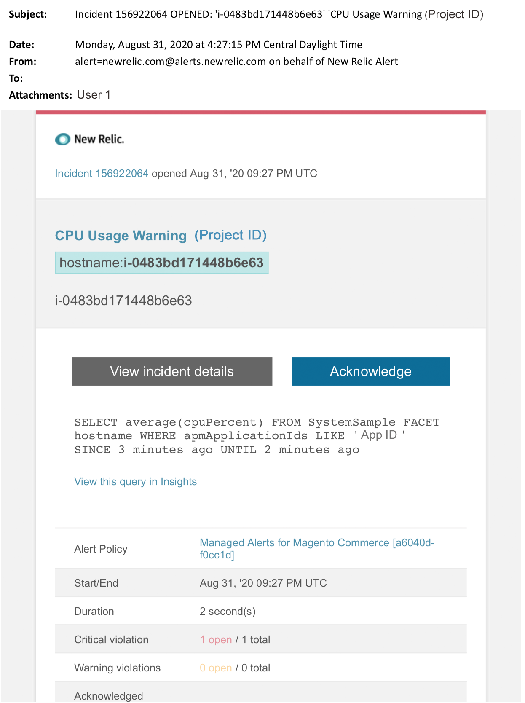

# Avvisi gestiti per Adobe Commerce: avviso di CPU

In questo articolo vengono descritti i passaggi di risoluzione dei problemi quando si riceve un avviso di CPU per Adobe Commerce in [!DNL New Relic]. È necessaria un&#39;azione immediata per risolvere il problema. L’avviso avrà un aspetto simile al seguente, a seconda del canale di notifica dell’avviso selezionato.

{width="500"}

## Prodotti e versioni interessati

Architettura del piano Pro di Adobe Commerce su infrastruttura cloud

## Problema

Riceverai un avviso tra [!DNL New Relic] se hai effettuato la registrazione a [Avvisi gestiti per Adobe Commerce](managed-alerts-for-magento-commerce.md) e una o più soglie di avviso sono state superate. Questi avvisi sono stati sviluppati da Adobe per fornire ai clienti un set standard utilizzando informazioni provenienti da Supporto e Progettazione.

<u> **Esegui!** </u>

* Interrompi qualsiasi distribuzione pianificata fino a quando l&#39;avviso non viene cancellato.
* Attiva immediatamente la modalità di manutenzione se il sito non risponde completamente. Per ulteriori informazioni, vedere [Attivare o disattivare la modalità di manutenzione](https://experienceleague.adobe.com/it/docs/commerce-operations/installation-guide/tutorials/maintenance-mode) nella Guida all&#39;installazione di Commerce. Assicurarsi di aggiungere l&#39;IP all&#39;elenco degli indirizzi IP esenti per assicurarsi di poter accedere al sito per la risoluzione dei problemi. Per ulteriori informazioni, vedere [Gestire l&#39;elenco degli indirizzi IP esenti](https://experienceleague.adobe.com/it/docs/commerce-operations/installation-guide/tutorials/maintenance-mode#maintain-the-list-of-exempt-ip-addresses) nella Guida all&#39;installazione di Commerce.

<u>**Non fare!**</u>

* Avvia ulteriori campagne di marketing che possono portare ulteriori visualizzazioni di pagina sul sito.
* Eseguire gli indicizzatori o altri nodi che possono causare ulteriore stress su CPU o disco.
* Esegui le principali attività amministrative (ad esempio, amministrazione di Commerce, importazioni/esportazioni di dati).
* Cancella la cache.

## Soluzione

Per identificare e risolvere la causa, seguire la procedura riportata di seguito.

1. Utilizza la pagina Transazioni di [[!DNL New Relic] APM](https://docs.newrelic.com/docs/apm/applications-menu/monitoring/transactions-page-find-specific-performance-problems) per identificare le transazioni con problemi di prestazioni:
   * Ordina le transazioni in base a [!DNL Apdex] punteggi crescenti. [[!DNL Apdex]](https://docs.newrelic.com/docs/apm/new-relic-apm/apdex/apdex-measure-user-satisfaction) fa riferimento alla soddisfazione degli utenti per il tempo di risposta delle applicazioni e dei servizi Web. [Un punteggio basso [!DNL Apdex] &#x200B;](https://experienceleague.adobe.com/it/docs/commerce-knowledge-base/kb/troubleshooting/miscellaneous/troubleshoot-performance-using-new-relic-on-magento-commerce) può indicare un collo di bottiglia (una transazione con un tempo di risposta più elevato). In genere si tratta del database, [!DNL Redis] o PHP. Per i passaggi, fare riferimento a [!DNL New Relic] [Visualizzare le transazioni con il più alto [!DNL Apdex] insoddisfazione](https://docs.newrelic.com/docs/apm/new-relic-apm/apdex/apdex-measure-user-satisfaction/#apdex-dissat).
   * Ordina le transazioni in base alla velocità effettiva più elevata, al tempo medio di risposta più lento, alla quantità di tempo più elevata e ad altre soglie. Per i passaggi, fare riferimento a [[!DNL New Relic] Trova problemi di prestazioni specifici](https://docs.newrelic.com/docs/apm/applications-menu/monitoring/transactions-page-find-specific-performance-problems).
1. Se non riesci ancora a identificare l&#39;origine, utilizza la pagina Infrastruttura di [[!DNL New Relic] APM](https://docs.newrelic.com/docs/infrastructure/infrastructure-data/infrastructure-ui-pages/infra-hosts-ui-page/) per identificare i servizi che richiedono molte risorse. Per i passaggi, vedere [!DNL New Relic] [Pagina Host di monitoraggio dell&#39;infrastruttura: [!UICONTROL Processes tab]](https://docs.newrelic.com/docs/infrastructure/infrastructure-ui-pages/infra-hosts-ui-page/#processes).
1. Se identifichi l’origine, SSH nell’ambiente per approfondire l’analisi. Per i passaggi, consulta [SSH nel tuo ambiente](https://experienceleague.adobe.com/it/docs/commerce-cloud-service/user-guide/develop/secure-connections#ssh) nella Guida di Commerce su Cloud.
1. Se hai ancora difficoltà a identificare l’origine:
   * Esamina le tendenze recenti per identificare i problemi relativi alle recenti implementazioni del codice o modifiche alla configurazione (ad esempio, nuovi gruppi di clienti e modifiche di grandi dimensioni al catalogo). È consigliabile verificare negli ultimi sette giorni di attività le correlazioni presenti nelle distribuzioni o nelle modifiche del codice.
   * Valutare la possibilità di verificare e disabilitare i cataloghi flat. Per i passaggi, consultare [Crons con prestazioni lente e esecuzione lenta](https://experienceleague.adobe.com/it/docs/commerce-knowledge-base/kb/troubleshooting/miscellaneous/slow-performance-slow-and-long-running-crons) nella Knowledge Base del supporto Commerce.
   * Se sospetti di avere un attacco DDoS, prova a bloccare il traffico da bot. Per i passaggi, fare riferimento a [Come bloccare il traffico dannoso per Adobe Commerce al livello Fastly](https://experienceleague.adobe.com/it/docs/commerce-knowledge-base/kb/how-to/block-malicious-traffic-for-magento-commerce-on-fastly-level) nella Knowledge Base di supporto di Commerce.
1. Se il problema sembra temporaneo, esegui passaggi di mitigazione quali un upsize o imposta il sito in modalità di manutenzione. Per ulteriori informazioni, vedere [Come richiedere il ridimensionamento temporaneo](https://experienceleague.adobe.com/it/docs/commerce-knowledge-base/kb/how-to/how-to-request-temporary-magento-upsize) nella Knowledge Base del supporto tecnico Commerce e [Attivare o disattivare la modalità di manutenzione](https://experienceleague.adobe.com/it/docs/commerce-operations/installation-guide/tutorials/maintenance-mode) nella Guida all&#39;installazione di Commerce. Se l’upsize ripristina le normali operazioni del sito, è consigliabile richiedere un upsize permanente (contatta il team dell’account Adobe) o provare a riprodurre il problema nella gestione temporanea dedicata eseguendo un test di carico e ottimizzando le query o il codice che riduce la pressione sui servizi. Per i passaggi, consulta [Test di carico e stress](https://experienceleague.adobe.com/it/docs/commerce-cloud-service/user-guide/develop/test/staging-and-production#load-and-stress-testing) nella Guida di Commerce su Cloud.
