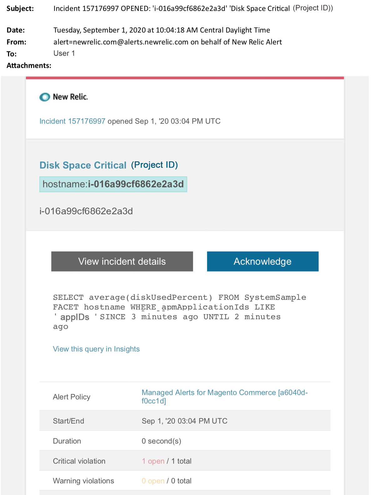

# Avvisi gestiti per Adobe Commerce: avvisi critici per il disco

In questo articolo vengono illustrati i passaggi per la risoluzione dei problemi quando si riceve un avviso di disco critico per Adobe Commerce in [!DNL New Relic]. È necessaria un&#39;azione immediata per risolvere il problema. L’avviso avrà un aspetto simile al seguente, a seconda del canale di notifica dell’avviso selezionato.

{width="500"}

## Prodotti e versioni interessati

Infrastruttura cloud Adobe Commerce su architettura ProPlan

## Problema

Riceverai un avviso tra [!DNL New Relic] se hai effettuato la registrazione a [Avvisi gestiti per Adobe Commerce](managed-alerts-for-magento-commerce.md) e una o più soglie di avviso sono state superate. Questi avvisi sono stati sviluppati da Adobe per fornire ai clienti un set standard utilizzando informazioni provenienti da Supporto e Progettazione.

<u> **Esegui!** </u>

* Interrompi qualsiasi distribuzione pianificata fino a quando l&#39;avviso non viene cancellato.
* Attiva immediatamente la modalità di manutenzione se il sito non risponde o se non risponde completamente. Per i passaggi fare riferimento a [Attiva o disattiva la modalità di manutenzione](https://experienceleague.adobe.com/en/docs/commerce-operations/installation-guide/tutorials/maintenance-mode). Assicurarsi di aggiungere l&#39;IP all&#39;elenco degli indirizzi IP esenti per assicurarsi di poter accedere al sito per la risoluzione dei problemi. Per ulteriori informazioni, vedere [Gestire l&#39;elenco degli indirizzi IP esenti](https://experienceleague.adobe.com/en/docs/commerce-operations/installation-guide/tutorials/maintenance-mode#maintain-the-list-of-exempt-ip-addresses).

**Non fare!**

* Avvia ulteriori campagne di marketing che possono portare ulteriori visualizzazioni di pagina sul sito.
* Eseguire gli indicizzatori o altri nodi che possono causare ulteriore stress su CPU o disco.
* Esegui le principali attività amministrative (ad esempio, amministrazione di Commerce, importazioni/esportazioni di dati).
* Cancella la cache.

Il sito potrebbe non rispondere (se non si è già verificata un’interruzione) se si esegue una delle azioni &quot;Non rispondere&quot; prima di aver indagato e risolto la causa dell’avviso.

## Soluzione

Per identificare e risolvere la causa, seguire la procedura riportata di seguito.

>[!WARNING]
>
>Poiché si tratta di un avviso critico, è consigliabile completare il **passaggio 1** prima di provare a risolvere il problema (passaggio 2 in poi).

1. Controlla se è presente un ticket di supporto Adobe Commerce. Per i passaggi, consulta [Tracciare i ticket di supporto](https://experienceleague.adobe.com/en/docs/commerce-knowledge-base/kb/help-center-guide/magento-help-center-user-guide#track-support-case) nella Knowledge Base di supporto di Commerce. Il supporto potrebbe aver ricevuto un avviso di soglia [!DNL New Relic], creato un ticket e iniziato a lavorare sul problema. Se non esiste alcun ticket, creane uno. Il ticket deve contenere le seguenti informazioni:
   * Motivo contatto: selezionare **[!UICONTROL New Relic CRITICAL alert received]**.
   * Descrizione dell&#39;avviso.
   * [[!DNL New Relic] Collegamento per incidente](https://docs.newrelic.com/docs/alerts/incident-management/view-event-details-incidents/). Questo è incluso nei tuoi [Avvisi gestiti per Adobe Commerce](managed-alerts-for-magento-commerce.md).
1. In [!DNL New Relic], esaminare i dischi per ottenere il massimo utilizzo. Per i passaggi, fare riferimento alla scheda **[!UICONTROL Storage]** nella pagina [[!DNL New Relic] Host di monitoraggio dell&#39;infrastruttura: [!UICONTROL Storage] scheda](https://docs.newrelic.com/docs/infrastructure/infrastructure-ui-pages/infra-hosts-ui-page/#storage):
   * Se in [!DNL New Relic] si verifica un aumento lento dell&#39;utilizzo del disco, provare le opzioni seguenti:
      * Ottimizzazione dello spazio su disco regolando l&#39;allocazione dello spazio. Per ulteriori informazioni, consultare [Gestione spazio su disco](https://experienceleague.adobe.com/docs/commerce-cloud-service/user-guide/develop/storage/manage-disk-space.html) nella Guida di Commerce su Cloud. Potresti anche aver bisogno di richiedere più spazio su disco (contatta il team del tuo account Adobe).
      * Libera spazio su disco per MySQL. Per ulteriori informazioni, consultare [Lo spazio su disco MySQL è insufficiente](https://experienceleague.adobe.com/en/docs/commerce-knowledge-base/kb/troubleshooting/database/mysql-disk-space-is-low-on-magento-commerce-cloud) nella Knowledge Base di supporto di Commerce.
      * Se [!DNL New Relic] mostra un utilizzo del disco in rapida crescita, ciò potrebbe indicare che si è verificato un problema che ha causato un aumento molto rapido di un file in una directory. Effettua i seguenti controlli:
         1. Controllare lo spazio su disco complessivo per identificare il problema eseguendo il comando seguente in CLI/Terminal: `df -h`
         1. Dopo aver identificato una directory con un utilizzo del disco inaspettatamente elevato e crescente, è necessario controllare il file system interessato. Nell&#39;esempio seguente viene illustrato come controllare la directory dei file `pub/media/`. Directory utilizzata da Commerce per l&#39;archiviazione dei log e dei file multimediali di grandi dimensioni. Tuttavia, è necessario eseguire questo comando per qualsiasi directory che mostri un utilizzo imprevisto del disco: `du -sch ~/pub/media/*`

Se l&#39;output del terminale mostra un file in una di queste directory che aumenta rapidamente nell&#39;utilizzo del disco e si sa che il contenuto del file non è necessario, si consiglia di rimuovere il file. Se non hai familiarità con questa azione, [invia un ticket di supporto Adobe Commerce](https://experienceleague.adobe.com/en/docs/commerce-knowledge-base/kb/help-center-guide/magento-help-center-user-guide#support-case).
