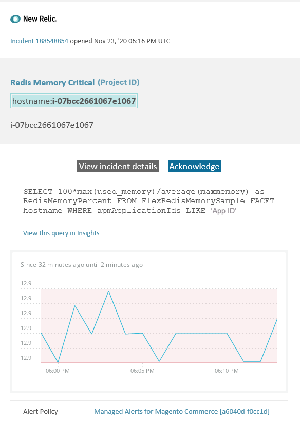

# Avvisi gestiti su Adobe Commerce: [!DNL Redis] avviso di memoria critica

In questo articolo vengono illustrati i passaggi per la risoluzione dei problemi relativi alla ricezione di un avviso di memoria critica [!DNL Redis] per Adobe Commerce in [!DNL New Relic]. Per risolvere il problema è necessaria un&#39;azione immediata. L’avviso avrà un aspetto simile al seguente, a seconda del canale di notifica dell’avviso selezionato.



## Prodotti e versioni interessati

Tutte le versioni di Adobe Commerce su infrastruttura cloud Architettura del piano Pro

## Problema

Riceverai un avviso tra [!DNL New Relic] se hai effettuato la registrazione a [Avvisi gestiti per Adobe Commerce](managed-alerts-for-magento-commerce.md) e una o più soglie di avviso sono state superate. Questi avvisi sono stati sviluppati da Adobe per fornire ai commercianti un set standard di avvisi utilizzando le informazioni provenienti dal supporto e dal team Engineering.

**<u>Esegui!</u>**

* Interrompi qualsiasi distribuzione pianificata fino a quando l&#39;avviso non viene cancellato.
* Attiva immediatamente la modalità di manutenzione se il sito non risponde o se non risponde completamente. Per i passaggi, fare riferimento a [Attivare o disattivare la modalità di manutenzione](/help/installation/tutorials/maintenance-mode.md) nella Guida all&#39;installazione di Commerce. Assicurarsi di aggiungere l&#39;IP all&#39;elenco degli indirizzi IP esenti per assicurarsi di poter accedere al sito per la risoluzione dei problemi. Per ulteriori informazioni, vedere [Gestire l&#39;elenco degli indirizzi IP esenti](/help/installation/tutorials/maintenance-mode.md#maintain-the-list-of-exempt-ip-addresses) nella Guida all&#39;installazione di Commerce.

**<u>Non fare!</u>**

* Avvia ulteriori campagne di marketing che possono portare ulteriori visualizzazioni di pagina sul sito.
* Eseguire gli indicizzatori o altri nodi che possono causare ulteriore stress su CPU o disco.
* Esegui le principali attività amministrative (ad esempio, azioni principali nell’amministratore di Commerce come importazioni/esportazioni di dati, scaricamento dei supporti, salvataggio delle categorie con un numero elevato di prodotti assegnati e aggiornamenti di massa).
* Cancella la cache.

## Soluzione

Per identificare e risolvere la causa, seguire la procedura riportata di seguito.

**Poiché si tratta di un avviso critico, è consigliabile completare il passaggio 1 prima di provare a risolvere il problema (dal passaggio 2 in poi).**

1. Controlla se è presente un ticket di supporto Adobe Commerce. Per i passaggi, consulta [Tracciare i ticket di supporto](https://experienceleague.adobe.com/it/docs/support-resources/adobe-support-tools-guide/adobe-commerce-support/adobe-commerce-help-center-user-guide#track-support-case) nella Knowledge Base di supporto di Commerce. Il supporto potrebbe aver già ricevuto un avviso di soglia [!DNL New Relic], creato un ticket e iniziato a lavorare sul problema. Se non esiste alcun ticket, creane uno. Il ticket deve contenere le seguenti informazioni:

   * Motivo contatto: selezionare **[!UICONTROL New Relic CRITICAL alert received]**.
   * Descrizione dell&#39;avviso.
   * [[!DNL New Relic] collegamento per incidente](https://docs.newrelic.com/docs/alerts-applied-intelligence/new-relic-alerts/alert-incidents/view-violation-event-details-incidents/). Questo è incluso nei tuoi [avvisi gestiti per Adobe Commerce](managed-alerts-for-magento-commerce.md).

1. Se non esiste alcun ticket di supporto, verificare se [!DNL Redis] memoria utilizzata sta aumentando o diminuendo passando a [one.newrelic.com](https://login.newrelic.com) > **[!UICONTROL Infrastructure]** > **[!UICONTROL Third-party services]** pagina, selezionare la dashboard [!DNL Redis]. Se è stabile o in aumento, [invia un ticket di supporto](https://experienceleague.adobe.com/it/docs/support-resources/adobe-support-tools-guide/adobe-commerce-support/adobe-commerce-help-center-user-guide#support-case) per eseguire l&#39;upsize del cluster o aumenta il limite di `maxmemory` al livello successivo.
1. Se non riesci a identificare la causa dell&#39;aumento del consumo di memoria [!DNL Redis], controlla le tendenze recenti per identificare i problemi relativi alle recenti distribuzioni del codice o alle modifiche alla configurazione (ad esempio, nuovi gruppi di clienti e modifiche di grandi dimensioni al catalogo). È consigliabile verificare negli ultimi sette giorni di attività le correlazioni presenti nelle distribuzioni o nelle modifiche del codice.
1. Verifica se le estensioni di terze parti non si comportano correttamente:

   * Prova a trovare una correlazione con le estensioni di terze parti installate di recente e l’ora di inizio del problema.
   * Esamina le estensioni che potrebbero potenzialmente influenzare la cache di Adobe Commerce e causarne la rapida crescita. Ad esempio, blocchi di layout personalizzati, sostituzione della funzionalità della cache e memorizzazione di grandi quantità di dati nella cache.

1. Se i passaggi precedenti non consentono di identificare o risolvere il problema all&#39;origine, provare ad abilitare la cache L2 per ridurre il traffico di rete tra l&#39;app e [!DNL Redis]. Per informazioni generali sulla cache L2, fare riferimento a [Memorizzazione in cache L2 nell&#39;applicazione Adobe Commerce](/help/configuration/cache/level-two-cache.md) nella Guida alla configurazione di Commerce. Per abilitare la cache L2 per l’infrastruttura cloud, prova quanto segue:

   * Aggiornare la versione ECE Tools se precedente alla versione 2002.1.2.
   * Configurare la cache L2 utilizzando [Usa variabile REDIS\_BACKEND](https://experienceleague.adobe.com/en/docs/commerce-on-cloud/user-guide/configure/env/stage/variables-deploy#redis_backend) e aggiornando il file `.magento.env.yaml`:

   ```yaml
   stage:
       deploy:
           REDIS_BACKEND: '\Magento\Framework\Cache\Backend\RemoteSynchronizedCache'
   ```
