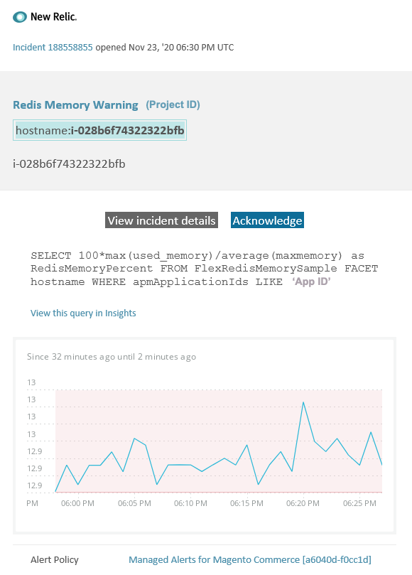

# Avvisi gestiti su Adobe Commerce: avviso di memoria [!DNL Redis]

In questo articolo vengono illustrati i passaggi per la risoluzione dei problemi relativi alla ricezione di un avviso di [!DNL Redis] per Adobe Commerce in [!DNL New Relic]. Per risolvere il problema è necessaria un&#39;azione immediata. L’avviso avrà un aspetto simile al seguente, a seconda del canale di notifica dell’avviso selezionato:



## Prodotti e versioni interessati

Tutte le versioni di Adobe Commerce su infrastruttura cloud Architettura del piano Pro.

## Problema

Riceverai un avviso tra [!DNL New Relic] se hai effettuato la registrazione a [Avvisi gestiti per Adobe Commerce](managed-alerts-for-magento-commerce.md) e una o più soglie di avviso sono state superate. Questi avvisi sono stati sviluppati da Adobe per fornire ai commercianti un set standard di avvisi utilizzando le informazioni provenienti dal supporto e dal team Engineering.

**<u>Esegui!</u>**

* Si consiglia di interrompere qualsiasi distribuzione pianificata fino alla cancellazione dell&#39;avviso.
* Se il sito non risponde o non risponde più, attiva immediatamente la modalità di manutenzione. Per ulteriori informazioni, vedere [Attivare o disattivare la modalità di manutenzione](https://experienceleague.adobe.com/it/docs/commerce-operations/installation-guide/tutorials/maintenance-mode) nella Guida all&#39;installazione di Commerce.
* Assicurarsi di aggiungere l&#39;IP all&#39;elenco degli indirizzi IP esenti per assicurarsi di poter accedere al sito per la risoluzione dei problemi. Per ulteriori informazioni, vedere [Gestire l&#39;elenco degli indirizzi IP esenti](https://experienceleague.adobe.com/it/docs/commerce-operations/installation-guide/tutorials/maintenance-mode#maintain-the-list-of-exempt-ip-addresses) nella Guida all&#39;installazione di Commerce.

**<u>Non fare!</u>**

* Avvia ulteriori campagne di marketing che possono portare ulteriori visualizzazioni di pagina sul sito.
* Eseguire gli indicizzatori o altri nodi che possono causare ulteriore stress su CPU o disco.
* Esegui le principali attività amministrative (ad esempio, azioni principali nell’amministratore di Commerce, come importazioni/esportazioni di dati, scaricamento dei file multimediali, salvataggio delle categorie con un numero elevato di prodotti assegnati e aggiornamenti di massa).
* Cancella la cache.

## Soluzione

Per identificare e risolvere la causa, seguire la procedura riportata di seguito.

1. Verificare se la memoria utilizzata [!DNL Redis] aumenta o diminuisce passando alla pagina [one.newrelic.com](https://login.newrelic.com/login) > **Infrastruttura** > **Servizi di terze parti**, selezionare il dashboard [!DNL Redis]. Se è stabile o in aumento, [invia un ticket di supporto](https://experienceleague.adobe.com/it/docs/commerce-knowledge-base/kb/help-center-guide/magento-help-center-user-guide#support-case) per eseguire l&#39;upsize del cluster o aumenta il limite di `maxmemory` al livello successivo.
1. Se non riesci a identificare la causa dell&#39;aumento del consumo di memoria [!DNL Redis], controlla le tendenze recenti per identificare i problemi relativi alle recenti distribuzioni del codice o alle modifiche alla configurazione (ad esempio, nuovi gruppi di clienti e modifiche di grandi dimensioni al catalogo). È consigliabile verificare negli ultimi sette giorni di attività le correlazioni presenti nelle distribuzioni o nelle modifiche del codice.
1. Verifica se le estensioni di terze parti non si comportano correttamente:
   * Prova a trovare una correlazione con le estensioni di terze parti installate di recente e l’ora di inizio del problema.
   * Esamina le estensioni che potrebbero potenzialmente influenzare la cache di Adobe Commerce e causarne la rapida crescita. Ad esempio, blocchi di layout personalizzati, sostituzione della funzionalità della cache e memorizzazione di grandi quantità di dati nella cache.
1. Se non ci sono prove di malfunzionamento delle estensioni, [Installa le ultime patch per risolvere [!DNL Redis] i problemi per Adobe Commerce nell&#39;infrastruttura cloud](https://experienceleague.adobe.com/it/docs/commerce-knowledge-base/kb/troubleshooting/miscellaneous/install-latest-patches-to-fix-magento-redis-issues). Se i passaggi precedenti non consentono di identificare o risolvere il problema all&#39;origine, provare ad abilitare la cache L2 per ridurre il traffico di rete tra l&#39;app e [!DNL Redis]. Per informazioni generali sulla cache L2, fare riferimento a [Memorizzazione in cache L2 nell&#39;applicazione Adobe Commerce](https://experienceleague.adobe.com/it/docs/commerce-operations/configuration-guide/cache/level-two-cache) nella Guida alla configurazione di Commerce. Per abilitare la cache L2 per l’infrastruttura cloud, prova quanto segue:
   * Aggiornare la versione ECE Tools se precedente alla versione 2002.1.2.
   * Configurare la cache L2 utilizzando [Usa variabile REDIS\_BACKEND](https://experienceleague.adobe.com/it/docs/commerce-on-cloud/user-guide/configure/env/stage/variables-deploy#redis_backend) e aggiornando il file `.magento.env.yaml`:

   ```yaml
   stage:
      deploy:
          REDIS_BACKEND: '\Magento\Framework\Cache\Backend\RemoteSynchronizedCache'
   ```
