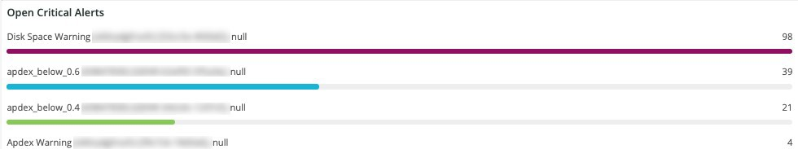

# Scheda [!UICONTROL Alerts]

La scheda [!UICONTROL Alerts] fornisce una serie di avvisi, inclusi gli avvisi critici di apertura e chiusura.

## [!UICONTROL Open Alert Details]

Il frame **[!UICONTROL Open Alert Details]** mostra un conteggio degli avvisi critici aperti nell&#39;arco temporale selezionato. Gli avvisi includono quelli creati dagli Adobi e quelli creati dal partner o dall’esercente.

## [!UICONTROL Closed Critical Alerts]

Il frame **[!UICONTROL Closed Critical Alerts]** mostra un conteggio degli avvisi critici chiusi nell&#39;intervallo temporale selezionato. Gli avvisi includono quelli creati dagli Adobi e quelli creati dal partner o dall’esercente.

## [!UICONTROL Critical Alert Details]

Il frame **[!UICONTROL Critical Alert Details]** mostra un conteggio dei dettagli critici degli avvisi nell&#39;intervallo temporale selezionato, inclusi la marca temporale, il nome della condizione e se l&#39;evento di avviso è aperto o chiuso.

## [!UICONTROL Infrastructure Alert Details]

Il frame **[!UICONTROL Infrastructure Alert Details]** mostra applicazioni, host e altri eventi di infrastruttura nell&#39;intervallo temporale selezionato.
