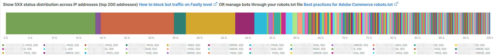

# La [!UICONTROL bots] scheda

Questa scheda contiene informazioni che spiegano come identificare se e cosa [!DNL bots] causano problemi al sito.

## Panoramica di alto livello [!DNL bots]:

* A [!DNL bot] è un software che esegue attività automatiche ripetitive. Con l&#39;intelligenza artificiale e l&#39;evoluzione dell&#39;apprendimento automatico, i compiti, i metodi e le interazioni di [!DNL bots] stanno cambiando. Ci sono *buono* [!DNL bots] che avvantaggiano i siti tramite ricerca per indicizzazione e l&#39;aggiunta di loro ai motori di ricerca Internet. Questo fa sì che gli utenti di Internet siano guidati al sito attraverso i risultati del motore di ricerca. A *buono* [!DNL bot] generalmente rispetta i limiti posizionati sul [!DNL bot] da `robots.txt` file o impostazioni in una console del motore di ricerca. I limiti possono limitare l&#39;accesso al sito o a parti del sito.
* Maligno [!DNL bots] ignora `robots.txt` file o possono macchiare una buona [!DNL bot] attraverso il campo dell’agente utente della richiesta HTTP. Alcune cose che maligne [!DNL bots] esegui:
   * Aggiungi il caricamento a un sito per negare agli utenti legittimi l&#39;accesso al sito.
   * Raccogli e riutilizza i contenuti senza autorizzazione.
   * Registra account falsi per inviare servizi e-mail o indirizzi o reindirizzare ad altri siti ([!DNL SPAM bots]).
   * Creare visualizzazioni false ([!DNL Viewbots]).
   * Acquistare prodotti o biglietti ([!DNL Focused bots]).
* Gestione [!DNL bots]
   * [!DNL Observation for Adobe Commerce] ha opinioni su [!DNL bot] traffico:
      * Mostra totale non memorizzato nella cache [!DNL bot] attività che visualizza il carico che un [!DNL bot] sta aggiungendo a un sito e quando tale caricamento avviene.
      * Mostra la [!DNL bots] che generano errori. In genere se un [!DNL bot] sta aggiungendo il carico che causa problemi al sito, che [!DNL bot] o indirizzo IP ha la frequenza più elevata di errori.
      * Mostra [!DNL bot] nomi (richiedi valori di campo dell&#39;agente utente) e indirizzi IP da gestire tramite:
         * [!DNL Fastly] (limitativo delle aliquote o [!DNL VCLs] che bloccano indirizzi IP, intervalli o [!DNL bots] in base al valore del nome).
         * Aggiunta di buone [!DNL bot] informazioni `robots.txt field` limitare o limitare il tasso di accesso al sito.
         * Gestione [!DNL Bing] o [!DNL Google bots] tramite la console del motore di ricerca.

## [!UICONTROL Total Bot traffic by bot name]:

* La **[!UICONTROL Total Bot traffic by bot name during selected time period]** la tabella contiene il conteggio aggregato delle richieste non memorizzate nella cache in cui la variabile [!UICONTROL request_user_agent] ha una stringa di [!DNL bots] nel valore . Questo può essere o meno il [!DNL bot] come [!UICONTROL request_user_agent] il valore del campo può essere spoofed. Il valore sotto il [!UICONTROL Count] La colonna è la più importante.

## [!UICONTROL Total Bot Traffic by Bot name/IP address]

* La **[!UICONTROL Total Bot Traffic by Bot name/IP address during selected time period How to block bot traffic on Fastly level OR manage bots through your robots.txt file Best practices for Adobe Commerce robots.txt]** La tabella mostra gli stessi dati della tabella precedente, ma aggiunge gli indirizzi IP che eseguono le richieste per conto della [!DNL bot]. Come malvagio [!DNL bots] cattivo [!DNL bots], gli indirizzi IP devono essere verificati tramite siti web che identificano gli indirizzi IP abusivi o tramite *palude* servizi o [!DNL DNS lookups]. Ad esempio: [!DNL Google] pubblica le loro [[!DNL googlebot] Indirizzi IP](https://developers.google.com/search/apis/ipranges/googlebot.json) e [!DNL Microsoft] dispone di uno strumento di verifica per [[!DNL Bingbots]](https://www.bing.com/webmasters/help/Verify-Bingbot-2195837f).

## [!UICONTROL Graph - Bots with HTTP status errors]

* La **[!UICONTROL Graph - Bots with HTTP status errors during selected time period How to block bot traffic on Fastly level OR manage bots through your robots.txt file Best practices for Adobe Commerce robots.txt]** grafico mostra gli errori su [!DNL bots] che si dichiarano nel campo dell&#39;agente utente della richiesta. Questo non significa necessariamente che l&#39;errore sia causato dal volume dal [!DNL bot] o altro traffico. Gli errori potrebbero essere che [!DNL bot] richiede informazioni che non esistono o si verifica un altro problema nella richiesta.
* Se si verifica un picco di errori negli indirizzi IP durante l’instabilità o l’interruzione del sito, potrebbero essere sospettati del problema del sito.

## [!UICONTROL Table - IPs that do not identify as bots]

* La **[!UICONTROL Table - IPs that do not identify as bots with HTTP status errors during selected time period How to block bot traffic on Fastly level OR manage bots through your robots.txt file Best practices for Adobe Commerce robots.txt]** La tabella mostrerà le richieste IP con codici di stato http non-200 che NON si identificano automaticamente come [!DNL bots] nel campo richiedi agente utente. Questi indirizzi IP potrebbero essere indirizzi IP dannosi, soprattutto se i conteggi sono elevati per il periodo di tempo selezionato.
* Se i conteggi dei codici di stato http diversi da 200 sono bassi e gli intervalli degli indirizzi IP non sono simili, gli indirizzi potrebbero non contribuire ai problemi del sito.

## [!UICONTROL Table – Cache Status 'ERROR']

* Quando gli indirizzi IP generano un’alta frequenza di errori, chiedi cosa stanno facendo? La **[!UICONTROL Table – Cache Status 'ERROR' detail table (what are these IPs doing?) How to block bot traffic on Fastly level OR manage bots through your robots.txt file Best practices for Adobe Commerce robots.txt]** La tabella mostrerà l’URL richiesto insieme al valore di stato HTTP per le richieste con uno stato di cache [!UICONTROL ERROR] valore. La frequenza è sfaccettata dall’URL, quindi il conteggio potrebbe essere basso. L’indirizzo IP potrebbe effettuare migliaia di richieste durante il periodo di tempo selezionato. Questa visualizzazione confronta fino a 2000 richieste nell&#39;intervallo di tempo (il limite di visualizzazione del record).

## [!UICONTROL Show 5XX status distribution]

* La **[!UICONTROL Show 5XX status distribution across IP addresses (top 200 addresses) How to block bot traffic on Fastly level OR manage bots through your robots.txt file Best practices for Adobe Commerce robots.txt]** frame è potente. Mostra gli indirizzi IP che hanno codici di stato http 5XX durante il periodo di tempo selezionato. Se un indirizzo IP sta effettuando un volume elevato di richieste e il sito è interessato al punto in cui non può gestire il traffico, allora gli indirizzi IP che stanno effettuando la frequenza più elevata di richieste avranno in genere il volume più alto di errori. I codici di stato http 5XX in genere indicano un sito che sta avendo difficoltà a rispondere alle richieste.
* Più ampia è la barra, maggiore è la percentuale di errori che l&#39;indirizzo IP ha nel numero totale di errori 5xx durante quel periodo di tempo. Nota: un indirizzo IP potrebbe avere più segmenti nel grafico se ha più codici di stato http (ad esempio, 502 e 503 stati http).
* Una distribuzione tipica verrebbe indicata verso il lato destro della barra in cui gli indirizzi IP sono uguali in larghezza o ci sarebbero alcune barre ampie con conteggi molto bassi.
* Se passi il cursore del mouse sul segmento a barre, verrà visualizzato il numero di errori indicati durante il periodo di tempo selezionato.

## [!UICONTROL IP cache status (MISS, PASS, ERROR) and HTTP status]

* Questo **[!UICONTROL IP cache status (MISS, PASS, ERROR) and HTTP status during selected time period How to block bot traffic on Fastly level OR manage bots through your robots.txt file Best practices for Adobe Commerce robots.txt]** frame mostra il conteggio del codice di stato HTTPS e le richieste non memorizzate nella cache per IP nell&#39;intervallo di tempo selezionato. Indica il carico proporzionale da ciascun indirizzo IP e il volume totale. Mostrerà gli indirizzi IP con il maggior numero di richieste.

## [!UICONTROL Fastly Cache Summary for selected time period]

* Se fai clic sul pulsante [!UICONTROL Error] nel grafico seguente, puoi confrontare gli ultimi due grafici tra loro. Questo può aiutare a indicare dove il caricamento contribuisce ai problemi del sito.

## [!UICONTROL Graph - IPs that do not identify as bots]

* La **[!UICONTROL Graph - IPs that do not identify as bots without error during selected time period How to block bot traffic on Fastly level OR manage bots through your robots.txt file Best practices for Adobe Commerce robots.txt]** frame mostra il campo dell’agente utente della richiesta, l’indirizzo IP e il codice di stato per le richieste in cui il campo dell’agente utente della richiesta non indica un [!DNL bot]. Questo frame può mostrare richieste ad alta frequenza da qualsiasi indirizzo IP ma prestare attenzione alle richieste ad alta frequenza, soprattutto durante un periodo di tempo in cui il sito può avere problemi.

## [!UICONTROL Graph - Suspicious Non-Bot traffic]

* La **[!UICONTROL Graph - Suspicious Non-Bot traffic during selected time period]** graph cerca un valore dell&#39;agente utente della richiesta di Go-http-client ma sarà esteso per esaminare altri valori dell&#39;agente utente della richiesta sospetta. Questo valore dell&#39;agente utente della richiesta viene utilizzato dai siti per la connessione dai servizi e può essere valido ma viene anche utilizzato da malware [!DNL bots].

## [!UICONTROL Graph - Bot traffic by Bot name]

* La **[!UICONTROL Graph - Bot traffic by Bot name during selected time period]** Il frame visualizza gli stessi dati del traffico totale bot per [!DNL Bot] nome durante la tabella del periodo di tempo selezionato nella parte superiore della scheda . Mostra i dati tramite la timeline in modo da poter vedere quando le richieste di [!DNL bots] vengono fatti e le loro distribuzioni.

## [!UICONTROL Graph - Top 250 Bot Names and IP addresses]

* La **[!UICONTROL Graph - Top 250 Bot Names and IP addresses during selected time period How to block bot traffic on Fastly level OR manage bots through your robots.txt file Best practices for Adobe Commerce robots.txt]** mostra gli stessi dati del Totale [!DNL Bot] Traffico per nome bot/indirizzo IP durante la tabella del periodo di tempo selezionato nella parte superiore della scheda. I dati vengono visualizzati nella timeline e impostati per indirizzo IP. Viene visualizzato quando le richieste di [!DNL bots] vengono effettuate, quale IP sta effettuando le richieste e le distribuzioni delle richieste.

## [!UICONTROL Blocked Bot name / IP addresses (in Fastly)]

* La **[!UICONTROL Blocked Bot name / IP addresses (in Fastly) during selected time period. This graph displays bot traffic and IPs that were returned a 403 Forbidden HTTP Status code]** frame mostra il nome bot e gli indirizzi IP bloccati. Puoi vedere in questo grafico come tutte le richieste sono bloccate in [!DNL Fastly] andare avanti.

## [!UICONTROL Blocked non-Bot name / IP addresses (in Fastly)]

* La **[!UICONTROL Blocked non-Bot name / IP addresses (in Fastly) during selected time period graph displays non-bot traffic and IPs that were returned a 403 Forbidden HTTP Status code]** il frame mostra gli indirizzi IP che non si identificano come [!DNL bot] che sono stati bloccati [!DNL Fastly].

## [!UICONTROL This table shows the number of user agents per IP address, number of successful, unsuccessful and blocked requests:]

* Maligno [!DNL bots] cattivi altri [!DNL bots] attraverso il valore del [!UICONTROL Request User Agent] campo . Questa tabella mostra quanti valori univoci contiene l’indirizzo IP in quel campo. Maggiore è il valore nel [!UICONTROL Request User Agent] più l&#39;indirizzo IP è sospetto.

## [!UICONTROL IP with non-200 status errors]

* La **[!UICONTROL IP with non-200 status errors – without 403 status]** Questo riquadro mostra la distribuzione nell’arco temporale selezionato degli indirizzi IP con codici di stato HTTP diversi da 200. Quando visualizzi valori più elevati su un singolo IP o su un gruppo di indirizzi IP, sono necessarie ulteriori indagini.

## [!UICONTROL IP with 403 status codes:]

* La **[!UICONTROL IP with 403 status codes]** il frame mostra le richieste non memorizzate nella cache senza [!UICONTROL cache_status=ERROR] con uno stato HTTP 403. Questo può mostrare che il server di origine è l&#39;origine del 403 (non autorizzato) piuttosto che un blocco da [!DNL Fastly].

## [!UICONTROL Top 5 with non-200 status codes]

* La **[!UICONTROL Top 5 with non-200 status codes showing cache_status]** la tabella mostra a livello di IP / stato i conteggi di ogni con [!UICONTROL cache_status] valore.

## [!UICONTROL Pageview Latency will show as spikes]

* La **[!UICONTROL Pageview Latency will show as spikes on this graph:]** il frame mostra la latenza di caricamento della pagina/risposta API che potrebbe essere in linea con [!DNL bot] traffico.

## [!UICONTROL Experimental Potential Malicious Bots] cornice

La **[!UICONTROL Experimental Potential Malicious Bots]** frame esegue dieci query separate e complesse. Rileva firme di richiesta IP dannose e quindi aggrega i risultati, li somma e li ordina in base al conteggio in ordine decrescente. Le query contengono una moltitudine di firme dati di sfruttamento CVE e altre richieste dannose. Anche quando le esplosioni sono bloccate da correzioni/patch di sicurezza e non rappresentano una minaccia per il sito, la richiesta deve ancora essere gestita dal sito web. Il volume delle richieste può diventare significativo in un breve periodo di tempo. Questo frame non mostra le richieste totali dall’indirizzo IP, ma piuttosto le richieste che contengono segnali che indicano che le richieste avevano un intento sospetto.

Assicurati di verificare che il traffico sia sospetto e che non provenga da un indirizzo CDN (Content Distributed Network) che potrebbe anche distribuire richieste valide. Se le richieste provengono da un indirizzo IP CDN, contattare il fornitore del servizio per bloccare il traffico sospetto attraverso la rete. Se devi bloccare l’indirizzo o l’URL della richiesta, fai riferimento a [Blocca il traffico dannoso per Adobe Commerce su [!DNL Fastly] livello](https://experienceleague.adobe.com/docs/commerce-knowledge-base/kb/how-to/block-malicious-traffic-for-magento-commerce-on-fastly-level.html) nella Knowledge Base del supporto Adobe Commerce.
