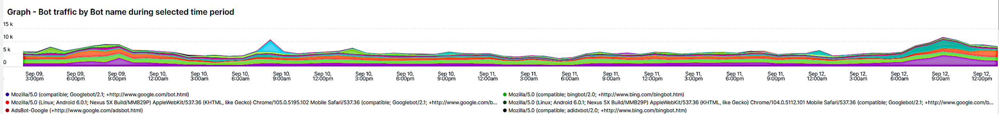

# Scheda [!UICONTROL bots]

Questa scheda contiene informazioni che spiegano come identificare se e cosa [!DNL bots] sta causando problemi del sito.

## Panoramica di alto livello di [!DNL bots]:

* [!DNL bot] è un componente software che esegue attività automatizzate ripetitive. Con l&#39;evoluzione dell&#39;intelligenza artificiale e dell&#39;apprendimento automatico, le attività, i metodi e le interazioni di [!DNL bots] stanno cambiando. Ci sono *buoni* [!DNL bots] che offrono vantaggi ai siti eseguendo la ricerca per indicizzazione e aggiungendoli ai motori di ricerca Internet. In questo modo gli utenti di Internet vengono guidati al sito attraverso i risultati dei motori di ricerca. Un *buono* [!DNL bot] rispetta in genere i limiti inseriti in [!DNL bot] da un file `robots.txt` o le impostazioni in una console del motore di ricerca. I limiti possono limitare l&#39;accesso al sito o a parti del sito.
* [!DNL bots] dannoso ignora il file `robots.txt` o potrebbe contraffare un [!DNL bot] valido tramite il campo dell&#39;agente utente della richiesta dei dati della richiesta HTTP. Alcune operazioni che possono essere eseguite da [!DNL bots]:
   * Aggiungi il carico a un sito per negare l’accesso al sito agli utenti legittimi.
   * Eliminare e riutilizzare i contenuti senza autorizzazione.
   * Registrare account falsi per inondare i servizi e-mail o gli indirizzi o reindirizzare ad altri siti ([!DNL SPAM bots]).
   * Creare visualizzazioni false ([!DNL Viewbots]).
   * Acquista prodotti o biglietti ([!DNL Focused bots]).
* Gestione di [!DNL bots]
   * [!DNL Observation for Adobe Commerce] ha visualizzazioni del traffico [!DNL bot]:
      * Mostra il totale delle attività di [!DNL bot] non memorizzate nella cache che visualizza il carico che un [!DNL bot] sta aggiungendo a un sito e quando si verifica tale caricamento.
      * Mostra i [!DNL bots] che stanno generando errori. In genere, se un [!DNL bot] aggiunge un carico che causa problemi al sito, tale indirizzo IP o [!DNL bot] presenta la frequenza più elevata di errori.
      * Vengono visualizzati i nomi [!DNL bot] (valori del campo agente utente di richiesta) e gli indirizzi IP da gestire tramite:
         * [!DNL Fastly] (limitazione della velocità o [!DNL VCLs] che bloccano indirizzi IP, intervalli o [!DNL bots] per valore di nome).
         * Aggiunta di informazioni [!DNL bot] valide a `robots.txt field` per limitare o limitare la velocità di accesso al sito.
         * Gestione di [!DNL Bing] o [!DNL Google bots] tramite la console del motore di ricerca.

## [!UICONTROL Experimental Potential Malicious Bots frame]

Il frame **[!UICONTROL Experimental Potential Malicious Bots frame]** viene eseguito su 12 query distinte e complesse. Rileva le firme di richieste IP dannose e quindi aggrega i risultati, le somme e li ordina in base al conteggio in ordine decrescente. Le query contengono una moltitudine di firme di dati di exploit CVE e altre richieste dannose. Anche quando gli exploit sono bloccati da correzioni/patch di sicurezza e non rappresentano una minaccia per il sito, la richiesta deve ancora essere gestita dal sito web. Il volume delle richieste può diventare significativo in un breve periodo di tempo. In questo frame non vengono visualizzate tutte le richieste provenienti dall’indirizzo IP, ma solo quelle con segnali che indicano che la richiesta aveva un intento sospetto.

Verificare che il traffico sia sospetto e non provenga da un indirizzo [!DNL Content Distributed Network] (CDN) che potrebbe anche fornire richieste valide. Se le richieste provengono da un indirizzo IP CDN, contatta il fornitore del servizio per aiutarti a bloccare il traffico sospetto attraverso la rete. Se devi bloccare l&#39;indirizzo o l&#39;URL della richiesta, consulta [Blocca traffico dannoso per Adobe Commerce al  [!DNL Fastly] livello](https://experienceleague.adobe.com/docs/commerce-knowledge-base/kb/how-to/block-malicious-traffic-for-magento-commerce-on-fastly-level.html) nella Knowledge Base del supporto Adobe Commerce.

## [!UICONTROL Rate of HTTP request per second (top 25) during requested time period]

Il frame **[!UICONTROL Rate of HTTP request per second (top 25) during requested time period]** mostra gli indirizzi IP con il numero più elevato di richieste al secondo durante l&#39;intervallo di tempo selezionato. Se questi indirizzi sono presenti anche nella tabella precedente, accertati che non siano indirizzi CDN e dannosi e bloccarli tramite [!DNL Fastly].

## [!UICONTROL Total Bot traffic by bot name]:

La tabella **[!UICONTROL Total Bot traffic by bot name during selected time period]** contiene il conteggio aggregato delle richieste non memorizzate nella cache in cui il campo [!UICONTROL request_user_agent] contiene una stringa di [!DNL bots] nel valore. Questo potrebbe essere o meno il [!DNL bot] denominato, in quanto il valore del campo [!UICONTROL request_user_agent] può essere oggetto di spoofing. Il valore nella colonna [!UICONTROL Count] è il più importante.

## [!UICONTROL Total Bot Traffic by Bot name/IP address]

La tabella **[!UICONTROL Total Bot Traffic by Bot name/IP address during selected time period How to block bot traffic on Fastly level OR manage bots through your robots.txt file Best practices for Adobe Commerce robots.txt]** mostra gli stessi dati della tabella precedente, ma aggiunge indirizzi IP che eseguono le richieste per conto di [!DNL bot] denominato. [!DNL bots] dannoso/i buono/i [!DNL bots], gli indirizzi IP devono essere verificati tramite siti Web che identificano gli indirizzi IP abusivi o tramite i servizi *whois* o [!DNL DNS lookups]. Ad esempio, [!DNL Google] pubblica i propri [[!DNL googlebot] indirizzi IP](https://developers.google.com/search/apis/ipranges/googlebot.json) e [!DNL Microsoft] dispone di uno strumento di verifica per [[!DNL Bingbots]](https://www.bing.com/webmasters/help/Verify-Bingbot-2195837f).

## [!UICONTROL Graph - Bots with HTTP status errors]

Il grafico **[!UICONTROL Graph - Bots with HTTP status errors during selected time period How to block bot traffic on Fastly level OR manage bots through your robots.txt file Best practices for Adobe Commerce robots.txt]** mostra gli errori in [!DNL bots] che si dichiarano nel campo dell&#39;agente utente della richiesta. Ciò non significa necessariamente che l&#39;errore sia causato dal volume di [!DNL bot] o da altro traffico. È possibile che [!DNL bot] stia richiedendo informazioni inesistenti o che si sia verificato un altro problema nella richiesta.

Se si verifica un picco di errori sugli indirizzi IP durante l’instabilità o l’interruzione del sito, potrebbero essere sospettati di un problema del sito.

## [!UICONTROL Table - IPs that do not identify as bots]

La tabella **[!UICONTROL Table - IPs that do not identify as bots with HTTP status errors during selected time period How to block bot traffic on Fastly level OR manage bots through your robots.txt file Best practices for Adobe Commerce robots.txt]** mostrerà le richieste IP con codici di stato http diversi da 200 che NON si autoidentificano come [!DNL bots] nel campo dell&#39;agente utente della richiesta. Questi indirizzi IP potrebbero essere indirizzi IP dannosi, soprattutto se il conteggio è elevato per il periodo di tempo selezionato.

Se il numero di codici di stato http diversi da 200 è basso e gli intervalli di indirizzi IP non sono simili, gli indirizzi potrebbero non contribuire ai problemi del sito.

## [!UICONTROL Table – Cache Status 'ERROR']

Quando gli indirizzi IP generano una frequenza elevata di errori, chiedi cosa stanno facendo? La tabella **[!UICONTROL Table – Cache Status 'ERROR' detail table (what are these IPs doing?) How to block bot traffic on Fastly level OR manage bots through your robots.txt file Best practices for Adobe Commerce robots.txt]** mostrerà l&#39;URL richiesto insieme al valore dello stato HTTP per le richieste che hanno uno stato della cache [!UICONTROL ERROR]. La frequenza è influenzata dall’URL, pertanto il conteggio potrebbe essere basso. Ricorda che l’indirizzo IP potrebbe effettuare migliaia di richieste durante il periodo di tempo selezionato. Si tratta di una visualizzazione rispetto a un massimo di 2000 richieste durante l’intervallo di tempo (il limite di visualizzazione dei record).

## [!UICONTROL Show 5XX status distribution]

Il frame **[!UICONTROL Show 5XX status distribution across IP addresses (top 200 addresses) How to block bot traffic on Fastly level OR manage bots through your robots.txt file Best practices for Adobe Commerce robots.txt]** è potente. Mostra gli indirizzi IP che hanno codici di stato http 5XX durante il periodo di tempo selezionato. Se un indirizzo IP effettua un elevato volume di richieste e il sito è interessato al punto tale da non essere in grado di gestire il traffico, gli indirizzi IP che effettuano la frequenza più elevata di richieste avranno in genere il maggior volume di errori. I codici di stato http 5XX indicano in genere un sito che ha difficoltà a rispondere alle richieste.

Più è ampia la barra, maggiore è la percentuale di errori che l’indirizzo IP ha nel numero totale di errori 5xx durante quel periodo di tempo. Nota: un indirizzo IP può avere più segmenti nel grafico se dispone di più codici di stato http (ad esempio, stati http 502 e 503).

La distribuzione tipica sarebbe indicata verso il lato destro della barra in cui gli indirizzi IP sono uguali in larghezza oppure ci sarebbero alcune barre larghe con conteggi molto bassi.

Se passi il cursore del mouse sul segmento della barra, viene visualizzato il numero di errori indicati durante il periodo di tempo selezionato.

## [!UICONTROL IP cache status (MISS, PASS, ERROR) and HTTP status]

Questo frame **[!UICONTROL IP cache status (MISS, PASS, ERROR) and HTTP status during selected time period How to block bot traffic on Fastly level OR manage bots through your robots.txt file Best practices for Adobe Commerce robots.txt]** mostra il conteggio dei codici di stato HTTPS e le richieste non memorizzate in cache per IP nell&#39;intervallo di tempo selezionato. Indica il carico proporzionale da ciascun indirizzo IP e il volume totale. Mostrerà gli indirizzi IP con il maggior numero di richieste.

## [!UICONTROL Fastly Cache Summary for selected time period]

Se fai clic sull&#39;icona [!UICONTROL Error] nel grafico seguente, puoi confrontare gli ultimi due grafici. Questo può aiutare a indicare dove il caricamento contribuisce ai problemi del sito.

## [!UICONTROL Graph - IPs that do not identify as bots]

Il frame **[!UICONTROL Graph - IPs that do not identify as bots without error during selected time period How to block bot traffic on Fastly level OR manage bots through your robots.txt file Best practices for Adobe Commerce robots.txt]** mostra il campo dell&#39;agente utente della richiesta, l&#39;indirizzo IP e il codice di stato per le richieste in cui il campo dell&#39;agente utente della richiesta non indica [!DNL bot]. Questo frame può mostrare richieste ad alta frequenza da qualsiasi indirizzo IP, ma prestare attenzione alle richieste ad alta frequenza, soprattutto durante un periodo di tempo in cui il sito può avere problemi.

## [!UICONTROL Graph - Suspicious Non-Bot traffic]

Il grafico **[!UICONTROL Graph - Suspicious Non-Bot traffic during selected time period]** cerca il valore Go-http-client dell&#39;agente utente della richiesta, ma verrà esteso per esaminare altri valori sospetti dell&#39;agente utente della richiesta. Questo valore dell&#39;agente utente della richiesta viene utilizzato dai siti per la connessione dai servizi e può essere valido, ma è anche utilizzato da [!DNL bots] dannoso.

## [!UICONTROL Graph - Bot traffic by Bot name]

Il frame **[!UICONTROL Graph - Bot traffic by Bot name during selected time period]** mostra gli stessi dati del traffico bot totale in base al nome [!DNL Bot] durante la tabella del periodo di tempo selezionato nella parte superiore della scheda. Mostra i dati tramite la timeline in modo da poter vedere quando vengono effettuate le richieste di [!DNL bots] e le relative distribuzioni.

## [!UICONTROL Graph - Top 250 Bot Names and IP addresses]

Il frame **[!UICONTROL Graph - Top 250 Bot Names and IP addresses during selected time period How to block bot traffic on Fastly level OR manage bots through your robots.txt file Best practices for Adobe Commerce robots.txt]** mostra gli stessi dati del traffico totale [!DNL Bot] per nome bot/indirizzo IP durante la tabella del periodo di tempo selezionata nella parte superiore della scheda. Mostra i dati tramite la timeline e facet per indirizzo IP. Questo mostra quando vengono effettuate le richieste da [!DNL bots], quale IP sta effettuando le richieste e le distribuzioni delle richieste.

## [!UICONTROL Blocked Bot name / IP addresses (in Fastly)]

Il frame **[!UICONTROL Blocked Bot name / IP addresses (in Fastly) during selected time period. This graph displays bot traffic and IPs that were returned a 403 Forbidden HTTP Status code]** mostra il nome del bot e gli indirizzi IP bloccati. In questo grafico puoi vedere come tutte le richieste vengono bloccate in [!DNL Fastly] in futuro.

## [!UICONTROL Blocked non-Bot name / IP addresses (in Fastly)]

Il frame **[!UICONTROL Blocked non-Bot name / IP addresses (in Fastly) during selected time period graph displays non-bot traffic and IPs that were returned a 403 Forbidden HTTP Status code]** mostra gli indirizzi IP che non si identificano come [!DNL bot] che sono stati bloccati tramite [!DNL Fastly].

## [!UICONTROL This table shows the number of user agents per IP address, number of successful, unsuccessful and blocked requests:]

[!DNL bots] dannoso spesso esegue lo spoofing di altri [!DNL bots] tramite il valore del campo [!UICONTROL Request User Agent]. Questa tabella mostra quanti valori univoci ha l’indirizzo IP in quel campo. Più alto è il valore nel campo [!UICONTROL Request User Agent], più è sospetto l&#39;indirizzo IP.

## [!UICONTROL IP with non-200 status errors]

Il frame **[!UICONTROL IP with non-200 status errors – without 403 status]** mostra la distribuzione nel periodo di tempo selezionato di indirizzi IP con codici di stato HTTP diversi da 200. I valori più elevati che si osservano su un singolo IP o gruppo di indirizzi IP richiedono ulteriori indagini.

## [!UICONTROL IP with 403 status codes:]

Il frame **[!UICONTROL IP with 403 status codes]** mostra le richieste non memorizzate nella cache senza [!UICONTROL cache_status=ERROR] con stato HTTP 403. Questo potrebbe mostrare che il server di origine è l&#39;origine del 403 (non autorizzato) piuttosto che un blocco da [!DNL Fastly].

## [!UICONTROL Top 5 with non-200 status codes]

La tabella **[!UICONTROL Top 5 with non-200 status codes showing cache_status]** mostra a livello di IP/stato i conteggi di ciascuno con il valore [!UICONTROL cache_status].

## [!UICONTROL Pageview Latency will show as spikes]

Il frame **[!UICONTROL Pageview Latency will show as spikes on this graph:]** mostra la latenza di caricamento pagina/risposta API che potrebbe essere in linea con il traffico [!DNL bot].
