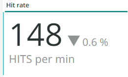
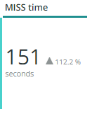
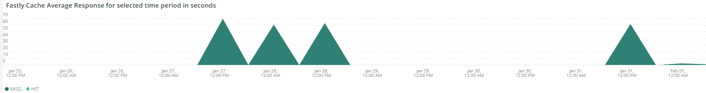
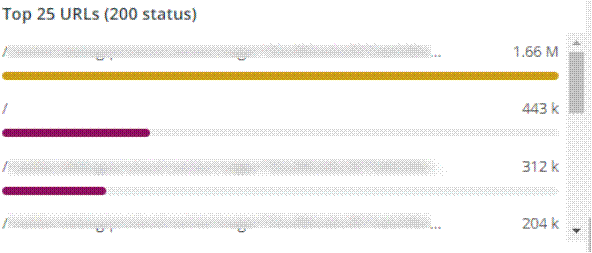

# La [!UICONTROL CDN] scheda

Questa scheda contiene informazioni incentrate sulle [!DNL content delivery network (CDN)]. Nel caso di Adobe Commerce Cloud, è la [!DNL Fastly] servizio.

## [!UICONTROL HIT rate]

La **[!UICONTROL HIT rate]** frame mostra il numero di richieste memorizzabili in cache che hanno generato [!UICONTROL HITS] all&#39;ultimo minuto. Questo indica che la memorizzazione in cache è riuscita. La freccia a destra mostra la percentuale sopra o sotto la stessa ora di una settimana fa.

## [!UICONTROL HIT Processing]

Questo **[!UICONTROL HIT processing]** mostra il numero di richieste memorizzabili nella cache che hanno generato [!UICONTROL HITS] durante la settimana.

## [!UICONTROL MISS rate]

Questo **[!UICONTROL MISS rate]** mostra il numero di mancate richieste memorizzabili nella cache all’ultimo minuto. Se la richiesta non viene memorizzata nella cache e deve essere trasmessa al server di origine per distribuire il contenuto, si verifica un errore di mancato recapito. Il valore a destra è il confronto tra aumento/diminuzione e il numero di minuti al minuto una settimana prima.

## [!UICONTROL MISS time]

## [!UICONTROL HIT Ratio]

## [!UICONTROL Error Percentage]

La **[!UICONTROL Error Percentage]** visualizza il valore della percentuale di ERRORE delle richieste e mostra l&#39;incremento/diminuzione relativi rispetto allo stesso tempo di una settimana prima.

## [!UICONTROL Total Requests]

## [!UICONTROL ERROR rate]

## [!UICONTROL Fastly Cache Average Response for selected time period in seconds]

Questo fotogramma mostra la durata in secondi delle richieste memorizzabili nella cache, il che significa che se un `cache_response` è un [!UICONTROL MISS], visualizza la media delle risposte memorizzate nella cache perse per il tempo selezionato.

## [!UICONTROL Fastly Cache Average Response for selected time period in seconds, faceted by POP]

## [!UICONTROL Total Bandwidth (All POPs) during the selected timeframe, compared with 1 week ago (% increase/decrease)]

## [!UICONTROL Requests – Since selected timeframe compared with one week ago]

Questo frame è simile alla casella di riepilogo per [!UICONTROL Total Requests] nella parte superiore, ma mostra il conteggio delle richieste delle settimane precedenti. Si tratta di tutte le richieste, non solo di quelle memorizzabili nella cache (dove `is_cacheable` è vero).

## [!UICONTROL Response Count]

## [!UICONTROL Bandwidth by POP]

## [!UICONTROL Top 5 URLs (5xx or 3xx status codes)]

La **[!UICONTROL Top 5 URLs]** visualizza i primi 5 URL con risposte di errore 5xx o 3xx. A causa del vincolo di spazio, dovrai passare il cursore sull’URL per visualizzare il codice di errore specifico associato a tale URL. (esempio nella casella rossa della figura sopra).

## [!UICONTROL Top 25 URLs (200 status)]

La **[!UICONTROL Top 25 URLs]** frame mostra gli URL che hanno restituito uno stato di 200 per conteggio durante l&#39;intervallo temporale selezionato.

## [!UICONTROL Duration by Response Status]

La **[!UICONTROL Duration by Response Status]** Il grafico visualizza le risposte di errore in base al conteggio durante l’intervallo temporale selezionato, in base al codice di stato dell’errore.

## [!UICONTROL Duration by Response Status, top 25 urls]

La **[!UICONTROL Duration by Response Status, top 25 URLs]** Il grafico mostra i primi 25 URL per la durata della risposta in secondi. Potrebbe essere necessario passare il mouse sull&#39;URL per visualizzare l&#39;intero percorso. Inoltre, per rimuovere tutti gli URL tranne uno, fai clic su di esso. Puoi quindi aggiungere nuovamente altri URL facendo clic su di essi singolarmente. Per rimuovere singoli URL, puoi tenere premuto il tasto e fare clic su ogni URL per rimuoverli dal grafico.

## [!UICONTROL Duration by Response Status, top 25 non-200 status]

La **[!UICONTROL Duration by Response Status, top 25 non-200 status]** Il grafico è simile all&#39;ultimo, tranne per il fatto che l&#39;attenzione è rivolta a codici di stato non-200 o a codici di stato di errore. Mostrerà il codice di errore e quindi l’URL. Potrebbe essere necessario passare il mouse sull&#39;URL per visualizzare l&#39;intero percorso. Inoltre, per rimuovere tutti gli URL tranne uno, fai clic su di esso. Puoi quindi aggiungere nuovamente altri URL facendo clic su di essi singolarmente. Per rimuovere singoli URL, puoi tenere premuto il tasto e fare clic su ogni URL per rimuoverli dal grafico.

## [!UICONTROL Error Count by POP timeline]

La **[!UICONTROL Error Count by POP timeline]** Il grafico mostra il conteggio degli stati di errore nella timeline dell’intervallo temporale selezionato, in base al codice di errore.

## [!UICONTROL Duration by Response status, top 25 client IP, non-200 status]

La **[!UICONTROL Duration by Response status, top 25 client IP, non 200 status]** Il grafico mostra gli indirizzi IP in base alla durata media nell’arco temporale selezionato in cui erano presenti codici di errore di stato.

## [!UICONTROL IP Frequency]

La **[!UICONTROL IP Frequency]** il frame conta gli stati (&quot;MISS&quot; e &quot;PASS&quot;) per ogni IP da [!DNL Fastly] registri. Le richieste web con questi stati raggiungeranno il server di origine e aggiungeranno il caricamento al server. Mostra i venti indirizzi principali in frequenza. Questo frame può essere utilizzato per rilevare attacchi IP o fonti di carico pesante su un sito web. Questo grafico è presente anche nella scheda di riepilogo e si trova qui per un semplice confronto con più dettagli sul [!DNL Fastly] informazioni di registro visualizzate in questa scheda.
