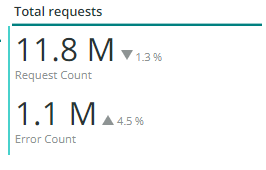

# Scheda [!UICONTROL CDN]

Questa scheda contiene informazioni incentrate su [!DNL content delivery network (CDN)]. Nel caso di Adobe Commerce Cloud, questo è il servizio [!DNL Fastly].

## [!UICONTROL HIT rate]

Il frame **[!UICONTROL HIT rate]** mostra il numero di richieste memorizzabili nella cache che hanno restituito [!UICONTROL HITS] all&#39;ultimo minuto. Ciò indica che la memorizzazione in cache è avvenuta correttamente. La freccia a destra mostra la percentuale al di sopra o al di sotto della stessa ora di una settimana fa.

## [!UICONTROL HIT Processing]

Questa casella **[!UICONTROL HIT processing]** mostra il numero di richieste memorizzabili nella cache che hanno generato [!UICONTROL HITS] durante la settimana.

## [!UICONTROL MISS rate]

Questa casella **[!UICONTROL MISS rate]** mostra il numero di richieste memorizzabili nella cache non riuscite all&#39;ultimo minuto. Un errore si verifica quando la richiesta non viene memorizzata in cache e deve essere passata al server di origine per distribuire il contenuto. Il valore a destra è il confronto tra aumento/diminuzione e il numero di minuti al minuto una settimana prima.

## [!UICONTROL MISS time]

## [!UICONTROL HIT Ratio]

## [!UICONTROL Error Percentage]

Nella casella **[!UICONTROL Error Percentage]** viene visualizzato il valore della percentuale di errore delle richieste e viene visualizzato l&#39;aumento o la diminuzione relativa rispetto alla stessa ora della settimana precedente.

## [!UICONTROL Total Requests]

## [!UICONTROL ERROR rate]

## [!UICONTROL Fastly Cache Average Response for selected time period in seconds]

Questo fotogramma mostra la durata in secondi delle richieste memorizzabili nella cache, il che significa che se un `cache_response` è un [!UICONTROL MISS], viene visualizzata la media delle risposte non memorizzate nella cache per il tempo selezionato.

## [!UICONTROL Fastly Cache Average Response for selected time period in seconds, faceted by POP]

*POP* in questo contesto fa riferimento a un punto di presenza (POP) configurato per funzionare come pool per l&#39;archiviazione della cache. Vedi [Punti di presenza](https://developer.fastly.com/learning/concepts/pop/).

## [!UICONTROL Total Bandwidth (All POPs) during the selected timeframe, compared with 1 week ago (% increase/decrease)]

## [!UICONTROL Requests – Since selected timeframe compared with one week ago]

Questo frame è simile alla casella di riepilogo per [!UICONTROL Total Requests] nella parte superiore, ma mostra i conteggi delle richieste delle settimane precedenti. Si tratta di tutte le richieste, non solo di quelle memorizzabili in cache (dove `is_cacheable` è true).

## [!UICONTROL Response Count]

## [!UICONTROL Bandwidth by POP]

## [!UICONTROL Top 5 URLs (5xx or 3xx status codes)]

La visualizzazione **[!UICONTROL Top 5 URLs]** mostra i primi 5 URL che ricevono risposte di errore 5xx o 3xx. A causa del vincolo di spazio, dovrai passare il cursore sull’URL per visualizzare il codice di errore specifico associato a tale URL. (esempio nella casella rossa della figura precedente).

## [!UICONTROL Top 25 URLs (200 status)]

Il frame **[!UICONTROL Top 25 URLs]** mostra gli URL che hanno restituito uno stato di 200 in base al conteggio durante l&#39;intervallo di tempo selezionato.

## [!UICONTROL Duration by Response Status]

Il grafico **[!UICONTROL Duration by Response Status]** visualizza le risposte di errore in base al conteggio durante l&#39;intervallo di tempo selezionato, interessato dal codice di stato dell&#39;errore.

## [!UICONTROL Duration by Response Status, top 25 urls]

Il grafico **[!UICONTROL Duration by Response Status, top 25 URLs]** mostra i primi 25 URL in base alla durata della risposta in secondi. Per visualizzare l’intero percorso, potrebbe essere necessario passare il cursore del mouse sull’URL. Inoltre, per rimuovere tutti gli URL tranne uno, fai clic su di essi. Puoi quindi aggiungere nuovamente altri URL facendo clic su di essi singolarmente. Se desideri rimuovere singoli URL, tieni premuto il tasto e fai clic su ciascun URL per rimuoverli dal grafico.

## [!UICONTROL Duration by Response Status, top 25 non-200 status]

Il grafico **[!UICONTROL Duration by Response Status, top 25 non-200 status]** è simile all&#39;ultimo tranne per il fatto che lo stato attivo è diverso da 200 codici di stato o codici di stato di errore. Il codice di errore e l’URL verranno visualizzati. Per visualizzare l’intero percorso, potrebbe essere necessario passare il cursore del mouse sull’URL. Inoltre, per rimuovere tutti gli URL tranne uno, fai clic su di essi. Puoi quindi aggiungere nuovamente altri URL facendo clic su di essi singolarmente. Se desideri rimuovere singoli URL, tieni premuto il tasto e fai clic su ciascun URL per rimuoverli dal grafico.

## [!UICONTROL Error Count by POP timeline]

Il grafico **[!UICONTROL Error Count by POP timeline]** visualizza il conteggio degli stati di errore lungo l&#39;intervallo temporale selezionato, interessato dal codice di errore.

## [!UICONTROL Duration by Response status, top 25 client IP, non-200 status]

Il grafico **[!UICONTROL Duration by Response status, top 25 client IP, non 200 status]** mostra gli indirizzi IP in base alla durata media nell&#39;arco temporale selezionato in cui erano presenti codici di errore di stato.

## [!UICONTROL IP Frequency]

Il frame **[!UICONTROL IP Frequency]** conta gli stati (&quot;MISS&quot; e &quot;PASS&quot;) per ogni IP dai registri [!DNL Fastly]. Le richieste web con questi stati raggiungono il server di origine e aggiungono un carico al server. Mostra i primi venti indirizzi in frequenza. Questo frame può essere utilizzato per rilevare attacchi IP o sorgenti di carico pesante su un sito web. Questo grafico è presente anche nella scheda Riepilogo e si trova qui per un semplice confronto con altri dettagli nelle informazioni di registro di [!DNL Fastly] visualizzate in questa scheda.
