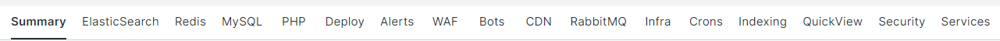

# Scelta del [!UICONTROL focus] schede

Il potere di [!DNL Observation for Adobe Commerce] proviene dall’allineamento di un enorme volume di visualizzazioni di dati diverse sulla stessa timeline. [!DNL Observation for Adobe Commerce] può presentare [!DNL New Relic] agenti con un esempio di dati raccolto e una visualizzazione dei registri di sistema e applicazioni. Se pensi alla risoluzione di problemi complessi, si tratta sempre di dati a metà divisione. Quando osservi un problema su una timeline, la prima domanda è: &quot;Quando si è verificato questo problema?&quot; Di immediata preoccupazione è tutto ciò che è accaduto prima di quel momento. Se conosci l’ora esatta in cui si è verificato il problema sulla timeline, puoi selezionare una timeline immediatamente prima del problema. Potresti non sapere i dettagli del problema se non il tuo sito è inattivo o lento. Con Adobe Commerce, i potenziali sospetti includono i servizi dei componenti, i livelli di risorse e il numero di processi in esecuzione.

La **[!UICONTROL focus]** le schede mostrano informazioni che possono aiutarti a concentrarti sulle aree che causano o contribuiscono al tuo problema. È inoltre possibile aggiungere continuamente segnali di dati a [!DNL Observation for Adobe Commerce]. I segnali di dati possono essere [!DNL New Relic] dati o conteggi delle fasi critiche o messaggi di errore raccolti dai registri. Poiché i messaggi di errore sono identificati come correlati ai problemi del sito, possono essere aggiunti al [!DNL Observation for Adobe Commerce] query per migliorare la visualizzazione delle informazioni critiche.

