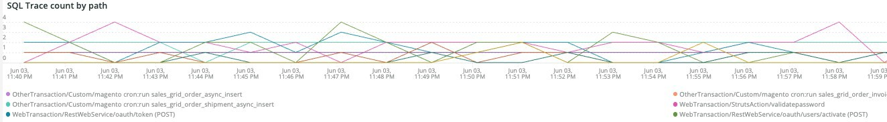

# La [!DNL Cron] scheda

Questa scheda è un tentativo di isolare rapidamente i problemi e le cause di [!DNL cron] problemi.

## [!UICONTROL Cron transaction duration in seconds]

La **[!UICONTROL Cron transaction duration in seconds]** display a frame [!DNL crons] durata della transazione in secondi. Verranno visualizzate le transazioni con tempi di esecuzione lunghi. Un&#39;analisi più approfondita di APM mostrerà più dettagli su quale query potrebbe essere in esecuzione la transazione/operazione.

## [!UICONTROL MySQL Non-Sleeping Threads by Node]

La **[!UICONTROL MySQL Non-Sleeping Threads by Node]** Il frame mostra i thread non server MySQL per nodo nell&#39;arco temporale selezionato.

## [!UICONTROL SQL Trace count by path]

La **[!UICONTROL SQL Trace count by path]** frame esamina i conteggi di traccia di MySQL in base al percorso, il che può aiutare a tracciare le istruzioni SQL in un arco temporale selezionato.

## [!UICONTROL Cron database call]

La **[!UICONTROL Cron database call]** il numero di [!DNL crons] chiamata al database in un arco temporale selezionato.

## [!UICONTROL Cron schedule table locks]

La **[!UICONTROL Cron schedule table locks]** inquadratura guarda [!DNL cron] la tabella di pianificazione si blocca in un arco temporale selezionato.

## [!UICONTROL Cron schedule clean cron fired]

La **[!UICONTROL Cron schedule clean cron fired]** il numero di [!DNL crons] ripulita in un arco temporale selezionato. Se in questo frame non vengono visualizzati dati, potrebbe essere segnalato un problema con [!DNL crons] in esecuzione correttamente. Se la [!DNL cron] la pianificazione del lavoro non è pulita, [!DNL crons] non viene eseguito in modo ottimale e l&#39;esecuzione potrebbe richiedere più tempo.

## [!UICONTROL Cron schedule clean records details table]

La **[!UICONTROL Cron schedule clean records details table]** la tabella fornisce dettagli sul lavoro da pulire i record dal `cron_schedule` in un arco temporale selezionato.

## [!UICONTROL cron_schedule table updates]

La **[!UICONTROL cron_schedule table updates]** il numero di [!DNL cron] aggiornamenti pianificati della tabella in un arco temporale selezionato. Un’attività elevata sull’eliminazione o l’aggiornamento di questa tabella può indicare un problema con [!DNL crons]. Inoltre, [!DNL crons] aggiorna questa tabella quando viene eseguita e completata, quindi se non è presente alcuna attività in questa tabella e sono presenti [!DNL crons] configurato, potrebbe esserci un problema con [!DNL crons].

## [!UICONTROL Datastore Operations Tables]

La **[!UICONTROL Datastore Operations Tables]** esamina le operazioni della tabella di database, tra cui `SELECT`, `DELETE`e `UPDATE` in un arco temporale selezionato. Questo frame mostra le tabelle del database con la frequenza di funzionamento più elevata rispetto a esse.
