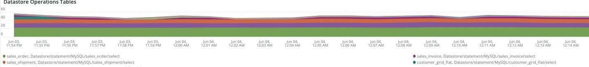

# La [!UICONTROL Cron] scheda

Questa scheda è un tentativo di isolare rapidamente i problemi e le cause dei cron.

## [!UICONTROL Cron transaction duration in seconds]

La **[!UICONTROL Cron transaction duration in seconds]** frame visualizza la durata della transazione cronica in secondi. Verranno visualizzate le transazioni con tempi di esecuzione lunghi. Un&#39;analisi più approfondita di APM mostrerà più dettagli su quale query potrebbe essere in esecuzione la transazione/operazione.

## [!UICONTROL MySql Non-Sleeping Threads by Node]

La **[!UICONTROL MySql Non-Sleeping Threads by Node]** Il frame mostra i thread non di sonno MySql per nodo nell&#39;arco temporale selezionato.

## [!UICONTROL SQL Trace count by path]

La **[!UICONTROL SQL Trace count by path]** frame esamina i conteggi di traccia di MySql in base al percorso, che può aiutare a tracciare le istruzioni SQL in un arco temporale selezionato.

## [!UICONTROL Cron database call]

La **[!UICONTROL Cron database call]** frame esamina il numero di cronometri che chiamano il database in un arco temporale selezionato.

## [!UICONTROL Cron schedule table locks]

La **[!UICONTROL Cron schedule table locks]** il frame esamina i blocchi della tabella di pianificazione cron in un arco temporale selezionato.

## [!UICONTROL Cron schedule clean cron fired]

La **[!UICONTROL Cron schedule clean cron fired]** frame esamina il numero di cronometri ripuliti in un arco temporale selezionato. Se in questo frame non vengono visualizzati dati, potrebbe essere presente un problema di funzionamento corretto dei cronometri. Se la pianificazione del processo cron non viene pulita, gli crons non verranno eseguiti in modo ottimale e l&#39;esecuzione potrebbe richiedere più tempo.

## [!UICONTROL Cron schedule clean records details table]

La **[!UICONTROL Cron schedule clean records details table]** la tabella fornisce dettagli sul lavoro da pulire i record dal `cron_schedule` in un arco temporale selezionato.

## [!UICONTROL cron_schedule table updates]

La **[!UICONTROL cron_schedule table updates]** frame esamina il numero di aggiornamenti della tabella pianificati cron in un arco temporale selezionato. Un’attività elevata sull’eliminazione o l’aggiornamento di questa tabella può indicare un problema relativo ai cronometri. Inoltre, gli cronisti aggiornano questa tabella quando vengono eseguiti e completati, quindi se non è presente alcuna attività in questa tabella e sono presenti cronometri configurati, potrebbe esserci un problema con gli crons.

## [!UICONTROL Datastore Operations Tables]

La **[!UICONTROL Datastore Operations Tables]** esamina le operazioni della tabella di database, tra cui `SELECT`, `DELETE`e `UPDATE` in un arco temporale selezionato. Questo frame mostra le tabelle del database con la frequenza di funzionamento più elevata rispetto a esse.
