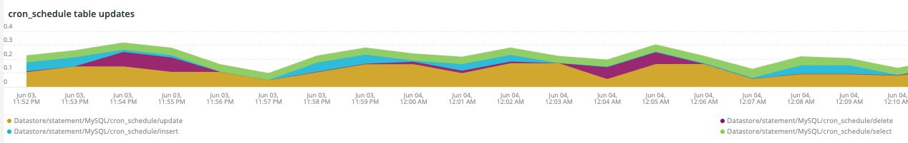

# Il [!DNL Cron] scheda

Questo scheda è un tentativo di isolare rapidamente i problemi e le cause dei [!DNL cron] problemi.

## [!UICONTROL Cron transaction duration in seconds]

Il **[!UICONTROL Cron transaction duration in seconds]** frame visualizza [!DNL crons] la durata della transazione in secondi. Verranno visualizzate le transazioni con tempi di esecuzione lunghi. Un approfondimento su APM mostrerà maggiori dettagli su quale query potrebbe essere in esecuzione la transazione/operazione.

## [!UICONTROL MySQL Non-Sleeping Threads by Node]

Il **[!UICONTROL MySQL Non-Sleeping Threads by Node]** frame mostra i thread MySQL Non-Sleeping per nodo nel arco temporale selezionato.

## [!UICONTROL SQL Trace count by path]

Il **[!UICONTROL SQL Trace count by path]** frame esamina i conteggi delle tracce MySQL per percorso, che può aiutare a tracciare le istruzioni SQL su un arco temporale selezionato.

## [!UICONTROL Cron database call]

Il **[!UICONTROL Cron database call]** frame esamina il numero di [!DNL crons] chiamate al database in un arco temporale selezionato.

## [!UICONTROL Cron schedule table locks]

Il frame **[!UICONTROL Cron schedule table locks]** esamina i blocchi della tabella di pianificazione [!DNL cron] in un intervallo temporale selezionato.

## [!UICONTROL Cron schedule clean cron fired]

La **[!UICONTROL Cron schedule clean cron fired]** cornice esamina il numero di [!DNL crons] elementi puliti in un arco temporale selezionato. Se nessun dato viene visualizzato in questo frame, potrebbe indicare che problema con [!DNL crons] l&#39;esecuzione corretta. Se il processo programmare non viene pulito, [!DNL crons] non verrà eseguito in modo ottimale e l&#39;esecuzione [!DNL cron] potrebbe richiedere più tempo.

## [!UICONTROL Cron schedule clean records details table]

La **[!UICONTROL Cron schedule clean records details table]** tabella fornisce dettagli sul processo di pulizia dei record dalla `cron_schedule` tabella in un arco temporale selezionato.

## [!UICONTROL cron_schedule table updates]

Il **[!UICONTROL cron_schedule table updates]** frame esamina il numero di [!DNL cron] aggiornamenti pianificati delle tabelle in un arco temporale selezionato. Un&#39;elevata attività sull&#39;eliminazione o l&#39;aggiornamento di questa tabella può indicare un problema con [!DNL crons]. Inoltre, [!DNL crons] aggiorna questa tabella quando vengono eseguiti e completati, quindi se non c&#39;è attività su questa tabella e sono [!DNL crons] configurati, potrebbe esserci un problema con [!DNL crons].

## [!UICONTROL Datastore Operations Tables]

Esamina **[!UICONTROL Datastore Operations Tables]** le operazioni della tabella di database, tra cui `SELECT`, `DELETE`e `UPDATE` in un arco temporale selezionato. Questo frame mostra le tabelle di database con la frequenza di operazione più elevata rispetto a esse.
