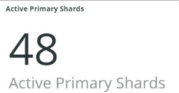

# Il [!UICONTROL Elasticsearch] scheda

## [!UICONTROL Cluster Status Summary]:

Nel periodo di tempo selezionato, il **[!UICONTROL Cluster Status Summary]** mostra gli stati dei colori che [!DNL Elasticsearch] cluster completato. In questo esempio, durante l’intervallo temporale selezionato, il cluster era in stato Verde una volta e in stato Giallo una volta durante l’intervallo temporale selezionato.

## [!UICONTROL Active Primary Shards]

Il **[!UICONTROL Active Primary Shards]** mostra i numeri diversi a seconda del numero di partizioni primarie attive per l&#39;account selezionato [!DNL Elasticsearch] servizio.

Da [!DNL Elasticsearch]: la guida definitiva [2.x]:

&quot;In [Indici aggiornabili dinamicamente](https://www.elastic.co/guide/en/elasticsearch/guide/2.x/dynamic-indices.html), abbiamo spiegato che un frammento è un indice Lucene e che un [!DNL Elasticsearch] index è una raccolta di frammenti. L’applicazione comunica con un indice e [!DNL Elasticsearch] indirizza le richieste alle condivisioni appropriate. Un frammento è l&#39;unità di scala. L&#39;indice più piccolo che si può avere è quello con una singola partizione. Questo può essere più che sufficiente per le vostre esigenze — un singolo frammento può contenere molti dati — ma limita la vostra capacità di scalare.&quot;

Quando viene creato un indice, con tale indice vengono create diverse partizioni. Per impostazione predefinita, a ogni nuovo indice vengono assegnate cinque partizioni primarie, il che significa che un indice può essere distribuito su cinque nodi (una partizione per nodo). Sono inoltre disponibili frammenti di replica. Questi sono principalmente destinati al failover. I frammenti di replica possono servire le richieste di lettura.

## [!UICONTROL Active Shards in Cluster]

Il **[!UICONTROL Active Shards in Cluster]** frame mostra il numero totale di partizioni primarie e di repliche in un [!DNL Elasticsearch] cluster.

## [!UICONTROL Index health - this will show the index name and color status]

Questa cornice mostra il nome dell&#39;indice e il conteggio dello stato del colore dell&#39;indice. Scorrere la tabella per visualizzare lo stesso nome di indice con gli stati Giallo e Rosso. Il numero che segue il nome dell’indice 27 è il conteggio del colore dello stato. Se è uguale a zero, non vi sono state istanze dell’indice che si trovavano nello stato di quel colore durante gli intervalli di tempo selezionati.

## [!UICONTROL Elasticsearch Status by node information]

Il **[!UICONTROL Elasticsearch Status by node information]** il frame mostra il [!DNL Elasticsearch] stato del cluster in base al colore e al nodo. Questo aiuta a indicare quale nodo nel [!DNL Elasticsearch] il cluster sta restituendo quale stato durante l’intervallo di tempo selezionato.

## [!UICONTROL Elasticsearch index information]

Il **[!UICONTROL Elasticsearch index information]** La tabella mostra il nome dell&#39;indice, il nodo su cui si trova, il numero di documenti indicizzati, lo stato dell&#39;indice e la dimensione dell&#39;indice in MB in un determinato momento.

## [!UICONTROL Elasticsearch process CPU %]

Il **[!UICONTROL Elasticsearch process CPU %]** il fotogramma mostra la percentuale di CPU del processo in base al [!DNL Elasticsearch] elabora nel periodo di tempo selezionato.

## [!UICONTROL Elasticsearch Memory garbage collection]

[!DNL Elasticsearch] è un processo Java. Se la memoria allocata è insufficiente, verrà avviata la raccolta di oggetti inattivi per liberare memoria. Se la raccolta di oggetti inattivi è frequente, è un’indicazione del fatto che potrebbero esserci troppi indici o frammenti per la memoria allocata. Ci può essere l&#39;opportunità di ripulire gli indici e le schegge o [!DNL Elasticsearch] potrebbe aver bisogno di più memoria.

## [!UICONTROL Elasticsearch Index information]

Quando gli indici vengono creati e aggiornati, lo stato dell’indice potrebbe cambiare.

## [!UICONTROL Elasticsearch Index Size]

Il **[!UICONTROL Elasticsearch Index Size]** frame indica il nome e la dimensione dell’indice nell’arco temporale selezionato. Potrebbe indicare problemi nel modo in cui un sito viene indicizzato.

## [!UICONTROL Elasticsearch Errors]

Il **[!UICONTROL Elasticsearch Errors]** il frame visualizza gli errori con [!DNL Elasticsearch] come l’esaurimento dello spazio, il passaggio dallo stato Giallo a Rosso, quando tutte le partizioni hanno esito negativo, quando si verificano problemi di parametri con le ricerche, errori di versione e quando tutti i nodi non sono disponibili.

## [!UICONTROL Elasticsearch Unassigned Shards]:

Le parti non assegnate causeranno lo spostamento di un cluster dallo stato Verde allo stato Giallo.
