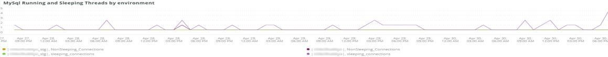

# La [!UICONTROL MySQL] scheda

## [!UICONTROL MySQL% free storage by node]

Molti problemi sono causati dall&#39;esaurimento dello spazio di archiviazione di MySQL nell&#39;archivio assegnato a MySQL (`datadir` Impostazione di configurazione MySQL, il valore predefinito è `/data/mysql`) o `tmpdir` esaurimento dello spazio. Il valore predefinito `tmpdir` (Impostazione MySQL) è `/tmp`. Questo fotogramma esamina il `/, /tmp` (se definito come montaggio separato) e `/data/mysql` % dello stoccaggio libero. A partire da MySQL versione 5.7 (MariaDB versione 10.2), le tabelle tmp non compresse vengono scritte in una tablespace tmp nella `/data/mysql` nel file (ibtmp1). Questo file si espande automaticamente senza limiti per impostazione predefinita. Poiché si tratta di una tablespace, non diminuirà le dimensioni e verrà reimpostato a 12 MB al riavvio di MySQL.

## [!UICONTROL MySQL Connections by Node]

La **[!UICONTROL MySQL Connections by Node]** frame indica periodi di interruzioni dei nodi del database o elevati volumi di connessioni.

## [!UICONTROL MySQL Node Summary]

La **[!UICONTROL MySQL Node Summary]** La tabella mostra i dettagli del nodo del database, ad esempio la versione del software e il tipo di istanza (dimensione).

## [!UICONTROL Galera Number of Nodes in cluster]

La **[!UICONTROL Galera Number of Nodes in cluster]** frame visualizza informazioni dai log di MySQL. Quando i nodi si uniscono e lasciano un cluster, vengono visualizzati solo i messaggi per l’intervallo temporale selezionato. Se un nodo lascia il cluster prima dell&#39;intervallo temporale, non esisterà alcun messaggio durante tale intervallo di tempo. Se si sospetta che il database sia a corto di un nodo, espandere l&#39;intervallo di tempo per visualizzare ulteriori informazioni. Se durante il periodo di tempo sono presenti informazioni che indicano meno di tutti i nodi nel [!DNL Galera] cluster, espandere l&#39;intervallo temporale per vedere se è possibile determinare quando il nodo ha lasciato il cluster.

## [!UICONTROL MySQL shutdowns and starts]

La **[!UICONTROL MySQL shutdowns and starts]** viene rilevato quando si arresta un nodo. [!DNL Galera] i nodi verranno sfrattati e verranno eliminati automaticamente dal [!DNL Galera] nodo. In genere questo si tradurrà in un riavvio del servizio MySQL.

## [!UICONTROL Galera log]

La **[!UICONTROL Galera log]** il frame mostra il conteggio di segnali particolari provenienti dai log di MySQL relativi [!DNL Galera] nodi, i relativi stati e le modifiche dello stato [!DNL Galera] cluster.

* &#39;%1047 WSREP non ha ancora preparato il nodo per l&#39;utilizzo dell&#39;applicazione%&#39;) come &#39;node_not_prep_for_use&#39;
* &#39;%\[ERROR\] WSREP: Impossibile leggere da: wsrep_sst_xtrabackup-v2%) come &#39;xtrabackup_read_fail&#39;
* &#39;%\[ERROR\] WSREP: Processo completato con errore: wsrep_sst_xtrabackup-v2 %) come &#39;xtrabackup_compl_w_err&#39;
* &#39;%\[ERROR\] WSREP: rbr write fail%&quot;) come &#39;rbr_write_fail&#39;
* &#39;%self-leave%&#39;) come &#39;sospeso_node&#39;
* &#39;%Members = 3/3 (unito/totale)%&#39;) come &#39;3of3&#39;
* &#39;%Members = 2/3 (unito/totale)%&#39;) come &#39;2of3&#39;
* &#39;%Members = 2/2%&#39;) come &#39;2of2&#39;
* &#39;%Members = 1/2%&#39;) come &#39;1of2&#39;
* &quot;%Members = 1/3%&quot;) come &quot;1of3&quot;
* ‘%Members = 1/1%&#39;) come &#39;1of1&#39;
* &#39;%\[Nota\] /usr/sbin/mysqld (mysqld 10.%&#39;) come &#39;sql_riavvio&#39;
* &#39;%Quorum: Nessun nodo con stato completo:%) come &#39;no_node_count&#39;
* &#39;%WSREP: Membro 0%) come &#39;mem_0&#39;
* &#39;%WSREP: Membro 1.0%) come &#39;mem_1&#39;
* &#39;%WSREP: Membro 2%) come &#39;mem2&#39;
* &#39;%WSREP: Sincronizzato con il gruppo, pronto per le connessioni%) come &#39;ready&#39;
* &#39;%/usr/sbin/mysqld, versione:%&#39;) come &#39;mysql_riavvio_mysql.slow&#39;
* &#39;%\[Nota\] WSREP: Nuova vista cluster: stato globale:%) come &#39;galera_cluster_view_change&#39;

## [!UICONTROL Galera Log by Host]

La **[!UICONTROL Galera Log by Host]** è lo stesso del **[!UICONTROL Galera log]** frame, con la differenza che è suddiviso per nodo per facilitare la risoluzione dei problemi.

## [!UICONTROL Database performance]

La **[!UICONTROL Database performance]** frame mostra le prestazioni del database durante richieste specifiche. Per visualizzare ogni metrica, fai clic su di esse nelle icone colorate sotto il grafico. Molte delle metriche definite in [Monitoraggio delle prestazioni del database MySQL con la nuova relic](https://newrelic.com/blog/how-to-relic/how-to-monitor-mysql) si trovano in questo fotogramma.

* average(query.queryPerSecond)
* average(query.slowQueriesPerSecond)
* average(db.createdTmpDiskTablesPerSecond)
* average(db.createdTmpFilesPerSecond)
* average(db.tablesLocksWaitedPerSecond)
* average(db.innodb.rowLockTimeAvg)
* average(db.innodb.rowLockWaitsPerSecond)

## [!UICONTROL Transaction Database Call Count]

La **[!UICONTROL Transaction Database Call Count]** frame mostra il numero di chiamate al database effettuate da ogni facet di transazione. Questo sembra essere incentrato sulle righe e non sulle dichiarazioni.

## [!UICONTROL Cron_schedule table updates]

La **[!UICONTROL Cron_schedule table updates]** frame visualizza la durata massima degli aggiornamenti del database alla tabella cron_Schedule per il periodo di tempo selezionato.

## [!UICONTROL Slow Query Traces]

La **[!UICONTROL Slow Query Traces]** frame visualizza la tabella e il tipo di richiesta in cui esistono tracce di query lente. Viene creata una traccia lenta della query per le transazioni di query che richiedono più di 5 secondi. Per questo frame sono importanti le query di aggiornamento. Se una tabella viene aggiornata da `UPDATE`, `DELETE`e `INSERT` istruzioni, possono bloccare le tabelle per un periodo di tempo.

Pari `SELECT` le istruzioni possono bloccare le righe se utilizzate con FOR UPDATE.

## [!UICONTROL Datastore Operations tables]

## [!UICONTROL Cron table change]

La **[!UICONTROL Cron table change]** frame è alla ricerca di messaggi di errore &quot;impossibile acquisire il blocco per cron job:&quot;, insieme a un errore di memoria PHP specifico e blocchi che coinvolgono `cron_schedule` tabella. Se la `cron_schedule` tabella bloccata (ad esempio da un `DELETE` query eseguita contro), impedirà l’esecuzione di altri cronisti.

## [!UICONTROL Deadlocks]

La **[!UICONTROL Deadlocks]** frame sta esaminando le seguenti stringhe analizzate dai log MySQL.

* &#39;%Errore irreversibile PHP: Dimensione di memoria consentita pari a%&#39;) come php_mem_error
* &#39;%get lock; prova a riavviare la transazione. query: DELETE DA \`cron_schedp%&#39;) come cron_sched_lock_del
* Blocco &#39;% per lavoro cron: indexer_reindex_all_valid%&#39;) come &#39;lock_indexer_reindex_all_valid%&#39;
* Blocco &#39;% per lavoro cron: cron_pianificazione%) come &#39;lock_cron_Schedule&#39;
* &#39;% di blocco per il lavoro cron:%&#39;) come &#39;total_cron_lock&#39;
* &#39;%Errore generale: 1205 Timeout attesa blocco superato%) come &#39;sql_1205_lock&#39;
* &#39;%ERROR 1213 (40001): Deadlock trovato quando si tenta di ottenere lock%) come &#39;sql_1213_lock&#39;
* &#39;%SQLSTATE[40001]: Errore di serializzazione: 1213 Deadlock trovato%) come &#39;sql_1213_lock2&#39;
* Blocco &#39;% per lavoro cron: indexer_update_all_views%) come &#39;lock_indexer_update_all_views&#39;
* Blocco &#39;% per lavoro cron: sales_grid_order_Invoice_async_insert%&#39;) come &#39;lock_sales_grid_order_Invoice_async_insert&#39;,
* Blocco &#39;% per lavoro cron: staging_remove_Updates%) as &#39;lock_staging_remove_Updates&#39;
* Blocco &#39;% per lavoro cron: sales_grid_order_Shipping_async_insert%) come &#39;lock_sales_grid_order_Shipping_async_insert&#39;
* Blocco &#39;% per lavoro cron: amazon_payments_process_quesent_rimborsi%) come &#39;lock_amazon_payments_process_quesent_rimborsi&#39;
* Blocco &#39;% per lavoro cron: sales_send_order_Shipping_emails%&quot;) come &#39;lock_sales_send_order_mailails&#39;
* Blocco &#39;% per lavoro cron: staging_sync_entity_period%) come &#39;lock_staging_sync_entity_period&#39;
* Blocco &#39;% per lavoro cron: indexer_clean_all_changelogs%) come &#39;lock_indexer_clean_all_changelogs&#39;
* Blocco &#39;% per lavoro cron: magento_targetrule_index_reindex%&#39;) as &#39;lock_magento_targetrule_index_reindex&#39;
* Blocco &#39;% per lavoro cron: newsletter_send_all%) come &#39;lock_newsletter_send_all&#39;
* Blocco &#39;% per lavoro cron: newsletter_send_all%) come &#39;lock_newsletter_send_all&#39;
* Blocco &#39;% per lavoro cron: sales_send_order_emails%&#39;) come &#39;lock_sales_send_order_email&#39;
* Blocco &#39;% per lavoro cron: sales_send_order_creditmemo_emails%&quot;) come &#39;lock_sales_send_order_creditmemo_email&#39;
* Blocco &#39;% per lavoro cron: sales_grid_order_creditmemo_async_insert%&#39;) come &#39;lock_sales_grid_order_creditemo_async_insert&#39;
* Blocco &#39;% per lavoro cron: bulk_cleanup%) come &#39;lock_bulk_cleanup&#39;
* Blocco &#39;% per lavoro cron: flush_preview_quote%) come &#39;lock_flush_preview_quote&#39;
* Blocco &#39;% per lavoro cron: sales_send_order_fattura_emails%&#39;) come &#39;lock_sales_send_order_Invoice_email&#39;
* Blocco &#39;% per lavoro cron: sales_send_order_fattura_emails%&#39;) come &#39;lock_sales_send_order_Invoice_email&#39;
* Blocco &#39;% per lavoro cron: captcha_delete_expires_images%) as &#39;lock_captcha_delete_expiration_images&#39;
* Blocco &#39;% per lavoro cron: magento_newrelicreporting_cron%) as &#39;lock_magento_newrelicreporting_cron&#39;
* Blocco &#39;% per lavoro cron: obsoleto_authentication_Failure_cleanup%) come &#39;lock_outobsolobsolobsoleto_authentication_Failure_cleanup&#39;
* Blocco &#39;% per lavoro cron: send_notification%) come &#39;lock_send_notification&#39;
* Blocco &#39;% per lavoro cron: magento_giftcardaccount_generage_codes_pool%) come &#39;lock_magento_giftcardaccount_generage_codes_pool&#39;
* Blocco &#39;% per lavoro cron: catalog_product_frontend_actions_flush%&#39;) come &#39;lock_catalog_product_frontend_actions_flush&#39;
* Blocco &#39;% per lavoro cron: mysqlmq_clean_messages%&#39;) come &#39;mysqlmq_clean_messages&#39;
* Blocco &#39;% per lavoro cron: catalog_product_attribute_value_sync%&#39;) come &#39;lock_catalog_product_attribute_value_sync&#39;
* Blocco &#39;% per lavoro cron: ddg_automation_importer%) come &#39;lock_ddg_automation_importer&#39;
* Blocco &#39;% per lavoro cron: ddg_automation_review_and_wishlist%) come &#39;lock_ddg_automation_review_and_wishlist&#39;
* Blocco &#39;% per lavoro cron: captcha_delete_old_paths%&#39;) as &#39;lock_captcha_delete_old_documents&#39;
* Blocco &#39;% per lavoro cron: catalog_product_outdated_price_values_cleanup%) come &#39;lock_catalog_product_outdated_price_values_cleanup&#39;
* Blocco &#39;% per lavoro cron: consumer_runner%) come &#39;lock_consumer_runner&#39;
* Blocco &#39;% per lavoro cron: ddg_automation_customer_subscriber_guest_sync%&#39;) come &#39;lock_ddg_automation_customer_subscriber_guest_sync&#39;
* Blocco &#39;% per lavoro cron: get_amazon_capture_update%) as &#39;lock_get_amazon_capture_Updates&#39;
* Blocco &#39;% per lavoro cron: get_amazon_authorization_Updates%) as &#39;lock_send_get_amazon_authorization_Updates&#39;
* Blocco &#39;% per lavoro cron: temando_process_platform_events%&#39;) come &#39;lock_temando_process_platform_events&#39;
* Blocco &#39;% per lavoro cron: ddg_automation_status%&#39;) come &#39;lock_dg_automation_status&#39;
* Blocco &#39;% per lavoro cron: ddg_automation_status%&#39;) come &#39;lock_dg_automation_status&#39;
* Blocco &#39;% per lavoro cron: sales_clean_orders%) come &#39;lock_sales_clean_orders&#39;
* Blocco &#39;% per lavoro cron: catalog_index_refresh_price%) come &#39;lock_catalog_index_refresh_price&#39;
* Blocco &#39;% per lavoro cron: magento_premi_balance_warning_notification%) come &#39;lock_magento_premier_balance_warning_notification&#39;
* Blocco &#39;% per lavoro cron: analytics_update%) come &#39;lock_analytics_update&#39;
* Blocco &#39;% per lavoro cron: messagequeue_clean_outdated_locks%) come &#39;lock_messagequeue_clean_outdated_lock&#39;
* Blocco &#39;% per lavoro cron: messagequeue_clean_outdated_locks%) come &#39;lock_messagequeue_clean_outdated_lock&#39;
* Blocco &#39;% per lavoro cron: staging_apply_version%) come &#39;lock_staging_apply_version&#39;
* Blocco &#39;% per lavoro cron: magento_premiare_expires_points%) come &#39;lock_magento_premiare_expires_points&#39;
* Blocco &#39;% per lavoro cron: yotpo_yotpo_orders_sync%) come &#39;lock_yotpo_yotpo_orders_sync&#39;
* Blocco &#39;% per lavoro cron: catalog_event_status_checker%) come &#39;lock_catalog_event_status_checker&#39;
* Blocco &#39;% per lavoro cron: ddg_automation_campaign%&#39;) come &#39;lock_ddg_automation_campaign&#39;
* Blocco &#39;% per lavoro cron: visitor_clean%) come &#39;lock_visitor_clean&#39;
* Blocco &#39;% per lavoro cron: scconnector_verify_website%&#39;) come &#39;lock_scconnector_verify_website&#39;
* Blocco &#39;% per lavoro cron: ddg_automation_email_templates%&#39;) come &#39;lock_ddg_automation_email_templates&#39;
* Blocco &#39;% per lavoro cron: aggregate_sales_report_order_data%&#39;) come &#39;lock_aggregate_sales_report_order_data&#39;
* Blocco &#39;% per lavoro cron: ddg_automation_catalog_sync%) come &#39;lock_ddg_automation

## [!UICONTROL DB Statistics]

La **[!UICONTROL DB Statistics]** frame visualizza eliminazioni, scritture, righe lette, aggiornamenti e query lente al secondo.

## [!UICONTROL Request frequency]

## [!UICONTROL Database Errors]

La **[!UICONTROL Database Errors]** frame mostra una varietà di database [avvisi ed errori](https://mariadb.com/kb/en/mariadb-error-codes/).

* &#39;%La dimensione della memoria allocata per la tabella temporanea è superiore al 20% di innodb_buffer_pool_size%&#39; come &#39;temp_tbl_buff_pool&#39;
* &#39;%\[ERROR\] WSREP: rbr write fail%&quot;) come &#39;rbr_write_fail&#39;
* &#39;%mysqld: Disco pieno%) come &#39;disk_full&#39;
* &#39;%Error number 28%&#39;) as &#39;err_28&#39;
* &#39;%rollback%&#39;) come &#39;rollback&#39;
* &#39;%Il vincolo di chiave esterna non riesce per la tabella%&#39;) come &#39;vincolo_chiave_esterna&#39;
* &#39;%Codice_errore: 1114%) come &#39;sql_1114_full&#39;%CRITICO: SQLSTATE[HY000] [2006] Il server MySQL è andato via%) come &#39;sql_go&#39;
* &#39;%SQLSTATE[HY000] [1040] Troppe connessioni%) come &#39;sql_1040&#39;
* &#39;%CRITICO: SQLSTATE[HY000] [2002]%) come &#39;sql_2002&#39;
* &#39;%SQLSTATE[08S01]:%) come &#39;sql_1047&#39;
* &#39;%[Avviso] Connessione interrotta%) come &#39;aborted_conn&#39;
* &#39;%SQLSTATE[23000]: Violazione del vincolo di integrità:%) come &#39;sql_23000&#39;
* &#39;%1205 Timeout attesa blocco%&#39;) come &#39;sql_1205&#39;
* &#39;%SQLSTATE[HY000] [1049] Database sconosciuto%) come &#39;sql_1049&#39;
* &#39;%SQLSTATE[42S02]: Tabella o vista di base non trovata:%) come &#39;sql_42S02&#39;
* &#39;%Errore generale: 1114%) come &#39;sql_1114&#39;
* &#39;%SQLSTATE[40001]%&#39;) come &#39;sql_1213&#39;
* &#39;%SQLSTATE[42S22]: Colonna non trovata: 1054 (colonna sconosciuta%) come &#39;sq1_1054&#39;
* &#39;%SQLSTATE[42000]: Errore di sintassi o violazione dell&#39;accesso:%&#39;) come &#39;sql_42000&#39;
* &#39;%SQLSTATE[21000]: Violazione cardinalità:%) come &#39;sql_1241&#39;
* &#39;%SQLSTATE[2003]:%) come &#39;sql_22003&#39;
* &#39;%SQLSTATE[HY000] [9000] Client con indirizzo IP%) come &#39;sql_9000&#39;
* &#39;%SQLSTATE[HY000]: Errore generale: 2014%) come &#39;sql_2014&#39;
* &#39;%1927 Connessione interrotta%&#39;) come &#39;sql_1927&#39;
* &#39;%1062 \[ERROR\] InnoDB:%&#39;) come &#39;sql_1062_e&#39;
* &quot;&#39;%[Nota] WSREP: Scaricamento della mappa di memoria sul disco in corso...%) come &#39;mem_map_flush&#39;
* &#39;%Codice errore interno MariaDB: 1146%) come &#39;sql_1146&#39;
* &#39;%Codice errore interno MariaDB: 1062%) come &#39;sql_1062&#39; ・ &#39;%1062 [Avviso] InnoDB:%) come &#39;sql_1062_w&#39;
* &#39;%Codice errore interno MariaDB: 1064%) come &#39;sql_1064&#39;
* &#39;%InnoDB: Errore di asserzione nel file%) come &#39;assertion_err&#39;
* &#39;%mysqld_safe Numero di processi in esecuzione: 0%) come &#39;mysql_oom&#39;
* &#39;%\[ERROR\] mysqld ha ricevuto il segnale%&#39;) come &#39;mysql_sigterm&#39;
* &#39;%1452 Impossibile aggiungere%&#39;) come &#39;sql_1452&#39;
* &#39;%ERROR 1698%&#39;) come &#39;sql_1698&#39;
* &#39;%SQLSTATE[HY000]: Errore generale: 3%) come &#39;cnt_wrt_tmp&#39;
* &#39;%Errore generale: 1 %) come &#39;sql_sintassi&#39;
* &#39;%42S22%&#39;) come &#39;sql_42S22&#39;
* &#39;%InnoDB: Errore (chiave duplicata)%) come &#39;innodb_dup_key&#39; DA Log TIMESERIES

## [!UICONTROL DB Error Table]

La **[!UICONTROL DB Error Table]** mostra le stesse informazioni del **[!UICONTROL Database Errors]** ma potete vederlo per nodo e in formato tabella. Vedi [Codici di errore MariaDB](https://mariadb.com/kb/en/mariadb-error-codes/) per ulteriori informazioni.

## [!UICONTROL Database Traces]

La **[!UICONTROL Database Traces]** frame mostra le tracce del database per tipo nella timeline selezionata.

## [!UICONTROL Database processes]

La **[!UICONTROL Database processes]** frame mostra i processi, gli ambienti e gli identificatori dei nodi del database.

## [!UICONTROL MySQL Non-Sleeping Threads by Node]

La **[!UICONTROL MySQL Non-Sleeping Threads by Node]** frame mostra i thread di connessione al database. Questo fotogramma mostra i thread attivi.

## [!UICONTROL MySQL Running and Sleeping Threads by environment]

La **[!UICONTROL MySQL Running and Sleeping Threads by environment]** frame mostra le connessioni attive e in sospeso al database. Se sono presenti connessioni al database in cui le query lente sono andate in sospensione, le connessioni in sospeso saranno disponibili. Le connessioni server possono essere query di database bloccate da righe o tabelle bloccate. Queste connessioni a letto sono anche in possesso di connessioni di lavoro PHP.

## [!UICONTROL MySQL mem used by node]

La **[!UICONTROL MySQL mem used by node]** frame mostra l&#39;utilizzo del nodo della memoria da parte di MySQL. Su siti più grandi, questo frame può essere barre continue con GB di memoria utilizzata.

## [!UICONTROL Database mysql-slow.log]

La **[!UICONTROL Database mysql-slow.log]** il frame mostra i tipi di istruzione query presenti nel `mysql-slow.log` nell’arco temporale selezionato.

