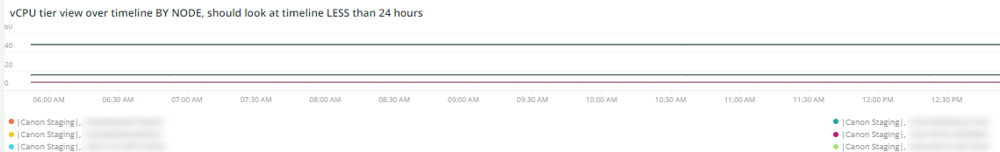

# Il [!DNL Infra] scheda

Il **[!DNL Infra]** La scheda isola i problemi e le cause dei problemi dell&#39;infrastruttura. Vengono inoltre descritti i fotogrammi visibili nella scheda.

## [!UICONTROL Service Alerts – Infrastructure Alerts by Application name]

Il **[!UICONTROL Service Alerts – Infrastructure Alerts by Application name]** grafico mostra gli avvisi del servizio raccolti da [!DNL New Relic] agente dell&#39;infrastruttura. Verranno visualizzati i riavvii del servizio, molti associati alle distribuzioni.

## [!UICONTROL Inode usage by mount]

Il **[!UICONTROL Inode usage by mount]** mostra fotogrammi [!DNL inode] utilizzo in base al montaggio nell’intervallo temporale selezionato. Anche se lo spazio di archiviazione disponibile potrebbe essere sufficiente, se un nodo si esaurisce [!DNL inodes], mostrerà una mancanza di storage disponibile. La rimozione dei file (in particolare quelli di piccole dimensioni) consente di liberare spazio e creare [!DNL inodes] disponibile.

## [!UICONTROL vCPU tier view over timeline GREATER 2 weeks]

Il **[!UICONTROL vCPU tier view over timeline GREATER 2 weeks]** Il fotogramma mostra la vista a livello vCPU per l’intervallo di tempo selezionato di oltre due settimane. Questo frame esamina il numero di vCPU assegnate al [!DNL New Relic] nome applicazione visualizzato.

## [!UICONTROL vCPU tier view over timeline]

Il **[!UICONTROL vCPU tier view over timeline]** il fotogramma mostra la vista a livello vCPU per un arco temporale selezionato di oltre 24 ore. Questo frame esamina il numero di vCPU assegnate al [!DNL New Relic] nome applicazione visualizzato. Verranno visualizzati sia gli upsize del cluster che gli downsize.

## [!UICONTROL vCPU tier view over timeline BY NODE]

Il **[!UICONTROL vCPU tier view over timeline BY NODE]** fotogramma mostra le viste a livello vCPU nell’arco temporale selezionato per nodo. Questo frame è utile per rilevare la perdita di nodi o quando i nodi vengono aumentati o ridimensionati. La vista a livello vCPU sulla timeline BY NODE dovrebbe esaminare la timeline MENO di 24 ore.

## [!UICONTROL Instance details]

Il **[!UICONTROL Instance details]** la tabella mostra i dettagli di ciascuna istanza [!DNL New Relic] applicazione.

## [!UICONTROL Logging, if there is a broken line for a node, it indicates non-responsive node during that time period]

Il **[!UICONTROL Logging, if there is a broken line for a node, it indicates non-responsive node during that time period]** il frame mostra i nodi non reattivi in un periodo di tempo.
