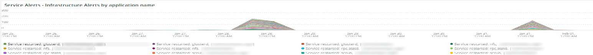

# Scheda [!DNL Infra]

La scheda **[!DNL Infra]** isola i problemi e le cause dei problemi dell&#39;infrastruttura. Vengono inoltre descritti i fotogrammi visibili nella scheda.

## [!UICONTROL Service Alerts – Infrastructure Alerts by Application name]

Il grafico **[!UICONTROL Service Alerts – Infrastructure Alerts by Application name]** mostra gli avvisi del servizio raccolti dall&#39;agente dell&#39;infrastruttura [!DNL New Relic]. Verranno visualizzati i riavvii del servizio, molti associati alle distribuzioni.

## [!UICONTROL Inode usage by mount]

Il frame **[!UICONTROL Inode usage by mount]** mostra l&#39;utilizzo di [!DNL inode] per mount nell&#39;intervallo temporale selezionato. Anche se lo spazio di archiviazione disponibile potrebbe essere sufficiente, se un nodo esaurisce [!DNL inodes], lo spazio di archiviazione disponibile risulterà insufficiente. La rimozione dei file (soprattutto quelli di piccole dimensioni) libererà spazio e renderà disponibili [!DNL inodes].

## [!UICONTROL vCPU tier view over timeline GREATER 2 weeks]

Il frame **[!UICONTROL vCPU tier view over timeline GREATER 2 weeks]** mostra la vista a livello vCPU per l&#39;intervallo di tempo selezionato di oltre due settimane. Questo frame esamina il numero di vCPU assegnate al nome dell&#39;applicazione [!DNL New Relic] visualizzato.

## [!UICONTROL vCPU tier view over timeline]

Il frame **[!UICONTROL vCPU tier view over timeline]** mostra la vista a livello vCPU in un arco temporale selezionato di oltre 24 ore. Questo frame esamina il numero di vCPU assegnate al nome dell&#39;applicazione [!DNL New Relic] visualizzato. Verranno visualizzati sia gli upsize del cluster che gli downsize.

## [!UICONTROL vCPU tier view over timeline BY NODE]

Il frame **[!UICONTROL vCPU tier view over timeline BY NODE]** mostra le visualizzazioni a livello vCPU nell&#39;intervallo temporale selezionato per nodo. Questo frame è utile per rilevare la perdita di nodi o quando i nodi vengono aumentati o ridimensionati. La vista a livello vCPU sulla timeline BY NODE dovrebbe esaminare la timeline MENO di 24 ore.

## [!UICONTROL Instance details]

La tabella **[!UICONTROL Instance details]** mostra i dettagli dell&#39;istanza di ogni applicazione [!DNL New Relic].

## [!UICONTROL Logging, if there is a broken line for a node, it indicates non-responsive node during that time period]

Il frame **[!UICONTROL Logging, if there is a broken line for a node, it indicates non-responsive node during that time period]** mostra nodi non reattivi in un periodo di tempo.
