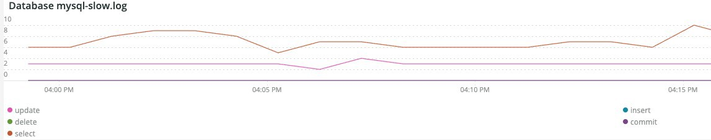

# Scheda [!UICONTROL PHP]

La scheda **PHP** mostra i problemi del processo PHP per fornire un&#39;analisi più approfondita dei problemi PHP.

## [!UICONTROL PHP active process details]

Il frame **[!UICONTROL PHP active process details]** mostra i processi PHP, incluso php-fpm, nell&#39;intervallo temporale selezionato.

## [!UICONTROL PHP process load (# of PHP processes and % of CPU load)]

Il frame **[!UICONTROL PHP process load (# of PHP processes and % of CPU load)]** mostra il carico della CPU dai processi PHP-FPM nell&#39;arco temporale selezionato.

## [!UICONTROL PHP Memory detail]

Il frame **[!UICONTROL PHP Memory detail]** mostra l&#39;utilizzo di memoria dei processi PHP nel periodo di tempo selezionato.

## [!UICONTROL PHP CPU Utilization]

Il frame **[!UICONTROL PHP CPU Utilization]** mostra la percentuale di utilizzo della CPU dei processi PHP nell&#39;arco temporale selezionato.

## [!UICONTROL PHP Process states]

Il frame **[!UICONTROL PHP Process states]** mostra gli stati del processo PHP nell&#39;arco temporale selezionato. Viene visualizzato quando i processi PHP terminano e si riavviano. Attenzione ai processi PHP terminati che non mostrano riavvii.

* &#39;%NOTICE: terminazione in corso...%&#39;) come &#39;php_term&#39;
* &#39;% AVVISO: uscita, arrivederci!%&#39;) come &#39;php_exit&#39;
* &#39;% AVVISO: fpm è in esecuzione, pid%&#39;) come &#39;fpm_start&#39;
* &#39;%NOTICE: pronto per gestire le connessioni%&#39;) come &#39;php_ready&#39;

## [!UICONTROL PHP Errors]

Il frame **[!UICONTROL PHP Errors]** mostra il numero di errori del processo di lavoro PHP nell&#39;intervallo di tempo selezionato. I messaggi di errore analizzati e visualizzati includono:

* &#39;%worker_connections non sono sufficienti%&#39;) come &#39;worker&#39;
* &#39;%PHP Errore irreversibile: dimensioni di memoria consentite.%&#39;) come &#39;mem_size&#39;
* &#39;%exited sul segnale 11 (SIGSEGV)%&#39;) come &#39;sig_11&#39;
* &#39;%exited sul segnale 7 (SIGBUS)%&#39;) come &#39;sig_7&#39;
* &#39;%increased pm.start_servers%&#39;) come &#39;pmstart_serv&#39;
* &#39;%max_children%&#39;) come &#39;max_children_cnt&#39;
* &#39;%PHP Errore irreversibile: dimensione di memoria consentita pari a%&#39;) come &#39;mem_exit_count&#39;
* &#39;%Impossibile allocare memoria per il pool%&#39;) come &#39;opc_mem_count&#39;
* &#39;%Warning Interned string buffer overflow%&#39;) come &#39;opc_str_buf&#39;
* &#39;%offsetl%&#39;) come &#39;opc_sv_comments&#39;
* &#39;%PHP Errore irreversibile: RedisException non rilevata: errore di lettura sulla connessione%&#39;) come &#39;php_exc&#39;

## [!UICONTROL PHP processes count]

Il frame **[!UICONTROL PHP processes count]** mostra un conteggio di processi PHP nell&#39;intervallo temporale selezionato.

## [!UICONTROL Database Errors]

Il frame **[!UICONTROL Database Errors]** mostra gli errori del database nell&#39;intervallo di tempo selezionato. Gli errori analizzati includono:

* &#39;%La dimensione della memoria allocata per la tabella temporanea è superiore al 20% di innodb_buffer_pool_size%&#39;) come &#39;temp_tbl_buff_pool&#39;
* &#39;%\[ERROR\] WSREP: rbr write fail%&#39;) come &#39;rbr_write_fail&#39;
* &#39;%mysqld: disco pieno%&#39;) come &#39;disk_full&#39;
* &#39;%Error number 28%&#39;) come &#39;err_28&#39;
* &#39;%rollback%&#39;) come &#39;rollback&#39;
* &#39;%Foreign key_constraint&#39; non riesce per la tabella%&#39;) come &#39;foreign_key_constraint&#39;
* &#39;%Error_code: 1114%&#39;) come &#39;sql_1114_full&#39;
* &#39;%CRITICAL: SQLSTATE[HY000] [2006] Il server MySQL è andato via%&#39;) come &#39;sql_gone&#39;
* &#39;%SQLSTATE[HY000] [1040] Troppe connessioni%&#39;) come &#39;sql_1040&#39;
* &#39;%CRITICAL: SQLSTATE[HY000] [2002]%&#39;) come &#39;sql_2002&#39;
* &#39;%SQLSTATE[08S01]:%&#39;) come &#39;sql_1047&#39;
* &#39;%[Avviso] Connessione interrotta%&#39;) come &#39;aborted_conn&#39;
* &#39;%SQLSTATE[23000]: violazione del vincolo di integrità:%&#39;) come &#39;sql_23000&#39;
* &#39;%1205 Lock wait timeout%&#39;) come &#39;sql_1205&#39;
* &#39;%SQLSTATE[HY000] [1049] Database sconosciuto%&#39;) come &#39;sql_1049&#39;
* &#39;%SQLSTATE[42S02]: tabella o vista di base non trovata:%&#39;) come &#39;sql_42S02&#39;
* &#39;%Errore generale: 1114%&#39;) come &#39;sql_1114&#39;
* &#39;%SQLSTATE[40001]%&#39;) come &#39;sql_1213&#39;
* &#39;%SQLSTATE[42S22]: colonna non trovata: 1054 Colonna sconosciuta%&#39;) come &#39;sq1_1054&#39;
* &#39;%SQLSTATE[42000]: errore di sintassi o violazione di accesso:%&#39;) come &#39;sql_42000&#39;
* &#39;%SQLSTATE[21000]: violazione di cardinalità:%&#39;) come &#39;sql_1241&#39;
* &#39;%SQLSTATE[22003]:%&#39;) come &#39;sql_22003&#39;
* &#39;%SQLSTATE[HY000] [9000] Client con indirizzo IP%&#39;) come &#39;sql_9000&#39;
* &#39;%SQLSTATE[HY000]: errore generale: 2014%&#39;) come &#39;sql_2014&#39;
* &#39;%1927 Connessione terminata%&#39;) come &#39;sql_1927&#39;
* &#39;%1062 \[ERROR\] InnoDB:%&#39;) come &#39;sql_1062_e&#39;
* &#39;%[Nota] WSREP: scaricamento mappa memoria su disco...%&#39;) come &#39;mem_map_flush&#39;
* &#39;%Internal MariaDB error code: 1146%&#39;) as &#39;sql_1146&#39;
* &#39;%Internal MariaDB codice errore: 1062%&#39;) come &#39;sql_1062&#39; * &#39;%1062 [Avviso] InnoDB:%&#39;) come &#39;sql_1062_w&#39;
* &#39;%Internal MariaDB error code: 1064%&#39;) as &#39;sql_1064&#39;
* &#39;%InnoDB: errore di asserzione nel file%&#39;) come &#39;assertion_err&#39;
* &#39;%mysqld_safe Numero di processi attualmente in esecuzione: 0%&#39;) come &#39;mysql_oom&#39;
* &#39;%\[ERROR\] mysqld ha ottenuto il segnale%&#39;) come &#39;mysql_sigterm&#39;
* &#39;%1452 Impossibile aggiungere%&#39;) come &#39;sql_1452&#39;
* &#39;%ERROR 1698%&#39;) come &#39;sql_1698&#39;
* &#39;%SQLSTATE[HY000]: errore generale: 3%&#39;) come &#39;cnt_wrt_tmp&#39;
* &#39;%General error: 1 %&#39;) come &#39;sql_syntax&#39;
* &#39;%42S22%&#39;) come &#39;sql_42S22&#39;
* &#39;%InnoDB: errore (chiave duplicata)%&#39;) come &#39;innodb_dup_key&#39;

## [!UICONTROL Database traces]

Il frame **[!UICONTROL Database traces]** mostra le informazioni di traccia del database. Questa cornice è allineata alla vista di riepilogo delle transazioni APM per la sequenza temporale selezionata.

## [!UICONTROL Database mysql-slow.log]

Il frame **[!UICONTROL Database mysql-slow.log]** mostra i tipi di istruzioni di query presenti nel file `mysql-slow.log` per l&#39;intervallo di tempo selezionato.
