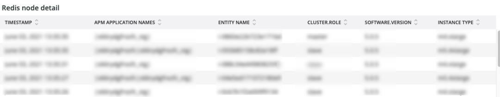
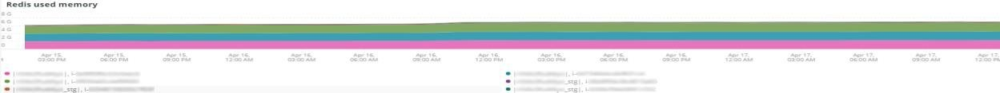

# Scheda [!DNL Redis]

## [!UICONTROL Redis Node summary]

**[!UICONTROL Redis Node summary]** include tutti i nodi di un ambiente. L’esempio precedente include i nodi per la gestione temporanea condivisa. Ci sono un primario e due secondari sulla produzione e anche un primario e due secondari sulla staging.

## [!UICONTROL Redis node detail]

Il frame **[!UICONTROL Redis node detail]** indica l&#39;ambiente, il ruolo [!DNL Redis], la versione del software e la dimensione del nodo.

## [!UICONTROL Redis node roles timeline]

Il frame **[!UICONTROL Redis node roles timeline]** indica la perdita del servizio [!DNL Redis] in ruoli specifici. Se una linea si abbassa, indica che il ruolo particolare rappresentato dalla linea ha perso uno o più nodi.

## [!UICONTROL Connection to Redis]

Nel frame **[!UICONTROL Connection to Redis]** viene visualizzato il valore net.connectedClients dai dati di esempio [!DNL New Relic Redis]. Visualizza il conteggio delle connessioni per applicazione (ambiente) e nodo [!DNL New Relic].

## [!UICONTROL Commands per second by node]

Il frame **[!UICONTROL Commands per second by node]** mostra i comandi [!DNL Redis] per nodo al secondo nell&#39;intervallo di tempo selezionato.

## [!UICONTROL Redis % of memory used]

Il frame **[!UICONTROL Redis % of memory used]** mostra la percentuale di memoria massima utilizzata dai server [!DNL Redis].

## [!UICONTROL Redis used memory]

Il frame **[!UICONTROL Redis used memory]** mostra l&#39;utilizzo della memoria del nodo in GB/MB.

## [!UICONTROL Redis changes since last db save]

[!DNL Redis] è residente in memoria e salva le informazioni nell&#39;archivio. Il frame **[!UICONTROL Redis changes since last db save]** indica il numero di modifiche alla memoria che si sono verificate dall&#39;ultimo salvataggio del database nell&#39;archivio. Per ulteriori informazioni sulla persistenza di [!DNL Redis's], consulta [Redis](https://redis.io/docs/latest/operate/oss_and_stack/management/persistence/).

## [!UICONTROL Redis synchronization from Log]

Il frame **[!UICONTROL Redis synchronization from Log]** si concentra sugli errori rilevati durante la sincronizzazione di [!DNL Redis] o su quelli che si verificano a causa di problemi di sincronizzazione. Per ulteriori informazioni su [!DNL Redis], consulta [[!DNL Redis] Documentazione](https://redis.io/docs/).
