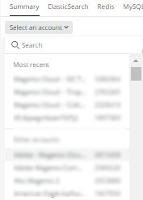

# Selezione dell’account e della tempistica:

Quando fai clic sul pulsante [!UICONTROL Observation for Adobe Commerce] l&#39;icona [!DNL Observation for Adobe Commerce] il nerdlet si aprirà.

1. Fai clic sul pulsante **Selezionare un account** a discesa. Se non visualizzi il **Selezionare un account** elenco a discesa, potresti non avere accesso. Richiedi [qui](https://adobe.sharepoint.com/sites/MG/it/IT%20Services%20Wiki/Requesting%20access%20to%20Magento%20Commerce%20New%20Relic.aspx):

   

1. È possibile incollare project_id, digitare nel [!DNL New Relic] numero di account o nome di account oppure consultare l&#39;elenco degli account.

   

1. Fai clic sul pulsante **blu chiaro** (verso l&#39;alto a destra della finestra del nerdlet) menu a discesa con l&#39;icona dell&#39;orologio.

   

1. Imposta l’ora precedente alla data del ticket per vedere se ci sono stati eventi/dati precedenti. Puoi utilizzare i tempi predefiniti a sinistra o impostare un intervallo temporale personalizzato selezionando **Imposta personalizzato**.
