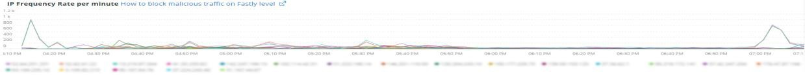
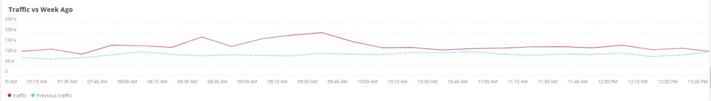

# Scheda [!UICONTROL Summary]

La scheda [!UICONTROL Summary] di [!DNL Observation for Adobe Commerce] ha lo scopo di visualizzare rapidamente alcuni dei problemi riscontrati da Sites per aiutarti a risolvere automaticamente o identificare potenziali cause principali dei problemi del sito. Le schede aggiuntive forniscono informazioni più approfondite sui servizi dei componenti, sul database, sull&#39;infrastruttura e sugli stati dei processi.

## [!UICONTROL Transaction Overview]

### [Che cos&#39;è una transazione?](https://docs.newrelic.com/docs/apm/transactions/intro-transactions/transactions-new-relic-apm/#:%7E:text=transactions%20are%20reported.-,Che%20è%20a%20transaction%3F,lavoro%20in%20a%20software%20application.&text=For%20APM%2C%20it%20will%20frequent,quando%20la%20response%20is%20sent)

&quot;In [!DNL New Relic], una transazione è definita come un&#39;unità logica di lavoro in un&#39;applicazione software. In particolare, si riferisce alle chiamate di funzione e di metodo che compongono tale unità di lavoro. Si riferisce spesso a una transazione web, che rappresenta un’attività che si verifica tra il momento in cui l’applicazione riceve una richiesta web e il momento in cui viene inviata la risposta.&quot;

### Tipi di transazioni:

**Web:** transazioni Web avviate con una richiesta HTTP. Per la maggior parte delle organizzazioni, queste rappresentano interazioni incentrate sul cliente e rappresentano quindi le transazioni più importanti da monitorare.

**Non Web:** le transazioni non Web non sono avviate con una richiesta Web. Possono includere processi di lavoro non web, processi in background, script, attività della coda di messaggi e altre attività.

Osservando il frame **[!UICONTROL Transaction Overview]** di cui sopra, sono state registrate quasi 53.000 transazioni con un punteggio APDEX medio di 0,76 e il 95% di tali transazioni è stato eseguito in meno di 2.313 secondi. Si tratterebbe di un fotogramma in cui un arco temporale più ristretto potrebbe mostrare una deviazione dalla media corrente se si verifica un hit APDEX in un breve arco temporale.

## [!UICONTROL 404 page errors frame]

Nel frame **[!UICONTROL 404 page errors]** sono elencati [URI](https://en.wikipedia.org/wiki/Uniform_Resource_Identifier) e il numero di errori di pagina 404 per un intervallo di tempo selezionato.

## [!UICONTROL % of Storage Free frame]

Nel frame **[!UICONTROL % of Storage Free]** viene visualizzata la percentuale media di spazio libero sugli mount dell&#39;archiviazione in tutti i nodi del cluster. Ad esempio, se disponi di un cluster a tre nodi, il frame mostra \&lt;punto di montaggio\>, \&lt;nome ambiente\>. Questo fotogramma può essere ingannevole se c&#39;è una varianza tra tre nodi. Un esempio di varianza potrebbe essere se il punto di montaggio libero `/data/mysql` fosse un valore diverso nel cluster a tre nodi. Nella scheda [!UICONTROL MySQL] è presente un frame che esegue il facet dei punti di montaggio in base al nome del nodo per visualizzare con maggiore precisione lo spazio di archiviazione `/data/mysql` disponibile su ciascun nodo.

## [!UICONTROL % of system memory that is free frame]

Il **% della memoria di sistema disponibile** frame visualizza, per nodo, la quantità di memoria di sistema disponibile su ciascun nodo.

## [!UICONTROL Swap memory free in bytes]

Nel frame **[!UICONTROL Swap memory free in bytes]** viene visualizzata, per nodo, la quantità di memoria SWAP disponibile sul nodo.

## [!UICONTROL CPU % by host]

L&#39;aggregato di tutti gli ambienti e i nodi viene visualizzato nel frame **[!UICONTROL CPU % by host]**. Devi deselezionare gli ambienti non di produzione. Inoltre, tieni presente tutte le istanze in cui non sono presenti tutti i nodi per l’ambiente di produzione. Per ulteriori suggerimenti sull&#39;utilizzo intensivo di CPU, fare riferimento a [Risoluzione dei problemi relativi alle prestazioni con New Relic su Adobe Commerce](https://experienceleague.adobe.com/docs/commerce-knowledge-base/kb/troubleshooting/miscellaneous/troubleshoot-performance-using-new-relic-on-magento-commerce.html?lang=it).

## [!UICONTROL Alerts during timeframe]

**[!UICONTROL Alerts during timeframe]** visualizza tutti gli avvisi, incluso [!UICONTROL Managed Alerts] aggiunti dal supporto Adobe Commerce.

## [!UICONTROL CPU Usage]

Se il frame **[!UICONTROL CPU Usage]** è vuoto, significa che l&#39;applicazione di infrastruttura di [!DNL New Relic] non è abilitata. Se il tuo sito è su Starter, queste informazioni non vengono visualizzate. Se il tuo sito è su Pro, apri un [ticket di supporto](https://experienceleague.adobe.com/docs/commerce-knowledge-base/kb/help-center-guide/magento-help-center-user-guide.html?lang=it) per abilitare [!DNL New Relic Infrastructure] per il tuo sito.

## [!UICONTROL Average Response Time]

Il grafico **[!UICONTROL Average Response Time]** mostra il tempo medio di risposta per le transazioni (web e altre).

## [!UICONTROL Long duration cron_schedule updates]

La tabella **[!UICONTROL cron_schedule]** viene scritta all&#39;inizio e alla fine dei processi cron. Processi cron di lunga durata potrebbero indicare una latenza nell’aggiornamento di questa tabella, che può indicare uno stack di cron o un problema nella pianificazione degli elementi cronici.

## [!UICONTROL Response Code]

Il frame **[!UICONTROL Response Code]** è una buona indicazione del traffico web e del codice di risposta delle richieste. Si tratta di [!DNL New Relic's] dati di transazione ed è sfaccettato da `httpResponseCode` restituito.

## [!UICONTROL Web Traffic volume compared with one week ago Magento Managed Alerts Information]

Questo frame visualizza il volume di traffico web comparativo dell’ultima settimana e della settimana corrente.

## [!UICONTROL Deployment Log Entries]

Nel frame **[!UICONTROL Deployment Log Entries]** viene visualizzato un conteggio delle voci di log di distribuzione e cloud e i conteggi vengono raggruppati in base al nome del log di distribuzione.

## [!UICONTROL Deployment State]

Il frame **[!UICONTROL Deployment State]** presenta determinate fasi di distribuzione dai registri di distribuzione. Di seguito sono riportati alcuni esempi di fasi conteggiate nel registro e nel nome del facet:

**Fasi del registro di distribuzione:**

* &#39;%Starting generate command%&#39;) come &#39;start_gen&#39;
* &#39;%git apply /app/vendor/magento/ece-tools/patches%&#39;) come &#39;apply_patches&#39;
* &#39;%Set flag: .static_content_deploy%&#39;) come &#39;SCD&#39;
* &#39;%NOTICE: generazione comando completata%&#39;) come &#39;gen_compl&#39;
* &#39;%NOTICE: distribuzione completata%&#39;) come &#39;deploy_compl&#39;
* &#39;%NOTICE: avvio post-distribuzione.%&#39;) come &#39;start_pdeploy&#39;
* &#39;%NOTICE: la post-distribuzione è completa%&#39;) come &#39;pdeploy&#39;
* &#39;%deploy-complete%&#39;) come &#39;cl_deploy_compl&#39;

## [!UICONTROL IP Frequency]

Il frame **[!UICONTROL IP Frequency]** conta gli stati (&quot;MISS&quot; e &quot;PASS&quot;) per ogni IP dai registri [!DNL Fastly]. Le richieste web con questi stati raggiungono il server di origine e aggiungono un carico al server. Mostra i primi venti indirizzi in frequenza. Questo frame può essere utilizzato per rilevare attacchi IP o sorgenti di carico pesante su un sito web.

## [!UICONTROL IP Response – top 20 URLs in duration]

Nel frame **[!UICONTROL IP Response – top 20 URLs in duration]** vengono visualizzati gli URL con la risposta di durata maggiore. Può indicare file immagine di grandi dimensioni o pagine, API o pagine con la durata di risposta più lunga.

## [!UICONTROL API Calls by IP]

Il frame **[!UICONTROL API Calls by IP]** consente di identificare il traffico pesante rispetto alle API e agli indirizzi IP che effettuano richieste dagli URL API.

## [!UICONTROL API Calls by IP, details by URL]

Il frame **[!UICONTROL API Calls by IP, details by URL]** fornisce i dettagli del traffico pesante contro le API e i dettagli degli URL che effettuano le richieste.

## [!UICONTROL IP Frequency Rate per minute]

A volte è difficile dire quale indirizzo IP ha il maggior numero di richieste sugli altri fotogrammi. Il frame **[!UICONTROL IP Frequency Rate per minute]** mostra la velocità al minuto per indirizzo IP.

## [!UICONTROL Potential Bots]

Il frame **[!UICONTROL Potential Bots]** esamina le richieste con un nome request_user_agent come NULL o &#39;%bot%&#39;. In genere, request_user_agent &#39;%bot%&#39; segue la configurazione dei criteri nel file `robots.txt`.

## [!UICONTROL Transaction Errors]

Nel frame **[!UICONTROL Transaction Errors]** viene visualizzato il numero di errori di transazione da [!DNL New Relic].

## [!UICONTROL Nginx access by node]

Accesso 

Il frame **[!UICONTROL Nginx access by node]** esamina i conteggi da `access.log` per nodo. È utile verificare se il carico è distribuito in modo uniforme. Spesso viene visualizzato quando un nodo si abbassa. La cornice mostra anche il carico in tutto il sito.

## [!UICONTROL Galera Log]

[[!DNL Galera]](https://galeracluster.com/library/galera-documentation.pdf) è utilizzato per il cluster di database. Questo frame è incentrato su segnali particolari provenienti dal cluster [!UICONTROL Galera]. I segnali si concentrano sui nodi che entrano ed escono dal cluster, il che è un comportamento normale per mantenere l&#39;integrità dei dati del database. I nodi vengono mantenuti sincronizzati quando lo stato del cluster [!UICONTROL Galera] cambia.

**Elenco di [!UICONTROL Galera] modifiche stato:**

* &#39;%1047 WSREP non ha ancora preparato il nodo per l&#39;utilizzo dell&#39;applicazione (percentuale)&#39; come &#39;node_not_prep_for_use&#39;
* &#39;%\[ERROR\] WSREP: impossibile leggere da: wsrep_sst_xtrabackup-v2%&#39;) come &#39;xtrabackup_read_fail&#39;
* &#39;%\[ERROR\] WSREP: processo completato con errore: wsrep_sst_xtrabackup-v2 %&#39;) come &#39;xtrabackup_compl_w_err&#39;
* &#39;%\[ERROR\] WSREP: rbr write fail%&#39;) come &#39;rbr_write_fail&#39;
* &#39;%self-leave%&#39;) come &#39;susp_node&#39;
* &#39;%members = 3/3 (join/total)%&#39;) come &#39;3of3&#39;
* &#39;%members = 2/3 (join/total)%&#39;) as &#39;2of3&#39;
* &#39;%members = 2/2%&#39;) come &#39;2of2&#39; * &#39;%members = 1/2%&#39;) come &#39;1of2&#39; * &#39;%members = 1/3%&#39;) come &#39;1of3&#39;
* &#39;%members = 1/1%&#39;) come &#39;1of1&#39;
* &#39;%\[Nota\] /usr/sbin/mysqld (mysqld 10.%&#39;) come &#39;sql_restart&#39;
* &#39;%Quorum: nessun nodo con stato completo:%&#39;) come &#39;no_node_count&#39;
* &#39;%WSREP: membro 0%&#39;) come &#39;mem_0&#39;
* &#39;%WSREP: membro 1.0%&#39;) come &#39;mem_1&#39;
* &#39;%WSREP: membro 2%&#39;) come &#39;mem2&#39;
* &#39;%WSREP: sincronizzato con il gruppo, pronto per le connessioni%&#39;) come &#39;ready&#39;
* &#39;%/usr/sbin/mysqld, Version:%&#39;) come &#39;mysql_restart_mysql.slow&#39;
* &#39;%\[Nota\] WSREP: nuova visualizzazione cluster: stato globale:%&#39;) come &#39;galera_cluster_view_chng&#39;

Questi segnali possono indicare problemi di archiviazione, memoria o query se lo stato cambia frequentemente.

## [!UICONTROL Database errors]

**Elenco di errori o messaggi del database rilevati:**

* &#39;%La dimensione della memoria allocata per la tabella temporanea è superiore al 20% di innodb_buffer_pool_size%&#39;) come &#39;temp_tbl_buff_pool&#39;
* &#39;%\[ERROR\] WSREP: rbr write fail%&#39;) come &#39;rbr_write_fail&#39;
* &#39;%mysqld: disco pieno%&#39;) come &#39;disk_full&#39;
* &#39;%Error number 28%&#39;) come &#39;err_28&#39;
* &#39;%rollback%&#39;) come &#39;rollback&#39;
* &#39;%Foreign key_constraint&#39; non riesce per la tabella%&#39;) come &#39;foreign_key_constraint&#39;
* &#39;%Error_code: 1114%&#39;) come &#39;sql_1114_full&#39;
* &#39;%CRITICAL: SQLSTATE\[HY000\] \[2006\] Il server MySQL è scomparso (%) come &#39;sql_gone&#39;
* &#39;%SQLSTATE\[HY000\] \[1040\] Troppe connessioni%&#39;) come &#39;sql_1040&#39;
* &#39;%CRITICAL: SQLSTATE\[HY000\] \[2002\]%&#39;) come &#39;sql_2002&#39;
* &#39;%SQLSTATE\[08S01\]:%&#39;) come &#39;sql_1047&#39;
* &#39;%\[Avviso\] Connessione interrotta%&#39;) come &#39;aborted_conn&#39;
* &#39;%SQLSTATE\[23000\]: violazione vincolo di integrità:%&#39;) come &#39;sql_23000&#39;
* &#39;%1205 Lock wait timeout%&#39;) come &#39;sql_1205&#39;
* &#39;%SQLSTATE\[HY000\] \[1049\] Database sconosciuto%&#39;) come &#39;sql_1049&#39;
* &#39;%SQLSTATE\[42S02\]: tabella o vista di base non trovata:%&#39;) come &#39;sql_42S02&#39;
* &#39;%Errore generale: 1114%&#39;) come &#39;sql_1114&#39;
* &#39;%SQLSTATE\[40001\]%&#39;) come &#39;sql_1213&#39;
* &#39;%SQLSTATE\[42S22\]: colonna non trovata: 1054 Colonna sconosciuta (%)) come &#39;sq1_1054&#39;
* &#39;%SQLSTATE\[42000\]: errore di sintassi o violazione di accesso:%&#39;) come &#39;sql_42000&#39;
* &#39;%SQLSTATE\[21000\]: violazione cardinalità:%&#39;) come &#39;sql_1241&#39;
* &#39;%SQLSTATE\[22003\]:%&#39;) come &#39;sql_22003&#39;
* &#39;%SQLSTATE\[HY000\] \[9000\] Client con indirizzo IP%&#39;) come &#39;sql_9000&#39;
* &#39;%SQLSTATE\[HY000\]: errore generale: 2014%&#39;) come &#39;sql_2014&#39;
* &#39;%1927 Connessione terminata%&#39;) come &#39;sql_1927&#39;
* &#39;%1062 \[\ERROR\] InnoDB:%&#39;) come &#39;sql_1062_e&#39;
* &#39;%\[Note\] WSREP: Scaricamento mappa memoria su disco...%&#39;) come &#39;mem_map_flush&#39;
* &#39;%Internal MariaDB error code: 1146%&#39;) as &#39;sql_1146&#39;
* &#39;%Internal MariaDB error code: 1062%&#39;) as &#39;sql_1062&#39; * &#39;%1062 \[Warning\] InnoDB:%&#39;) as &#39;sql_1062_w&#39;
* &#39;%Internal MariaDB error code: 1064%&#39;) as &#39;sql_1064&#39;
* &#39;%InnoDB: errore di asserzione nel file%&#39;) come &#39;assertion_err&#39;
* &#39;%mysqld_safe Numero di processi attualmente in esecuzione: 0%&#39;) come &#39;mysql_oom&#39;
* &#39;%\[ERROR\] mysqld ha ottenuto il segnale%&#39;) come &#39;mysql_sigterm&#39;
* &#39;%1452 Impossibile aggiungere%&#39;) come &#39;sql_1452&#39;
* &#39;%ERROR 1698%&#39;) come &#39;sql_1698&#39;
* &#39;%SQLSTATE\[HY000\]: errore generale: 3%&#39;) come &#39;cnt_wrt_tmp&#39;
* &#39;%General error: 1 %&#39;) come &#39;sql_syntax&#39;
* &#39;%42S22%&#39;) come &#39;sql_42S22&#39;
* &#39;%InnoDB: errore (chiave duplicata)%&#39;) come &#39;innodb_dup_key&#39;

## [!UICONTROL Database traces]

Il frame **[!UICONTROL Database traces]** esamina i dati dell&#39;entità [sql trace](https://docs.newrelic.com/docs/apm/transactions/transaction-traces/transaction-traces-database-queries-page/) di [!DNL New Relic] e restituisce il percorso della traccia.

## [!UICONTROL Database mysql-slow.log]

Il frame **[!UICONTROL Database mysql-slow.log]** esegue un conteggio delle voci nel [mysql-slow.log](https://dev.mysql.com/doc/refman/5.7/en/slow-query-log.html) in base al tipo di richiesta di query. Isola visivamente gli intervalli di tempo che potrebbero essere di interesse in mysql-slow.log (log di query lento). Le query di tabelle senza indici o le query che aggiornano tabelle di grandi dimensioni possono bloccare altre query.

## [!UICONTROL Redis synchronization from Log]

[[!DNL Redis]](https://redis.io/docs/about/) è un archivio struttura dati in memoria open source (con licenza BSD) utilizzato come database, cache e broker di messaggi. Se configurato, può eseguire il caching di database e sessioni. Il frame **[!UICONTROL Redis synchronization from Log]** si concentra sulla [[!DNL Redis] sincronizzazione](https://redis.io/docs/latest/operate/oss_and_stack/management/replication/). Più grande è il set di dati [!DNL Redis], più probabile che si verifichino problemi con la sincronizzazione (più dati da mantenere sincronizzati).

**[!DNL Redis]errori e messaggi:**

* &#39;%SLAVE synchronization: spazio non disponibile nel dispositivo%&#39;) come &#39;spazio&#39;
* &#39;%Server avviato, Redis versione%&#39;) come &#39;serv_start&#39;
* &#39;%Il server è ora pronto per accettare le connessioni%&#39;) come &#39;ready&#39;
* &#39;%Connessione con master persa.%&#39;) come &#39;mstr_lost&#39;
* &#39;%+sdown sentinel%&#39;) come &#39;+sentinal&#39;
* &#39;%-sdown sentinel%&#39;) come &#39;-sentinal&#39;
* &#39;%-sdown slave%&#39;) come &#39;-slave&#39;, &#39;%+sdown slave%&#39;) come &#39;+slave&#39;
* &#39;%-failover-abort-not-selected master mymaster%&#39;) come &#39;-failover&#39;
* &#39;%+failover-abort-not-selected master mymaster%&#39;) come &#39;+failover&#39;
* &#39;%Parziale risincronizzazione non possibile (nessun master nella cache)%&#39;) come &#39;part_sync_err&#39;
* &#39;%MASTER ha interrotto la replica con un errore: ERR Can%&#39;) come &#39;mstr_sync_err&#39;
* &#39;%Master non supporta PSYNC o è in stato di errore%&#39;) come &#39;mstr_psync_err&#39;
* &#39;%SLAVE sync: completata con successo%&#39;) come &#39; slv_sync_suc&#39;
* &#39;%MASTER ha interrotto la replica con un errore: ERR Can%&#39;) come &#39;mstr_sync_err,count&#39;
* &#39;%OOM comando non consentito quando viene utilizzata memoria%&#39;) come &#39; max_mem_err&#39;
* &#39;%CredisException(codice: 0): errore di lettura sulla connessione%&#39;) come &#39;credis_read_error&#39;
* &#39;%RedisException:%&#39;) come &#39;redis_excp_err&#39;
* &#39;%psync pianificato come chiuso al più presto per il superamento del buffer di output%&#39;) come &#39;output_buf_err&#39;

## [!UICONTROL PHP process states]

Il comportamento dei processi PHP dipende dalla [configurazione](https://www.php.net/manual/en/install.fpm.configuration.php). La configurazione è complessa, con molte variabili e opzioni. Il frame **[!UICONTROL PHP process states]** ti aiuta a capire quando i processi PHP vengono terminati e riavviati.

### [!UICONTROL PHP errors]

Il frame **[!UICONTROL PHP errors]** mostra il numero di errori PHP con i lavoratori nell&#39;arco temporale selezionato. Per ulteriori informazioni, consultare [Impostazioni PHP di Adobe Commerce](../../installation/prerequisites/php-settings.md).

**Errori e messaggi PHP:**

* &#39;%worker_connections non sono sufficienti%&#39;) come &#39;worker&#39;
* &#39;%PHP Errore irreversibile: dimensioni di memoria consentite.%&#39;) come &#39;mem_size&#39;
* &#39;%exited sul segnale 11 (SIGSEGV)%&#39;) come &#39;sig_11&#39;
* &#39;%exited sul segnale 7 (SIGBUS)%&#39;) come &#39;sig_7&#39;
* &#39;%increased pm.start_servers%&#39;) come &#39;pmstart_serv&#39;
* &#39;%max_children%&#39;) come &#39;max_children_cnt&#39;
* &#39;%PHP Errore irreversibile: dimensione di memoria consentita pari a%&#39;) come &#39;mem_exit_count&#39;
* &#39;%Impossibile allocare memoria per il pool%&#39;) come &#39;opc_mem_count&#39;
* &#39;%Warning Interned string buffer overflow%&#39;) come &#39;opc_str_buf&#39;
* &#39;%offsetl%&#39;) come &#39;opc_sv_comments&#39;
* &#39;%PHP Errore irreversibile: RedisException non rilevata: errore di lettura sulla connessione%&#39;) come &#39;php_exc&#39;

## [!UICONTROL PHP processes]

[PHP-FPM](https://php-fpm.org/) è un [!UICONTROL FastCGI Process Manager] utilizzato da [!DNL Nginx]. Per informazioni sui requisiti di sistema, consulta [Requisiti di versione PHP mappati alle versioni di Adobe Commerce](../../installation/system-requirements.md). Il frame **[!UICONTROL PHP processes]** mostra il numero di processi PHP in esecuzione in un determinato momento nella timeline selezionata.

## [!UICONTROL Secondary processes]

I processi secondari possono influire sulla risposta del sito. Il frame **[!UICONTROL Secondary processes]** indica uno o più processi che potrebbero aggiungere un carico al sito. Il database dispone principalmente dei processi secondari in esecuzione.

## [!UICONTROL Traffic vs Week Ago]

Il frame **[!UICONTROL Traffic vs Week Ago]** esamina il traffico del sito Web (le richieste) dai registri [!DNL Fastly] con stati di cache (&#39;MISS&#39;, &#39;PASS&#39;). Queste richieste aggiungono un carico ai server di origine. Questo fotogramma mostra il volume di richieste web comparative della settimana corrente e dell’ultima settimana fa nello stesso arco temporale.

## [!UICONTROL Fastly Cache]

Il frame **[!UICONTROL Fastly Cache]** mostra una visualizzazione aggregata dello stato della cache delle richieste provenienti dai registri [!DNL Fastly]. Se selezioni ERRORE, verrà visualizzata la percentuale di errori nelle richieste. In genere questo aumenta quando il server di origine non risponde abbastanza rapidamente alle richieste di pagine.

## [!UICONTROL Page Rendering]

Il frame **[!UICONTROL Page Rendering]** visualizza la durata media del rendering della pagina della settimana corrente dall&#39;origine di visualizzazione della pagina di [!DNL New Relic] rispetto alla settimana precedente nello stesso periodo di tempo.

## [!UICONTROL Page loading detail]

Il frame **[!UICONTROL Page loading detail]** descrive gli eventi di caricamento della pagina. Descrive il significato di questi facet. Di seguito è riportata la query eseguita per questo frame:

`SELECT percentile(timeToResponseStart, 50) AS 'first byte', percentile(firstPaint, 50) as 'First paint', percentile(firstContentfulPaint, 50) as 'First contentful paint', percentile(timeToDomContentLoadedEventEnd, 50) AS 'DOM content loaded', percentile(duration, 50) AS 'Window load + AJAX' FROM BrowserInteraction TIMESERIES`

## [!UICONTROL Transactions – Avg, Max, Min]

Durata della transazione in secondi. A seconda della transazione, se la transazione è di lunga durata potrebbe influire su altre transazioni. Le transazioni elencate in nome e le durate si riferiscono al periodo di tempo specifico. Se si verifica un periodo di tempo breve per il problema, ridimensiona il selettore data/ora [!DNL Observation for Adobe Commerce] in base a tale periodo di tempo limitato.

## [!UICONTROL Admin Activities]

Il frame **[!UICONTROL Admin Activities]** identifica le transazioni con un utente amministratore.

## [!UICONTROL Order transactions (default?)]

Il frame **[!UICONTROL Order transactions (default?)]** cerca le transazioni `request.headers.host` dalle transazioni, dove il nome = `WebTransaction/Action/checkout/onepage/success`. Se l’URL di completamento dell’ordine è diverso, il frame non conterrà dati.

## [!UICONTROL Elasticsearch Index information]

**[Stati Elasticsearch:](https://www.elastic.co/guide/en/elasticsearch/reference/current/cluster-health.html)**

* Verde: vengono assegnati tutti i frammenti.
* Giallo: vengono assegnati tutti i frammenti primari, ma a uno o più frammenti di replica viene revocata l&#39;assegnazione. Se si verifica un errore in un nodo del cluster, alcuni dati potrebbero non essere disponibili fino al ripristino del nodo.
* Rosso: una o più partizioni primarie non sono assegnate, pertanto alcuni dati non sono disponibili. Ciò può verificarsi brevemente durante l&#39;avvio del cluster quando vengono assegnate le partizioni primarie.

## [!UICONTROL Elasticsearch Errors]

**[!DNL Elasticsearch]errori:**

* &#39;%all shards failed%&#39; come &#39;all_shards_failed&#39;
* &#39;%NoNodesAvailableException%&#39; come &#39;no_alive_nodes&#39;
* &#39;%PHP Errore irreversibile: errore non rilevato: parametri errati per Elasticsearch%&#39; come &#39;error_param&#39;
* &#39;%È possibile risolvere il problema aggiornando il servizio Elasticsearch nell&#39;infrastruttura Magento Cloud alla versione%&#39; come &#39;ver_err&#39;
* Lo stato di integrità del cluster &#39;%cluster è cambiato da \[GIALLO\] a \[ROSSO\] (motivo:%&#39; come &#39;giallo_rosso&#39;
* &#39;%Nessuno spazio disponibile nel dispositivo%&#39; come &#39;no_space&#39;
* &#39;% Impossibile eseguire &lbrack;SearchRequest&lbrace;searchType=%&#39; come &#39;failed_query&#39;

## [!UICONTROL Cron view]

Il fotogramma **[!UICONTROL Cron view]** esamina il registro cron per trovare un equilibrio tra il numero di cronometri avviati e il numero di cronometri finiti.

## [!UICONTROL Cron error]

**Errori Cron da cron.log:**

* &#39;%_stg%&#39; come &#39;stg_crons&#39;
* &#39;%Impossibile acquisire il blocco per il processo cron%&#39; come &#39;cron_lock&#39;
* &#39;%Errore generale: il server MySQL 2006 è andato via%&#39; come &#39;mysql_has_gone_away&#39;
* &#39;%error%&#39; come &#39;error&#39;
* &#39;%Errore generale: timeout attesa blocco 1205 superato%&#39; come sql_1205_cron

## [!UICONTROL cron_schedule table updates]

Il frame **[!UICONTROL cron_schedule table updates]** considera la durata massima in secondi, in cui gli aggiornamenti delle operazioni dell&#39;archivio dati coinvolgono la tabella cron_schedule. È sfaccettato sul tipo di richiesta SQL.

## [!UICONTROL Datastore Operations Tables]

In questo frame **[!UICONTROL Datastore Operations Tables]** vengono visualizzate le prime 25 operazioni in base al tempo di durata, al nome della tabella e al tipo di richiesta SQL. Passa il puntatore del mouse sui picchi per visualizzare i dettagli della tabella a cui si stava effettuando l’accesso e in base al tipo di richiesta.

## [!UICONTROL Cache Flush]

**Sono stati rilevati svuotamenti della cache:**

* &#39;%config%&#39; come &#39;config_cache_flushing&#39;
* &#39;%layout%&#39; come &#39;layout_cache_flush&#39;
* &#39;%block_html%&#39; come &#39;block_html_cache_flush&#39;
* &#39;%collections%&#39; come &#39;collections_cache_flush&#39;
* &#39;%reflection%&#39; come &#39;reflection_cache_flush&#39;
* &#39;%db_ddl%&#39; come &#39;db_ddl_cache_flush&#39;
* &#39;%compiled_config%&#39; come &#39;compiled_config_cache_flush&#39;
* &#39;%eav%&#39; come &#39;eav_cache_flush&#39;
* &#39;%customer_notification%&#39; come &#39;cust_notif_cache_flush&#39;
* &#39;%config_integration%&#39; come &#39;config_int_cache_flush&#39;
* &#39;%config_integration_api%&#39; come &#39;config_int_api_cache_flush&#39;
* &#39;%full_page%&#39; come &#39;full_page_cache_flush&#39;
* &#39;%config_webservice%&#39; come &#39;config_webserv_cache_flush&#39;
* &#39;%translate%&#39; come &#39;translate_cache_flush&#39;
