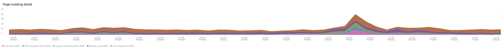

# La [!UICONTROL Summary] scheda

La [!UICONTROL Summary] scheda di [!DNL Observation for Adobe Commerce] ha lo scopo di vedere rapidamente alcuni dei problemi riscontrati dai siti per aiutarti a risolvere automaticamente o identificare le potenziali cause principali dei problemi del sito. Le schede aggiuntive forniscono informazioni più approfondite sugli stati dei processi, dei servizi dei componenti, del database, dell’infrastruttura e dell’infrastruttura.

## [!UICONTROL Transaction Overview]

### [Cos&#39;è una transazione?](https://docs.newrelic.com/docs/apm/transactions/intro-transactions/transactions-new-relic-apm/#:%7E:text=transactions%20are%20reported.-,What%20is%20a%20transaction%3F,work%20in%20a%20software%20application.&amp;text=For%20APM%2C%20it%20will%20spesso, quando%20the%20response%20is%20sent)

&quot;A [!DNL New Relic], una transazione è definita come un&#39;unità logica di lavoro in un&#39;applicazione software. In particolare, si riferisce alle chiamate di funzione e alle chiamate di metodo che compongono l&#39;unità di lavoro. Spesso si riferisce a una transazione web, che rappresenta un&#39;attività che si verifica quando l&#39;applicazione riceve una richiesta web a quando la risposta viene inviata.&quot;

### Tipi di transazioni:

**Web:** Le transazioni vengono avviate con una richiesta HTTP. Per la maggior parte delle organizzazioni, queste rappresentano le interazioni incentrate sul cliente e sono quindi le transazioni più importanti da monitorare.

**Non web:** Le transazioni non web non vengono avviate con una richiesta web. Possono includere processi di lavoro non web, processi in background, script, attività di coda messaggi e altre attività.

Osservare **[!UICONTROL Transaction Overview]** frame, ci sono state quasi 53.000 transazioni con un punteggio medio APDEX di 0,76, e il 95% di queste transazioni si è verificato in meno di 2.313 secondi. Si tratta di un intervallo in cui un intervallo temporale più breve può mostrare una deviazione dalla media corrente se si verifica un hit APDEX in un breve arco temporale.

## [!UICONTROL 404 page errors frame]

La **[!UICONTROL 404 page errors]** elenca [URI](https://en.wikipedia.org/wiki/Uniform_Resource_Identifier) e il conteggio di 404 errori di pagina nel periodo di tempo selezionato.

## [!UICONTROL % of Storage Free frame]

La **[!UICONTROL % of Storage Free]** frame visualizza la percentuale media senza gli attacchi di storage su tutti i nodi del cluster. Ad esempio, se disponi di un cluster a tre nodi, viene visualizzato il valore \&lt;mount point=&quot;&quot;>, \&lt;environment name=&quot;&quot;>. Questo frame può essere ingannevole se c&#39;è una varianza tra tre nodi. Un esempio di varianza sarebbe se `/data/mysql` il punto di montaggio libero era un valore diverso nel cluster a tre nodi. C&#39;è una cornice sotto il [!UICONTROL MySQL] scheda che fa sfaccettare i punti di montaggio per nome del nodo per vedere più accuratamente cosa `/data/mysql` l&#39;archiviazione gratuita su ogni nodo in realtà è.

## [!UICONTROL % of system memory that is free frame]

Questo frame visualizza, per nodo, la quantità di memoria di sistema disponibile su ciascun nodo.

## [!UICONTROL Swap memory free in bytes]

La **[!UICONTROL Swap memory free in bytes]** frame visualizza, per nodo, la quantità di memoria SWAP disponibile sul nodo.

## [!UICONTROL CPU % by host]

L’aggregato di tutti gli ambienti e i nodi viene visualizzato nella sezione **[!UICONTROL CPU % by host]** telaio. Deseleziona gli ambienti non di produzione. È necessario notare tutte le istanze in cui non sono presenti tutti i nodi per l’ambiente di produzione. Questo articolo fornisce suggerimenti sull&#39;elevato utilizzo della CPU: [Risolvere i problemi relativi alle prestazioni con la nuova versione di Adobe Commerce](https://support.magento.com/hc/en-us/articles/360042149832#high_cpu_usage).

## [!UICONTROL Alerts during timeframe]

La **[!UICONTROL Alerts during timeframe]** visualizza tutti gli avvisi, tra cui [!UICONTROL Managed Alerts] aggiunto dal supporto Adobe Commerce.

## [!UICONTROL CPU Usage]

Se la **[!UICONTROL CPU Usage]** è vuoto, è un indicatore che l&#39;applicazione dell&#39;infrastruttura di [!DNL New Relic] non è abilitato. Se il sito è su Starter, queste informazioni non verranno visualizzate. Se il tuo sito è su Pro, apri un ticket di supporto per avere [!DNL New Relic Infrastructure] abilitato per il sito.

## [!UICONTROL Average Response Time]

La **[!UICONTROL Average Response Time]** Il grafico mostra il tempo medio di risposta per le transazioni (web e altri).

## [!UICONTROL Long duration cron_schedule updates]

La **[!UICONTROL cron_schedule]** tavolo è scritto all&#39;inizio e alla fine dei lavori cron. I lavori cron a lunga durata potrebbero indicare la latenza nell’aggiornamento di questa tabella, che può indicare il backup dei cron o un problema con la pianificazione dei crons.

## [!UICONTROL Response Code]

La **[!UICONTROL Response Code]** frame è una buona indicazione del traffico web e del codice di risposta delle richieste. È [!DNL New Relic] i dati della transazione e sono sfaccettati dalla `httpResponseCode` restituito.

## [!UICONTROL Web Traffic volume compared with one week ago Magento Managed Alerts Information]

Questo frame visualizza il volume del traffico web di una settimana fa rispetto al volume corrente.

## [!UICONTROL Deployment Log Entries]

La **[!UICONTROL Deployment Log Entries]** frame visualizza un conteggio delle voci di log di distribuzione e cloud e fa il conteggio in base al nome del log di distribuzione.

## [!UICONTROL Deployment State]

La **[!UICONTROL Deployment State]** i facet frame definiscono particolari frasi di distribuzione dai log di distribuzione. Di seguito sono riportati alcuni esempi di frasi conteggiate nel registro e il nome del facet:

**Frasi del registro di distribuzione:**

* &#39;%Avvio generazione comando%&#39;) come &#39;start_gen&#39;
* &#39;%git applica /app/vendor/magento/ece-tools/patch%&#39;) come &#39;apply_patches&#39;
* &#39;%Imposta flag: .static_content_deploy%&#39;) come &#39;SCD&#39;
* &#39;%AVVISO: Genera il comando completato%) come &#39;gen_compl&#39;
* &#39;%AVVISO: Distribuzione completata%) come &#39;deploy_compl&#39;
* &#39;%AVVISO: Avvio della post-distribuzione.%) come &#39;start_pdeploy&#39;
* &#39;%AVVISO: Il post-distribuzione è completo%) come &quot;pdeploy&quot;
* &#39;%deploy-complete%&#39;) come &#39;cl_deploy_compl&#39;

## [!UICONTROL IP Frequency]

La **[!UICONTROL IP Frequency]** il frame conta gli stati (&quot;MISS&quot; e &quot;PASS&quot;) per ogni IP dal [!DNL Fastly] registri. Le richieste web con questi stati raggiungeranno il server di origine e aggiungeranno il caricamento al server. Mostra i venti indirizzi principali in frequenza. Questo frame può essere utilizzato per rilevare attacchi IP o fonti di carico pesante su un sito web.

## [!UICONTROL IP Response – top 20 URLs in duration]

Questo frame visualizza gli URL con la durata più lunga in risposta. Può indicare file immagine di grandi dimensioni o pagine, API o pagine con la durata di risposta più lunga.

## [!UICONTROL API Calls by IP]

La **[!UICONTROL API Calls by IP]** frame aiuta a identificare il traffico pesante rispetto alle API e agli indirizzi IP che eseguono richieste dagli URL API.

## [!UICONTROL API Calls by IP, details by URL]

La **[!UICONTROL API Calls by IP, details by URL]** frame fornisce dettagli sul traffico pesante rispetto alle API e dettagli degli URL che effettuano le richieste.

## [!UICONTROL IP Frequency Rate per minute]

A volte è difficile dire quale indirizzo IP ha più richieste sugli altri frame. La **[!UICONTROL IP Frequency Rate per minute]** il frame mostra la frequenza al minuto per indirizzo IP.

## [!UICONTROL Potential Bots]

La **[!UICONTROL Potential Bots]** frame esamina le richieste con un nome request_user_agent come NULL o ‘%bot%’. In genere, request_user_agent ‘%bot%’ seguirà la configurazione dei criteri in `robots.txt` file.

## [!UICONTROL Transaction Errors]

La **[!UICONTROL Transaction Errors]** frame visualizza il conteggio degli errori di transazione da [!DNL New Relic].

## [!UICONTROL Nginx access by node]

La **[!UICONTROL Nginx access by node]** il frame guarda i conteggi dal `access.log` per nodo. È utile vedere se il carico è distribuito in modo uniforme. Mostra spesso quando un nodo cade. Questo mostrerà anche il carico in tutto il sito.

## [!UICONTROL Galera Log]

[Galera](https://galeracluster.com/library/galera-documentation.pdf) viene utilizzato per il cluster di database. Questo frame è concentrato su segnali particolari provenienti da [!UICONTROL Galera] cluster. Questi segnali si concentrano sui nodi che entrano ed escono dal cluster, il che è un comportamento normale per mantenere l&#39;integrità dei dati del database. I nodi vengono mantenuti sincronizzati come [!UICONTROL Galera] modifiche allo stato del cluster.

**Elenco [!UICONTROL Galera] modifiche allo stato:**

* &#39;%1047 WSREP non ha ancora preparato il nodo per l&#39;utilizzo dell&#39;applicazione%&#39;) come &#39;node_not_prep_for_use&#39;
* &#39;%\[ERROR\] WSREP: Impossibile leggere da: wsrep_sst_xtrabackup-v2%) come &#39;xtrabackup_read_fail&#39;
* &#39;%\[ERROR\] WSREP: Processo completato con errore: wsrep_sst_xtrabackup-v2 %) come &#39;xtrabackup_compl_w_err&#39;
* &#39;%\[ERROR\] WSREP: rbr write fail%&quot;) come &#39;rbr_write_fail&#39;
* &#39;%self-leave%&#39;) come &#39;sospeso_node&#39;
* &#39;%Members = 3/3 (unito/totale)%&#39;) come &#39;3of3&#39;
* &#39;%Members = 2/3 (unito/totale)%&#39;) come &#39;2of3&#39;
* &#39;%Members = 2/2%&#39;) come &#39;2of2&#39; ・ &#39;%Members = 1/2%&#39;) come &#39;1of2&#39; ・ &#39;%Members = 1/3%&#39;) come &#39;1of3&#39;
* &#39;%Members = 1/1%&#39;) come &#39;1of1&#39;
* &#39;%\[Nota\] /usr/sbin/mysqld (mysqld 10.%) come &#39;sql_riavvio&#39;
* &#39;%Quorum: Nessun nodo con stato completo:%) come &#39;no_node_count&#39;
* &#39;%WSREP: Membro 0%) come &#39;mem_0&#39;
* &#39;%WSREP: Membro 1.0%) come &#39;mem_1&#39;
* &#39;%WSREP: Membro 2%) come &quot;mem2&quot;
* &#39;%WSREP: Sincronizzato con il gruppo, pronto per le connessioni%) come &#39;ready&#39;
* &#39;%/usr/sbin/mysqld, versione:%&#39;) come &#39;mysql_riavvio_mysql.slow&#39;
* ‘%\[Nota\] WSREP: Nuova vista cluster: stato globale:%) come &#39;galera_cluster_view_change&#39;

Questi segnali possono indicare problemi di archiviazione, memoria o query se lo stato cambia frequentemente.

## [!UICONTROL Database errors]

**Elenco degli errori o dei messaggi rilevati nel database:**

* &#39;%La dimensione della memoria allocata per la tabella temporanea è superiore al 20% di innodb_buffer_pool_size%&#39;) come &#39;temp_tbl_buff_pool&#39;
* &#39;%\[ERROR\] WSREP: rbr write fail%&quot;) come &#39;rbr_write_fail&#39;
* &#39;%mysqld: Disco pieno%) come &#39;disk_full&#39;
* &#39;%Error number 28%&#39;) as &#39;err_28&#39;
* &#39;%rollback%&#39;) come &#39;rollback&#39;
* &#39;%Il vincolo di chiave esterna non riesce per la tabella%&#39;) come &#39;vincolo_chiave_esterna&#39;
* &#39;%Codice_errore: 1114%) come &#39;sql_1114_full&#39;
* &#39;%CRITICO: SQLSTATE\[HY000\] \[2006\] MySQL server è andato via%) come &#39;sql_go&#39;
* &#39;%SQLSTATE\[HY000\] \[1040\] Troppe connessioni%&#39;) come &#39;sql_1040&#39;
* &#39;%CRITICO: SQLSTATE\[HY000\] \[2002\]%&#39;) come &#39;sql_2002&#39;
* &#39;%SQLSTATE\[08S01\]:%&#39;) come &#39;sql_1047&#39;
* &#39;%\[Avviso\] Interrotta connessione%&#39;) come &#39;aborted_conn&#39;
* &#39;%SQLSTATE\[23000\]: Violazione del vincolo di integrità:%) come &#39;sql_23000&#39;
* &#39;%1205 Timeout attesa blocco%&#39;) come &#39;sql_1205&#39;
* &#39;%SQLSTATE\[HY000\] \[1049\] Database sconosciuto%&#39;) come &#39;sql_1049&#39;
* &#39;%SQLSTATE\[42S02\]: Tabella o vista di base non trovata:%) come &#39;sql_42S02&#39;
* &#39;%Errore generale: 1114%) come &#39;sql_1114&#39;
* &#39;%SQLSTATE\[40001\]%&#39;) come &#39;sql_1213&#39;
* &#39;%SQLSTATE\[42S22\]: Colonna non trovata: 1054 (colonna sconosciuta%) come &#39;sq1_1054&#39;
* &#39;%SQLSTATE\[42000\]: Errore di sintassi o violazione dell&#39;accesso:%) come &#39;sql_42000&#39;
* &#39;%SQLSTATE\[21000\]: Violazione cardinalità:%) come &#39;sql_1241&#39;
* &#39;%SQLSTATE\[22003\]:%&#39;) come &#39;sql_22003&#39;
* &#39;%SQLSTATE\[HY000\] \[9000\] Client con indirizzo IP%&#39;) come &#39;sql_9000&#39;
* &#39;%SQLSTATE\[HY000\]: Errore generale: 2014%) come &#39;sql_2014&#39;
* &#39;%1927 Connessione interrotta%&#39;) come &#39;sql_1927&#39;
* &#39;%1062 \[\ERROR\] InnoDB:%&#39;) come &#39;sql_1062_e&#39;
* &#39;%\[Nota\] WSREP: Scaricamento della mappa di memoria sul disco in corso...%) come &#39;mem_map_flush&#39;
* &#39;%Codice errore interno MariaDB: 1146%) come &#39;sql_1146&#39;
* &#39;%Codice errore interno MariaDB: 1062%) come &#39;sql_1062&#39; ・ &#39;%1062 \[Warning\] InnoDB:%&#39;) come &#39;sql_1062_w&#39;
* &#39;%Codice errore interno MariaDB: 1064%) come &#39;sql_1064&#39;
* &#39;%InnoDB: Errore di asserzione nel file%) come &#39;assertion_err&#39;
* &#39;%mysqld_safe Numero di processi in esecuzione: 0%) come &#39;mysql_oom&#39;
* &#39;%\[ERROR\] mysqld ha ricevuto il segnale%&#39;) come &#39;mysql_sigterm&#39;
* &#39;%1452 Impossibile aggiungere%&#39;) come &#39;sql_1452&#39;
* &#39;%ERROR 1698%&#39;) come &#39;sql_1698&#39;
* &#39;%SQLSTATE\[HY000\]: Errore generale: 3%) come &#39;cnt_wrt_tmp&#39;
* &#39;%Errore generale: 1 %) come &#39;sql_sintassi&#39;
* &#39;%42S22%&#39;) come &#39;sql_42S22&#39;
* &#39;%InnoDB: Errore (chiave duplicata)%) come &#39;innodb_dup_key&#39;

## [!UICONTROL Database traces]

La **[!UICONTROL Database traces]** frame esamina i dati dal [traccia sql](https://docs.newrelic.com/docs/apm/transactions/transaction-traces/transaction-traces-database-queries-page/) entità [!DNL New Relic] e restituisce il percorso della traccia.

## [!UICONTROL Database mysql-slow.log]

La **[!UICONTROL Database mysql-slow.log]** il frame effettua un conteggio delle voci nel [mysql-slow.log](https://dev.mysql.com/doc/refman/5.7/en/slow-query-log.html) per tipo di richiesta di query. Isola visivamente i tempi che potrebbero interessare il mysql-slow.log (log di query lento). Le query di tabelle senza indici o query che aggiornano tabelle di grandi dimensioni possono bloccare altre query.

## [!UICONTROL Redis synchronization from Log]

[Redis](https://redis.io/docs/about/) è un archivio della struttura dati in memoria open source (con licenza BSD) utilizzato come database, cache e broker di messaggi. Se configurato, può eseguire il caching di database e sessioni. La **[!UICONTROL Redis synchronization from Log]** frame si concentra su [Sincronizzazione Redis](https://redis.io/docs/manual/replication/). Più grande è il [!DNL Redis] set di dati, maggiore è la probabilità che si verifichino problemi con la sincronizzazione (più dati da mantenere sincronizzati).

**[!DNL Redis]errori e messaggi**

* &#39;%SLAVE sincronizzazione: Spazio vuoto sul dispositivo%) come &#39;spazio&#39;
* &#39;%Server avviato, Redis versione%&#39;) come &#39;Serv_start&#39;
* &#39;%Il server è ora pronto per accettare le connessioni%&#39;) come &#39;ready&#39;
* &#39;%Connessione con master persa.%) come &#39;mstr_lost&#39;
* &#39;%+sdown sentinel%&#39;) come &#39;+sentinal&#39;
* &#39;%-sdown sentinel%&#39;) come &#39;-sentinal&#39;
* &#39;%-sdown slave%&#39;) come &#39;-slave&#39;, &#39;%+sdown slave%&#39;) come &#39;+slave&#39;
* &#39;%-failover-abort-not selected master%&#39;) come &#39;-failover&#39;
* &#39;%+failover-abort-not selected master%&#39;) come &#39;+failover&#39;
* &#39;%Impossibile eseguire la risincronizzazione parziale (nessun master memorizzato nella cache)%&#39;) come &#39;part_sync_err&#39;
* &#39;%MASTER ha interrotto la replica con un errore: ERR Can%) come &#39;mstr_sync_err&#39;
* &#39;%Master non supporta PSYNC o è in stato di errore%&#39;) come &#39;mstr_psync_err&#39;
* &#39;%SLAVE sync: Completato con successo%) come &#39; slv_sync_suc&#39;
* &#39;%MASTER ha interrotto la replica con un errore: ERR Can%) come &#39;mstr_sync_err,coun&#39;
* Comando &#39;%OOM non consentito quando si utilizza la memoria%&#39;) come &#39; max_mem_err&#39;
* &#39;%CredisException(codice: 0): errore di lettura sulla connessione%) come &#39;credis_read_error&#39;
* &#39;%RedisException:%&#39;) come &#39;redis_excp_err&#39;
* &#39;%psync pianificato per essere chiuso il prima possibile per il superamento del buffer di output%&#39;) come &#39;output_buf_err&#39;

## [!UICONTROL PHP process states]

Il modo in cui si comportano i processi PHP dipende da [configurazione](https://www.php.net/manual/en/install.fpm.configuration.php). La configurazione è complessa, con molte variabili e opzioni. La **[!UICONTROL PHP process states]** Il frame aiuta a capire quando i processi PHP vengono terminati e riavviati.

### [!UICONTROL PHP errors]

La **[!UICONTROL PHP errors]** frame mostra il numero di errori PHP con i lavoratori nell&#39;arco temporale selezionato. Per ulteriori informazioni, consulta [Impostazioni Adobe Commerce PHP](https://devdocs.magento.com/guides/v2.4/install-gde/prereq/php-settings.html).

**Errori e messaggi PHP**

* &#39;%worker_connections non sono sufficienti%&#39;) come &#39;worker&#39;
* &#39;%Errore irreversibile PHP: Dimensione della memoria consentita!%) come &#39;mem_size&#39;
* &#39;%exited on signal 11 (SIGSEGV)%&#39;) come &#39;sig_11&#39;
* &#39;%exited sul segnale 7 (SIGBUS)%&#39;) come &#39;sig_7&#39;
* &#39;%incrementare pm.start_servers%&#39;) come &#39;pmstart_serving&#39;
* &#39;%max_children%&#39;) come &#39;max_children_cnt&#39;
* &#39;%Errore irreversibile PHP: Dimensione della memoria consentita pari a%) come &#39;mem_exst_coun&#39;
* &#39;%Impossibile allocare memoria per pool%&#39;) come &#39;opc_mem_count&#39;
* &#39;%Warning Interned string buffer overflow%&#39;) come &#39;opc_str_buf&#39;
* &#39;%Illegal string offsetl%&#39;) come &#39;opc_sv_comments&#39;
* &#39;%Errore irreversibile PHP: RedisException non rilevata: errore di lettura sulla connessione%) come &#39;php_exc&#39;

## [!UICONTROL PHP processes]

[PHP-FPM](https://php-fpm.org/), [!UICONTROL FastCGI Process Manager] utilizzato da [!DNL Nginx]. Per informazioni sui requisiti di sistema, consulta [Requisiti della versione PHP mappati alle versioni Adobe Commerce](https://devdocs.magento.com/guides/v2.4/install-gde/system-requirements.html). La **[!UICONTROL PHP processes]** frame mostra il numero di processi PHP in esecuzione in un particolare momento nella timeline selezionata.

## [!UICONTROL Secondary processes]

I processi secondari possono influire sulla risposta del sito. La **[!UICONTROL Secondary processes]** frame può indicare uno o più processi che potrebbero aggiungere il carico al sito. Il database esegue principalmente i processi più secondari.

## [!UICONTROL Traffic vs Week Ago]

La **[!UICONTROL Traffic vs Week Ago]** esamina il traffico del sito web (richieste) dal [!DNL Fastly] registra con gli stati della cache (&quot;MISS&quot;, &quot;PASS&quot;). Queste richieste aggiungono il caricamento ai server di origine. Questo fotogramma mostra il volume della richiesta web rispetto a una settimana fa nello stesso intervallo di tempo.

## [!UICONTROL Fastly Cache]

La **[!UICONTROL Fastly Cache]** frame mostra una visualizzazione aggregata dello stato della cache delle richieste dai log Flast. Se fai clic su ERRORE, verrà visualizzata la percentuale di errori nelle richieste. In genere questo aumento si verifica quando il server di origine non risponde abbastanza rapidamente alle richieste di pagina.

## [!UICONTROL Page Rendering]

La **[!UICONTROL Page Rendering]** frame visualizza la durata media del rendering della pagina dall&#39;origine della visualizzazione della pagina di [!DNL New Relic] rispetto allo stesso periodo della settimana precedente.

## [!UICONTROL Page loading detail]

La **[!UICONTROL Page loading detail]** frame descrive gli eventi di caricamento della pagina. Descrive il significato di queste sfaccettature. Ecco la query in esecuzione per questo frame:

`SELECT percentile(timeToResponseStart, 50) AS 'first byte', percentile(firstPaint, 50) as 'First paint', percentile(firstContentfulPaint, 50) as 'First contentful paint', percentile(timeToDomContentLoadedEventEnd, 50) AS 'DOM content loaded', percentile(duration, 50) AS 'Window load + AJAX' FROM BrowserInteraction TIMESERIES`

## [!UICONTROL Transactions – Avg, Max, Min]

La durata della transazione è in secondi. A seconda della transazione, potrebbe influire su altre transazioni se è a lungo termine. Le transazioni elencate sotto il nome e le durate sono per il periodo di tempo specifico. In caso di problemi concisi, ridimensiona il [!DNL Observation for Adobe Commerce] selettore data/ora per l’intervallo temporale ristretto.

## [!UICONTROL Admin Activities]

La **[!UICONTROL Admin Activities]** frame identifica le transazioni con un utente amministratore.

## [!UICONTROL Order transactions (default?)]

La **[!UICONTROL Order transactions (default?)]** cerca transazioni `request.headers.host` da transazioni in cui il nome = &#39;WebTransaction/Action/checkout/onepage/success&#39;. Se l&#39;URL di successo dell&#39;ordine è diverso, questo frame non avrà dati.

## [!UICONTROL Elasticsearch Index information]

**[Elasticsearch di stati:](https://www.elastic.co/guide/en/elasticsearch/reference/current/cluster-health.html)**

* Verde: Tutte le frammenti vengono assegnate.
* Giallo: Tutte le condivisioni principali vengono assegnate, ma una o più condivisioni di replica non vengono assegnate. Se un nodo del cluster non riesce, alcuni dati potrebbero non essere disponibili finché il nodo non viene riparato.
* Rosso: Una o più frammenti principali non sono assegnate, pertanto alcuni dati non sono disponibili. Ciò può verificarsi brevemente durante l&#39;avvio del cluster, in quanto vengono assegnate le aree di condivisione principali.

## [!UICONTROL Elasticsearch Errors]

**[!DNL Elasticsearch]errori:**

* &#39;%all shards failed%&#39; as &#39;all_shards_failed&#39;
* &#39;%NoNodesAvailableException%&#39; come &#39;no_live_nodes&#39;
* &#39;%Errore irreversibile PHP: Errore non rilevato: Parametri errati per l&#39;Elasticsearch%&#39; come &#39;errato_param&#39;
* &#39;%È possibile risolvere questo problema aggiornando il servizio Elasticsearch sull&#39;infrastruttura di Magento Cloud alla versione%&#39; come &#39;ver_err&#39;
* Lo stato di integrità del cluster &#39;%cluster è stato modificato da \[YELLOW\] a \[RED\] (motivo:%&#39; come &#39;yel_red&#39;
* &#39;%Nessuno spazio rimasto sul dispositivo%&#39; come &#39;no_space&#39;
* &#39;%: impossibile eseguire [SearchRequest{searchType=%&#39; come &#39;failed_query&#39;

## [!UICONTROL Cron view]

La **[!UICONTROL Cron view]** frame esamina il log cron per trovare un equilibrio tra il numero di cronometri avviati e il numero di crons finishing.

## [!UICONTROL Cron error]

**Errori Cron da cron.log:**

* &#39;%_stg%&#39; come &#39;stg_crons&#39;
* &#39;%Impossibile acquisire il blocco per cron job%&#39; come &#39;cron_lock&#39;
* &#39;%Errore generale: 2006 MySQL server è andato via%&#39; come &#39;mysql_has_Go_away&#39;
* &#39;%error%&#39; come &#39;error&#39;
* &#39;%Errore generale: 1205 Timeout attesa blocco superato di%&quot; come sql_1205_cron

## [!UICONTROL cron_schedule table updates]

La **[!UICONTROL cron_schedule table updates]** frame controlla la durata massima in secondi in cui gli aggiornamenti delle operazioni del datastore coinvolgono la tabella cron_Schedule. È sfaccettato sul tipo di richiesta SQL.

## [!UICONTROL Datastore Operations Tables]

Questo **[!UICONTROL Datastore Operations Tables]** frame visualizza le prime 25 operazioni per durata, nome tabella e tipo di richiesta SQL. Passa il puntatore del mouse sui picchi per visualizzare i dettagli della tabella a cui si stava accedendo e per quale tipo di richiesta.

## [!UICONTROL Cache Flush]

**Sono stati rilevati scaricamenti della cache:**

* &#39;%config%&#39; come &#39;config_cache_flush&#39;
* &#39;%layout%&#39; come &#39;layout_cache_flush&#39;
* &#39;%block_html%&#39; come &#39;block_html_cache_flush&#39;
* &#39;%collections%&#39; come &#39;collections_cache_flush&#39;
* &#39;%riflesso%&#39; come &#39;riflessione_cache_flush&#39;
* &#39;%db_ddl%&#39; come &#39;db_ddl_cache_flush&#39;
* &#39;%compilato_config%&#39; come &#39;compilato_config_cache_flush&#39;
* &#39;%eav%&#39; come &#39;eav_cache_flush&#39;
* &#39;%customer_notification%&#39; come &#39;cust_notificf_cache_flush&#39;
* &#39;%config_integration%&#39; come &#39;config_integ_cache_flush&#39;
* &#39;%config_integration_api%&#39; come &#39;config_integ_api_cache_flush&#39;
* &#39;%full_page%&#39; come &#39;full_page_cache_flush&#39;
* &#39;%config_webservice%&#39; come &#39;config_webServ_cache_flush&#39;
* &#39;%translate%&#39; come &#39;translate_cache_flush&#39;
