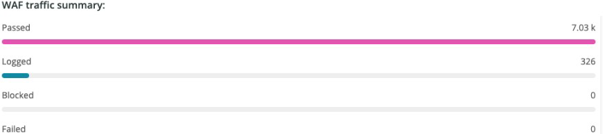
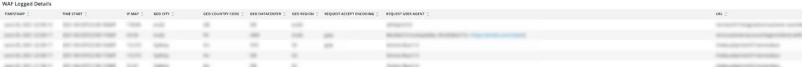

# Scheda [!DNL WAF]

La scheda **[!DNL WAF]** mostra il traffico passato e bloccato da [!DNL firewall].

## [!DNL WAF traffic summary]

Il frame **[!DNL WAF traffic summary]** mostra un conteggio del traffico passato, registrato, bloccato e non riuscito da [!DNL firewall].

## [!DNL WAF Top 10 blocked IP Addresses]

Il frame **[!DNL WAF Top 10 blocked IP Addresses]** mostra i primi 10 indirizzi IP più bloccati da [!DNL firewall].

## [!DNL WAF Top 10 countries for blocked requests]

Il frame **[!DNL WAF Top 10 countries for blocked requests]** mostra un conteggio delle richieste bloccate per i paesi nei primi 10 per le richieste bloccate da [!DNL firewall].

## [!DNL WAF Top 10 logged IP Addresses]

Il frame **[!DNL WAF Top 10 logged IP Addresses]** mostra gli indirizzi IP nei primi 10 indirizzi IP registrati da [!DNL firewall].

## [!DNL Top 10 WAF Rules Executed and Logged by IP address]

Il frame **[!DNL Top 10 WAF Rules Executed and Logged by IP address]** mostra gli indirizzi IP che si trovano nei primi 10 che più spesso corrispondono alle regole [!DNL firewall].

## [!DNL WAF Logged Details]

Il frame **[!DNL WAF Logged Details]** mostra le richieste registrate da [!DNL firewall], inclusi dettagli quali marca temporale, città, area geografica e data center.

## [!DNL WAF Blocked Details]

Il frame **[!DNL WAF Blocked Details]** mostra le richieste bloccate da [!DNL firewall], inclusi dettagli quali data e ora, città, area geografica e data center.
