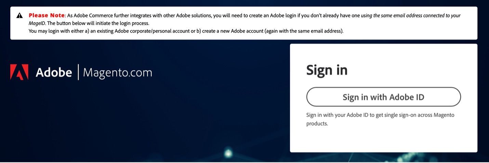

# Come accedere a [!DNL Site-Wide Analysis Tool]

Esistono due modi per accedere al [!DNL Site-Wide Analysis Tool Dashboard].

È possibile accedere a [!DNL dashboard] dal [[!DNL Site-Wide Analysis Tool] Sito Web](https://supportinsights.adobe.com/commerce) direttamente **(solo per Adobe Commerce su infrastruttura cloud)** e accedere con il proprio Adobe ID, oppure tramite [!DNL dashboard] dal punto vendita [!DNL Admin Panel].

Il [!DNL Site-Wide Analysis Tool] il servizio è disponibile in [modalità di produzione](https://docs.magento.com/user-guide/magento/installation-modes.html) per [!DNL Admin] utenti autorizzati ad accedere all&#39;utente [risorse ruolo](https://docs.magento.com/user-guide/system/permissions-user-roles.html).

>[!NOTE]
>
>Se hai installato Adobe Commerce on-premise, devi installare un’ [agente](../site-wide-analysis-tool/installation.md) sull’infrastruttura per utilizzare lo strumento.

*[!DNL Site-Wide Analysis Tool]Dashboard*

## Opzione 1: accesso al [!DNL Site-Wide Analysis Tool Dashboard] direttamente dal [!DNL Site-Wide Analysis Tool] dominio (solo per Adobe Commerce su infrastruttura cloud)

Un **[!DNL Adobe ID]è obbligatorio** per accedere a un [!DNL Commerce] account.
Se si dispone già di un [!DNL Commerce] account, ma non si dispone di un [!DNL Adobe ID], è possibile crearne una durante il processo di accesso.

1. Vai a [https://supportinsights.adobe.com/commerce](https://supportinsights.adobe.com/commerce).

1. Fai clic su **[!UICONTROL Sign in with Adobe ID]** e seguire le istruzioni.

   
   *[!DNL Adobe ID]schermata di accesso*

1. Accetta i termini e le condizioni.

1. **<u>Nota</u>:** Il tuo account dovrebbe avere diritto a **[!DNL Support Permissions]** per accedere a [!DNL Site-Wide Analysis Tool Dashboard].
Vedi ulteriori dettagli in [Condividi un [!DNL Commerce] account](https://experienceleague.adobe.com/docs/commerce-admin/start/commerce-account/commerce-account-share.html) nella guida utente.

## Opzione 2: accesso al [!DNL Site-Wide Analysis Tool Dashboard] dal punto vendita [!DNL Admin Panel]

### Passaggio 1: verificare le autorizzazioni

Verificare che [!DNL Admin] l&#39;account utente dispone dell&#39;autorizzazione per accedere a [!DNL Site-Wide Analysis Tool] attraverso i loro [ruolo utente assegnato](https://docs.magento.com/user-guide/system/permissions-user-roles.html).

>[!IMPORTANT]
>
>Il [!DNL Site-Wide Analysis Tool] risorsa ruolo (autorizzazione): **non** assegnato automaticamente. DEVE essere attivato per il ruolo utente e per il ruolo assegnato singolarmente a ciascun account utente nel [!UICONTROL Admin].

Per il ruolo personalizzato che richiede [!DNL Site-Wide Analysis Tool] eseguire le operazioni seguenti:

1. Seleziona la **[!UICONTROL Reports]** > *[!UICONTROL System Insights]* > **[!UICONTROL Site-Wide Analysis Tool]** risorsa ruolo.

   
   *[!DNL Site-Wide Analysis Tool]autorizzazione selezionata per il ruolo*

1. Clic **[!UICONTROL Save Role]**.

1. Notifica a tutti gli utenti a cui è assegnato quel ruolo di uscire da [!DNL Admin], e accedi di nuovo.

>[!NOTE]
>
>Se hai verificato che l’account utente dispone delle autorizzazioni necessarie per accedere a [!DNL Site-Wide Analysis Tool] e l’utente riceve un errore 403 quando tenta di accedere allo strumento da [!DNL Admin], nell’istanza di Adobe Commerce sull’infrastruttura cloud potrebbe essere abilitato il controllo degli accessi HTTP. Il [!DNL Site-Wide Analysis Tool] Il dashboard NON è supportato se è abilitata l’autenticazione HTTP. Per ulteriori informazioni sulla risoluzione di questo problema, consulta [Articolo di supporto](https://support.magento.com/hc/en-us/articles/360057400172-403-errors-when-accessing-Site-Wide-Analysis-Tool-on-Magento?_ga=2.168901729.117144580.1649172612-1623400270.1640858671).

### Passaggio 2: accesso [!DNL Site-Wide Analysis Tool]

1. Il giorno *[!UICONTROL Admin]* barra laterale, vai a **[!UICONTROL Reports]** > *[!UICONTROL System Insights]* > **[!UICONTROL Site-Wide Analysis Tool]**.

   
   *[!DNL Site-Wide Analysis Tool]posizione in [!DNL Admin Panel] in Adobe Commerce*

1. Leggi le *Condizioni d’uso* per [!DNL Site-Wide Analysis Tool] e fai clic su **[!UICONTROL Accept]** per continuare.

   Ogni utente deve accettare le Condizioni d’uso per la sessione. Questo passaggio viene ripetuto per ogni sessione registrata.

1. Nella parte superiore del dashboard, fai clic sulla scheda che desideri visualizzare.

   
   *[!DNL Site-Wide Analysis Tool]informazioni*

## Genera report da [!DNL Site-Wide Analysis Tool Dashboard]

1. Nell’angolo superiore destro del dashboard, fai clic su **[!UICONTROL Generate Report]**.

1. Seleziona la casella di controllo per ogni **[!UICONTROL Type]** e **[!UICONTROL Priority]** che desideri includere nel rapporto.

1. Clic **[!UICONTROL Generate Report]**.

   
   *Impostazioni dei rapporti*

| SCHEDA | DESCRIZIONE |
| --- | --- |
| Dashboard | Mostra l’integrità del sistema con le notifiche e i consigli correnti per priorità. |
| Informazioni | Fornisce informazioni di contatto dei clienti e un riepilogo dei ticket correnti, con informazioni dettagliate su ciascun prodotto Adobe Commerce installato. |
| Recommendations | Elenca i consigli basati sulle best practice per risolvere i problemi rilevati sul sito. |
| Eccezioni | Elenca gli errori generati dall&#39;applicazione causati da condizioni anomale senza un gestore degli errori. |
| Estensioni | Elenca tutte le estensioni e le librerie di terze parti. |

>[!NOTE]
>
>Dopo aver applicato un consiglio, potrebbero essere necessari alcuni giorni per aggiornarlo nel [!DNL Site-Wide Analysis Tool Dashboard] o generato.
